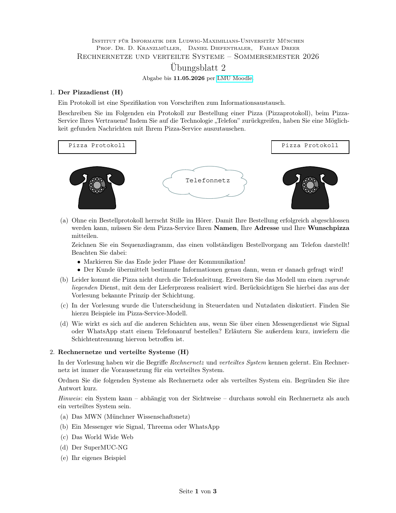
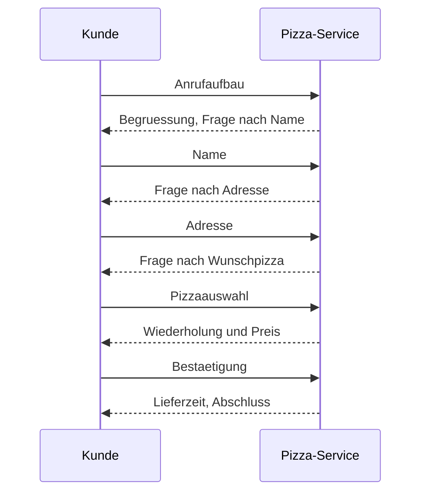

# Uebungsblatt 2 - 中德对照解答

## 1. Der Pizzadienst / 披萨协议



**DE Aufgabenidee:** Ein Protokoll fuer eine Pizza-Bestellung per Telefon beschreiben und auf Schichtung, Steuerdaten/Nutzdaten und Messenger-Alternativen beziehen.

**中文题意：** 用电话订披萨类比通信协议、分层、控制数据和有效载荷。

### (a) Sequenzdiagramm / 顺序图



**DE:** Jede Phase endet mit einer Rueckfrage, Bestaetigung oder dem Abschluss. Der Kunde sendet die Informationen erst dann, wenn danach gefragt wird.

**中文：** 每一阶段以确认、下一问题或结束语收尾；客户只在被询问时发送相应信息。这体现了协议的“状态”和“消息顺序”。

### (b) Schichtung / 分层

| Schicht | Pizza-Modell | 网络类比 |
|---|---|---|
| Anwendung | Bestellung, Name, Adresse, Pizza | 应用协议 |
| Kommunikationsdienst | Telefon oder Messenger | 传输/会话服务 |
| Lieferdienst | Kurier bringt Pizza | 底层承载服务 |
| Infrastruktur | Telefonnetz, Strassen | 网络基础设施 |

### (c) Steuerdaten und Nutzdaten / 控制数据与有效载荷

Nutzdaten: gewünschte Pizza, Adresse, Name.  
Steuerdaten: Begruessung, Fragen, Wiederholung, Preis, Lieferzeit, Bestaetigung, Gespraechsende.

中文：真正想传达的业务内容是“谁、送到哪里、要什么披萨”；为了让流程可靠进行的询问、确认、结束语等是控制信息。

### (d) Messenger statt Telefon / 用即时通信代替电话

**DE:** Die Semantik der Bestellung bleibt gleich, aber der darunterliegende Dienst wechselt von synchroner Sprache zu asynchronen Nachrichten. Nachrichten koennen spaeter gelesen werden, Lesebestaetigungen haben und Medien enthalten. Die Schichtentrennung bleibt erhalten, solange die Anwendung nur den Dienst "Nachrichten austauschen" benutzt.

**中文：** 订披萨这层语义不变，但底层服务从同步电话变成异步消息。消息可能延迟、可能有已读回执，也可以包含图片或菜单链接。分层思想仍然成立：只要上层看到的是“可以交换消息”的服务，上层披萨协议不需要关心底层是电话、Signal 还是 WhatsApp。

## 2. Rechnernetze und verteilte Systeme / 计算机网络与分布式系统

| System | Einordnung | Begruendung |
|---|---|---|
| MWN | Rechnernetz | 提供连接与转发，是通信基础设施 |
| Messenger | Verteiltes System, nutzt Rechnernetz | 多服务器/客户端协作提供统一消息服务 |
| World Wide Web | beides | 基于互联网连接，同时由浏览器、服务器、DNS、CDN 等组成分布式系统 |
| SuperMUC-NG | Verteiltes System, intern auch Netz | 多节点并行计算，对用户表现为一台高性能系统 |
| Beispiel: Cloud-Speicher | Verteiltes System | 多副本、多服务器提供文件服务 |

**Wissen / 知识点：** Rechnernetz 强调“通信连接”；verteiltes System 强调“多个计算节点协作，对外提供统一服务”。

## 3. RFC 768 / UDP

**(a)**  
**DE:** RFC 768 beschreibt das User Datagram Protocol (UDP). UDP dient dazu, Datagramme zwischen Prozessen ueber Ports zu transportieren.

**中文：** RFC 768 描述的是 UDP 用户数据报协议。UDP 的作用是在主机上的进程之间传输数据报，端口号用于区分不同进程或服务。

**(b)**  
**DE:** Zentrales Merkmal: verbindungslos, minimaler Header, keine Garantie fuer Zustellung, Reihenfolge oder Duplikatfreiheit. Optional wird eine Checksumme genutzt.

**中文：** 核心特征是无连接、首部很小、不保证送达、不保证顺序、不保证没有重复。UDP 可以使用校验和检测错误，但不会自动重传。

**(c)** Pizza ueber UDP:

| Schwierigkeit | Bedeutung im Pizza-Modell |
|---|---|
| Paketverlust | Bestellung oder Adresse kann fehlen |
| keine Reihenfolgegarantie | Pizzaauswahl kommt vor Name/Adresse an |
| keine Verbindung | Restaurant weiss nicht sicher, ob Kunde noch erreichbar ist |
| keine automatische Wiederholung | Anwendung muss selbst ACK/Retry bauen |

**Wissen / 知识点：** UDP ist einfach und schnell, aber Zuverlaessigkeit muss die Anwendung selbst herstellen.

## 4. Textbasiertes Arbeiten mit Linux / Linux 命令行

### (a) Grundbefehle

**中文说明：** 这些命令是 Linux 文本工作环境的基础：`pwd` 看当前位置，`ls` 列出文件，`cd` 切换目录，`man` 查看帮助手册。

| Aufgabe | Befehl |
|---|---|
| Home-Pfad anzeigen | `pwd` |
| Inhalt anzeigen | `ls` |
| Wurzelverzeichnis | `cd /` |
| zurueck ins Home | `cd ~` |
| Man-Page | Handbuchseite zu Befehlen, z.B. `man man` |
| versteckte Dateien mit `ls` | `ls -a` |

### (b) ping

**DE:** Roundtrip delay (RTD) ist die Zeit vom Senden einer Anfrage bis zum Empfang der Antwort.

**中文：** 往返时延 RTD/RTT 是从发出请求到收到响应之间经过的总时间，包含去程和回程。

Beispielbefehl:

```bash
ping -c 10 -i 2 -s 100 www.nm.ifi.lmu.de
```

Typische Spalten: Anzahl Bytes, Zielhost/IP, ICMP-Sequenznummer, TTL, Zeit/RTD.

### (c) traceroute

```bash
traceroute www.nm.ifi.lmu.de
```

**DE:** Die erste Zeile nennt Ziel, Ziel-IP, maximale Hop-Zahl und Paketgroesse. Danach zeigt jede Zeile einen Hop; die drei Zeitwerte sind Messungen fuer drei Probe-Pakete. Unterschiedliche Pfade koennen Lastverteilung, dynamisches Routing oder geaenderte Netzbedingungen bedeuten.

**中文：** 第一行通常给出目标、目标 IP、最大跳数和探测包大小。之后每一行代表一跳，三个时间值是三次探测的往返时间。多次 traceroute 路径不同，可能表示负载均衡、动态路由变化或网络状态变化。

**Wissen / 知识点：** `ping` misst Erreichbarkeit und RTT; `traceroute` nutzt TTL/Hop-Limit, um Zwischenrouter sichtbar zu machen。
