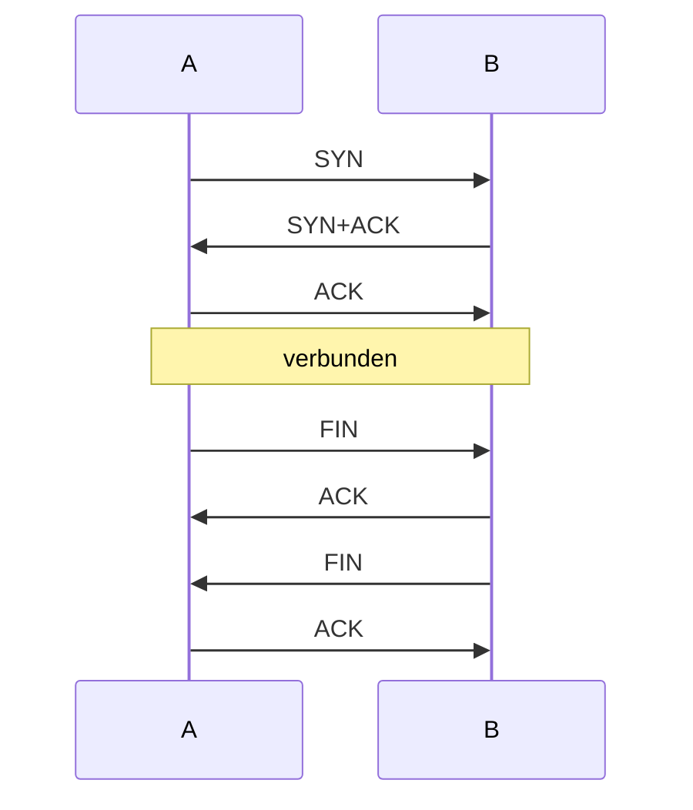
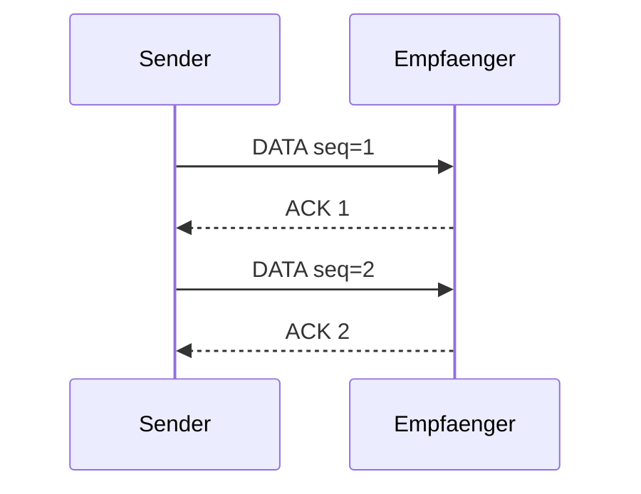
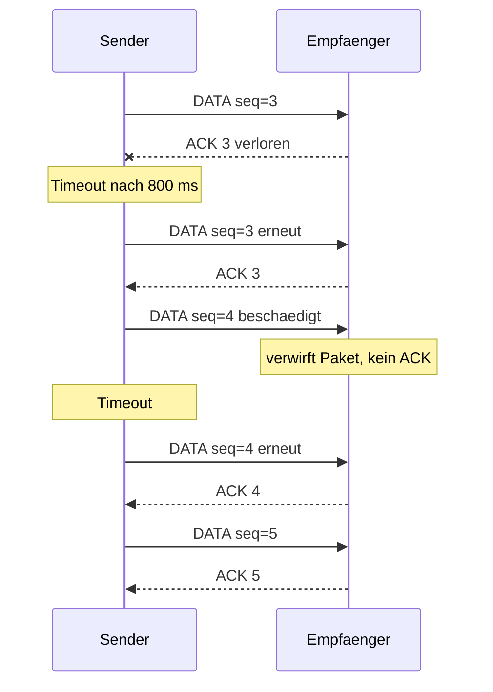

# Uebungsblatt 4 - 中德对照解答

## 1. Verbindungslose und verbindungsorientierte Kommunikation

**中文题意：** 比较无连接通信和面向连接通信。

**(a)**  
**DE:** Verbindungsorientiert bedeutet, dass vor der Datenuebertragung ein logischer Zustand aufgebaut wird, z.B. bei einem Telefonat oder bei TCP. Danach koennen Sequenznummern, ACKs und ein geordneter Abbau genutzt werden. Verbindungslos bedeutet, dass jedes Paket einzeln adressiert und ohne vorherigen Verbindungsaufbau gesendet wird, z.B. bei Briefpost, IP oder UDP.

**中文：** 面向连接通信会先建立一个逻辑连接状态，例如电话或 TCP，之后可以使用序列号、确认和连接释放。无连接通信不预先建立连接，每个包都独立携带目的地址并被单独转发，例如信件、IP 或 UDP。

**(b) Beispiele**

| Art | Beispiele |
|---|---|
| verbindungsorientiert | TCP, Telefonat |
| verbindungslos | UDP, IP-Datagramm, Briefpost |

**(c)**  
**DE:** Verbindungslos ist vorteilhaft bei kurzen Nachrichten, geringer Latenz, vielen Empfaengern, tolerierbarem Verlust oder wenn die Anwendung selbst Zuverlaessigkeit regelt.

**中文：** 无连接通信适合短消息、低延迟、多接收者、能容忍丢包，或者应用层自己实现可靠性的场景。它省去了连接建立开销。

## 2. Verbindungsaufbau und -abbau

**(a)**  
**DE:** Beim 2-Wege-Handshake sendet A einen Aufbauwunsch, B bestaetigt. Geht Bs Bestaetigung verloren, ist B im Zustand "verbunden", A wartet weiter oder laeuft in einen Timeout. Es entsteht Zustandsinkonsistenz.

**中文：** 二次握手中 A 发送连接请求，B 回复确认。如果 B 的确认丢失，B 会认为连接已经建立，而 A 仍在等待确认或最终超时，因此双方状态不一致。

**(b)**  
**DE:** Ein weiteres Szenario ist der Verlust des Aufbauwunsches von A. Dann wartet A auf eine Bestaetigung, B weiss aber nichts vom Verbindungsaufbau. Auch ein altes Duplikat eines Aufbauwunsches kann bei B eine Scheinverbindung erzeugen.

**中文：** 另一个错误场景是 A 的连接请求丢失：A 等待 ACK，但 B 完全不知道这次连接。也可能是旧的重复连接请求到达 B，导致 B 误以为要建立新连接。

**(c) 3-Wege-Handshake und Abbau**

**(d)**  
**DE:** Keine endliche Folge von Nachrichten kann absolute Gewissheit garantieren, weil immer die letzte Bestaetigung verloren gehen koennte. Dann weiss der Sender der letzten Nachricht nicht sicher, ob der andere sie erhalten hat. Das ist das klassische Two-Generals-Problem.

**中文：** 任何有限次握手都无法提供绝对保证，因为最后一条确认消息仍然可能丢失。发送最后一条消息的一方永远无法确定对方是否收到了它。这就是经典的“两将军问题”。

**(e)**  
**DE:** In der Praxis reicht der 3-Wege-Handshake, weil Sequenznummern, Timeouts, Wiederholungen und die begrenzte Lebensdauer alter Pakete das Risiko stark begrenzen.

**中文：** 实践中三次握手足够好，因为序列号、超时、重传以及旧包生命周期限制可以把错误连接的概率降得很低。

## 3. Sequenznummern 1, ohne Sendefenster

Rahmenbedingungen: Stop-and-Wait, Timeout 800 ms, Netzverzoegerung 20 ms je Richtung.

**(a)**  
**DE:** Warten auf jede Quittung ist akzeptabel, wenn die Datenrate klein, die RTT gering oder Einfachheit wichtiger als Durchsatz ist. Bei grosser Bandbreite oder grosser RTT ist es ineffizient.

**中文：** 每发一个包就等待确认，在数据量小、RTT 小或协议简单性更重要时可以接受。但在大带宽或大 RTT 场景下效率很低，因为链路大部分时间都在空等。

**(b) Zwei fehlerfreie Nachrichten**

ACK fuer eine Nachricht kommt fruehestens nach `20 ms + 20 ms = 40 ms` zurueck, wenn Sende- und Verarbeitungszeiten vernachlaessigt werden.

**(c) Fehlerfaelle**

**DE:** Der Sender erkennt beide Fehlerfaelle ueber Timeout. Der Empfaenger erkennt ein verlorenes ACK nicht direkt, sondern sieht spaeter ein Duplikat von `seq=3`. Eine beschaedigte Nachricht erkennt er ueber Pruefsumme oder Fehlererkennung und verwirft sie.

**中文：** 发送端对 ACK 丢失和数据包损坏的直接表现都是超时。接收端不能直接知道 ACK 丢了，只会之后看到重复的 `seq=3`。对于损坏的数据包，接收端通过校验和或错误检测发现问题并丢弃。

**Wissen / 知识点：** Stop-and-Wait 很简单，但吞吐量受 RTT 限制；序列号用于识别重复包，ACK 丢失和数据丢失在发送端通常都表现为超时。
