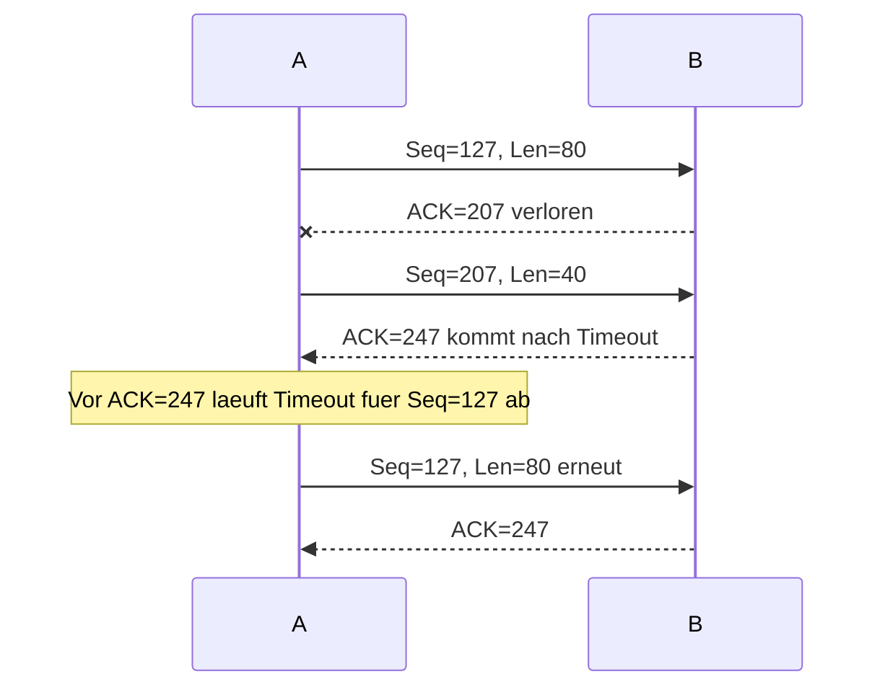
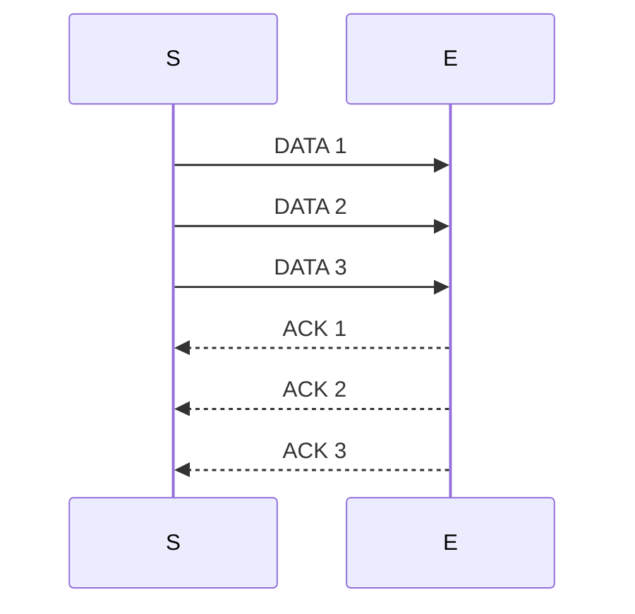
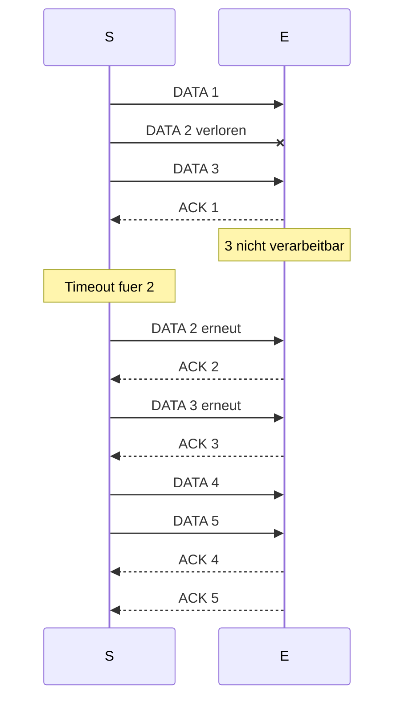

# Uebungsblatt 5 - 中德对照解答

## 1. Transportschicht in Pseudocode

Pseudocode baut aus Nutzdaten und Ports ein Segment:

```text
PDU = length + destination_port + source_port + checksum + bytes
```

**(a)**  
**DE:** Die `(N)-PDU` ist das erzeugte Transportsegment. Es enthaelt Header/PCI plus Nutzdaten `bytes`.

**中文：** `(N)-PDU` 就是生成出来的传输层报文段。它由传输层首部/控制信息 PCI 加上应用交下来的 `bytes` 有效载荷组成。

**(b)**  
**DE:** `(N)-PCI` enthaelt Laenge, Zielport, Quellport und Checksumme. Die `(N)-ICI` aus dem Aufruf enthaelt Zieladresse und Zielport; sie stimmt also nur teilweise mit der PCI ueberein. Die Zieladresse wird an die darunterliegende Schicht weitergegeben, nicht in den gezeigten Transportheader geschrieben.

**中文：** `(N)-PCI` 包含长度、目的端口、源端口和校验和。函数调用中的 `(N)-ICI` 包含目标地址和目标端口，因此只和 PCI 部分重合。目标 IP 地址不是这个传输层首部的一部分，而是交给下一层用于路由。

**(c)**  
**DE:** `(N-1)-ICI` ist `address_bytes`, weil die untere Schicht wissen muss, wohin sie das Paket routet. `(N-1)-IDU` besteht aus ICI plus der `(N)-PDU`; die `(N-1)-SDU` ist die gesamte Transport-PDU.

**中文：** `(N-1)-ICI` 是 `address_bytes`，因为下一层需要知道目标网络地址来转发包。`(N-1)-IDU` 由这个接口信息加上第 N 层 PDU 组成；对下一层来说，整个传输层 PDU 就是它的 SDU。

**(d)**  
**DE:** Kein Verbindungsaufbau, zufaelliger Quellport, Laenge, Ports und Checksumme: das skizziert UDP, also ein verbindungsloses Transportschichtprotokoll.

**中文：** 这里没有连接建立过程，只构造源端口、目的端口、长度和校验和，非常像 UDP。因此它是无连接的传输层协议。

## 2. TCP Sequenznummern

Gegeben: B hat 126 Bytes empfangen. Erstes neues Segment: Seq=127, Laenge 80, Source Port 302, Destination Port 80. Zweites Segment: Laenge 40.

**(a)**  
**DE:** Zweites Segment von A nach B:

**中文：** 第二个段紧跟第一个 80 字节段之后，所以序列号要加 80：

```text
Seq = 127 + 80 = 207
Source Port = 302
Destination Port = 80
```

**(b)**  
**DE:** Wenn Segment 1 zuerst ankommt, bestaetigt B das naechst erwartete Byte:

**中文：** 如果第一个段先到，B 已经连续收到到字节 206，因此下一个期望字节是 207：

```text
ACK-Nr = 207
Source Port = 80
Destination Port = 302
```

**(c)**  
**DE:** Wenn Segment 2 zuerst ankommt, fehlt Byte 127 bis 206. Bei kumulativen ACKs bleibt:

**中文：** 如果第二个段先到，字节 127 到 206 仍然缺失。TCP 的普通 ACK 是累计确认，所以 ACK 号仍然停在 127：

```text
ACK-Nr = 127
Source Port = 80
Destination Port = 302
```

**(d) ACK-Verlust und Timeout**



## 3. Sequenznummern 2, mit Sendefenster

**(a)**  
**DE:** Fehlerfrei bei `w=3`: Sender darf `1,2,3` sofort senden; Empfaenger quittiert jedes einzeln.

**中文：** 当发送窗口 `w=3` 且没有错误时，发送方可以不用等 ACK，直接连续发送 1、2、3 三个消息。接收方每收到一个就分别确认。



**(b)**  
**DE:** Nachricht 2 geht verloren, der Empfaenger kann nur in Reihenfolge verarbeiten. Er nimmt 1 an, kann 3 aber nicht verarbeiten; ACK fuer 2 fehlt und der Sender retransmittiert nach Timeout.

**中文：** 如果第 2 个消息丢失，而接收方只能按顺序处理，那么它可以接受 1，但不能处理 3。发送方迟迟收不到 2 的确认，超时后重传 2，然后再恢复后续传输。



**(c)**  
**DE:** Neue Regeln: `w=5`, NACKs und Puffer fuer ausser-der-Reihe. Wenn DATA 3 fehlerhaft ankommt, sendet E `NACK 3`, puffert 4 und 5 und verarbeitet nach erneuter 3.

**中文：** 新规则下窗口为 5，接收方可以发送 NACK，也能缓存乱序到达的正确消息。如果第 3 个消息损坏，接收方发送 `NACK 3`，同时缓存已经正确到达的 4 和 5；等 3 重传成功后再按顺序交付。

**(d)**  
**DE:** Negative Quittungen beschleunigen Wiederholung, weil der Sender nicht erst auf Timeout warten muss.

**中文：** NACK 的优点是发送方不用等超时，就能知道哪个消息出错，从而更快重传。

**(e)**  
**DE:** Positive ACKs kann man kumulativ gestalten: `ACK k` bedeutet, alle Daten bis vor `k` sind korrekt angekommen. Alternativ kann man SACK benutzen.

**中文：** 可以把正确认设计为累计 ACK：`ACK k` 表示 `k` 之前的数据都已正确收到。也可以使用选择确认 SACK，明确指出哪些块已经收到。

## 4. TCP in Wireshark

**DE:** Ohne die Datei `trace3.pcap` im Arbeitsverzeichnis lassen sich konkrete Paketnummern und Zeiten nicht bestimmen. Vorgehen:

**中文：** 当前工作目录中没有 `trace3.pcap`，所以不能给出具体包号、时间戳和绝对序列号。可以按下面方法在 Wireshark 中分析：

| Teil | Vorgehen |
|---|---|
| 3-Way-Handshake | Filter `tcp.flags.syn == 1`, Segmente `SYN`, `SYN ACK`, `ACK` |
| Verbindungsabbau | Segmente mit `FIN` und abschliessenden ACKs |
| RTD | Zeit zwischen SYN und SYN+ACK oder zwischen SYN+ACK und ACK |
| absolute/relative SeqNr | In Wireshark TCP-Details; relative Nummern starten meist bei 0 |
| SSHv2 nutzt TCP? | Ja, wenn SSHv2-PDUs in TCP-Segmenten mit TCP-Port 22 oder entsprechender Verbindung gekapselt sind |

**Wissen / 知识点：** TCP 的序号按字节编号；ACK 号表示“下一个期望字节”。UDP 是报文式，TCP 是字节流式。
