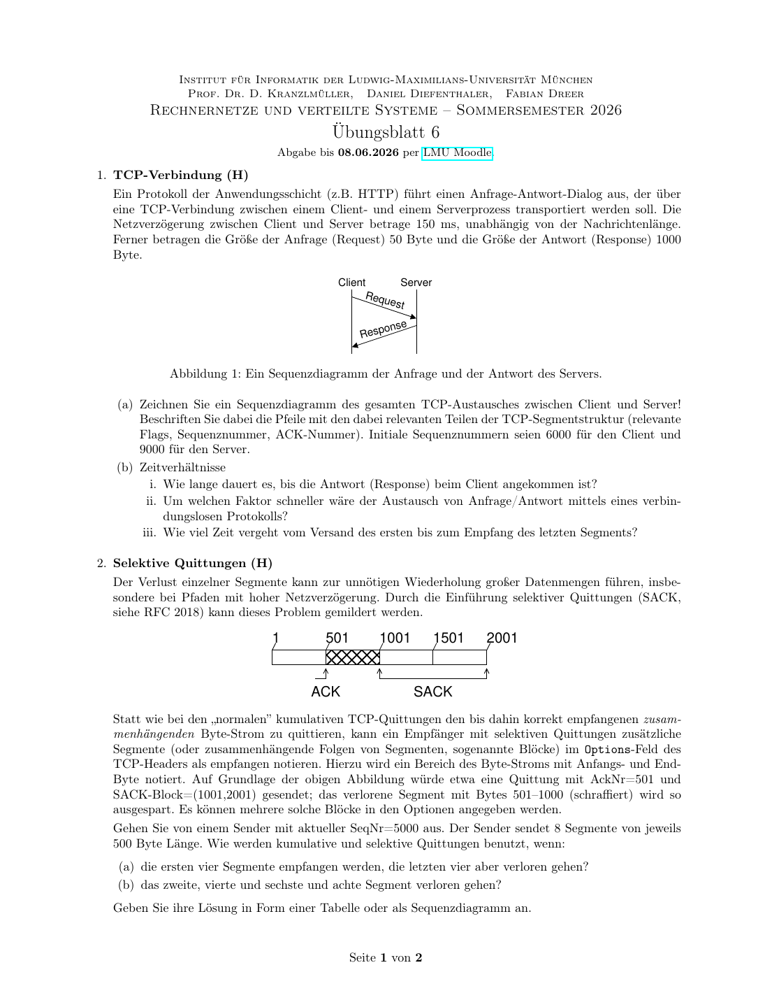
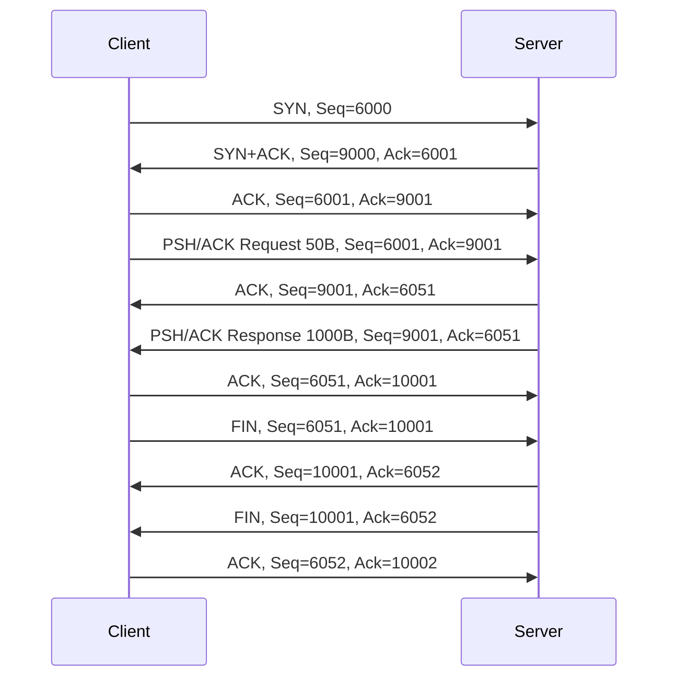
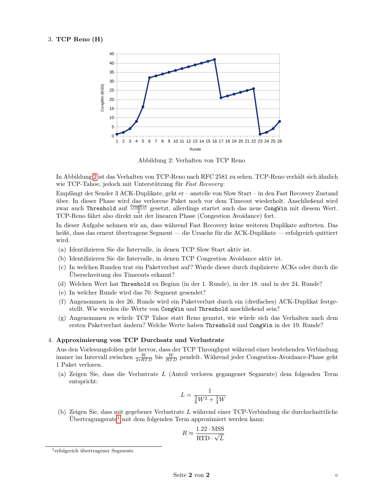

# Uebungsblatt 6 - 中德对照解答

## 1. TCP-Verbindung



**DE:** Gegeben ist ein Request von 50 Byte und eine Response von 1000 Byte ueber TCP. Die Einweg-Netzverzoegerung betraegt 150 ms. Initiale SeqNr: Client 6000, Server 9000.

**中文：** 应用层有一个 50 B 请求和一个 1000 B 响应，通过 TCP 传输。单向网络延迟是 150 ms。客户端初始序列号为 6000，服务器初始序列号为 9000。

**(a) Sequenzdiagramm**



**(b) Zeit**

**DE:** Wenn Sendezeiten vernachlaessigt werden:

**中文：** 如果忽略发送时间和处理时间，只考虑传播延迟：

1. **DE:** Antwort beim Client: 3-Way-Handshake braucht 1 RTT bis Client senden kann (`300 ms`), Request braucht `150 ms` zum Server, Response `150 ms` zum Client. Insgesamt etwa `600 ms`.  
   **中文：** 响应到达客户端：三次握手到客户端能发送请求需要 1 个 RTT，即 `300 ms`；请求到服务器需要 `150 ms`，响应回客户端还要 `150 ms`，总计约 `600 ms`。
2. **DE:** Verbindungslos: Request hin `150 ms`, Response zurueck `150 ms`, also `300 ms`. Faktor `600/300 = 2`.  
   **中文：** 如果使用无连接协议，请求去程 `150 ms`，响应回程 `150 ms`，共 `300 ms`。TCP 方案约慢 `600/300 = 2` 倍。
3. **DE:** Vom ersten SYN bis Empfang der Response: ebenfalls etwa `600 ms`; inklusive Verbindungsabbau dauert es laenger.  
   **中文：** 从第一个 SYN 发出到收到响应也约 `600 ms`；如果把连接释放也算进去，还会再多若干报文交换时间。

## 2. Selektive Quittungen / SACK

**DE:** Sender startet mit SeqNr 5000 und sendet 8 Segmente a 500 Byte.

**中文：** 发送方当前序列号为 5000，连续发送 8 个段，每段 500 B。因此每个段对应的字节范围如下：

| Segment | Bytebereich |
|---:|---|
| 1 | 5000-5499 |
| 2 | 5500-5999 |
| 3 | 6000-6499 |
| 4 | 6500-6999 |
| 5 | 7000-7499 |
| 6 | 7500-7999 |
| 7 | 8000-8499 |
| 8 | 8500-8999 |

**(a)**  
**DE:** Erste vier Segmente werden empfangen, die letzten vier gehen verloren.

**中文：** 前四个段都收到，后四个段丢失。因此连续字节流已经收到到 6999，下一个期望字节是 7000：

```text
Kumulatives ACK = 7000
SACK = leer, weil kein Block nach der Luecke empfangen wurde
```

**(b)**  
**DE:** Die Segmente 2, 4, 6 und 8 gehen verloren.

**中文：** 第 2、4、6、8 个段丢失。第 1 个段收到后，累计 ACK 只能到 5500；后面收到的第 3、5、7 段是不连续块，需要用 SACK 标出：

Nach Segment 1: ACK 5500. Danach kommen 3,5,7 ausserhalb der Luecken an:

```text
ACK = 5500
SACK-Bloecke = (6000,6500), (7000,7500), (8000,8500)
```

## 3. TCP Reno



**DE:** Die konkrete Antwort haengt von den Werten in der Grafik ab. Aus dem typischen Reno-Verlauf:

**中文：** 具体轮次要从图中的 CongWin 曲线读出。一般判断原则如下：

| Frage | Antwortprinzip |
|---|---|
| Slow Start | Bereiche mit exponentiellem Wachstum von CongWin |
| Congestion Avoidance | Bereiche mit linearer Erhoehung um ca. 1 MSS pro RTT |
| Paketverlust | starker Rueckfall auf 1 MSS bedeutet Timeout; Halbierung mit Fortsetzung bedeutet 3 Duplicate ACKs/Fast Recovery |
| Threshold | nach Verlust etwa `CongWin/2` |
| 70. Segment | kumulative Summe der pro Runde gesendeten CongWin-Werte bilden; die Runde, in der Summe >= 70 wird |
| Verlust in Runde 26 durch 3 DupACK | `Threshold = CongWin/2`, `CongWin = Threshold` nach Fast Recovery |
| Tahoe statt Reno | nach erstem Verlust: `Threshold = CongWin/2`, `CongWin = 1`, danach Slow Start |

**Wissen / 知识点：** Reno unterscheidet Timeout und Triple-Duplicate-ACK. Timeout ist schwerer: CongWin faellt auf 1. Triple-Duplicate-ACK halbiert grob und macht Fast Recovery.

## 4. TCP-Durchsatz und Verlustrate

**DE:** In Congestion Avoidance pendelt das Fenster zwischen `W/2` und `W`. Pro Zyklus werden ungefaehr:

**中文：** 在拥塞避免阶段，窗口在 `W/2` 到 `W` 之间线性增长。一个周期中发送的段数约为：

```text
(W/2 + W) / 2 * (W/2) = 3W^2/8
```

Segmente gesendet; genauer mit diskreter Summation kommt:

```text
3W^2/8 + 3W/4
```

**DE:** Da pro Zyklus ein Segment verloren geht:

**中文：** 因为假设每个周期丢 1 个段，所以丢包率等于“1 除以一个周期内发送的段数”：

```text
L = 1 / (3W^2/8 + 3W/4)
```

**DE:** Nach Umstellen gilt naeherungsweise:

**中文：** 将丢包率公式近似变形，可以得到窗口大小和吞吐率的近似关系：

```text
W approx sqrt(8/(3L))
R approx (0.75 * W * MSS) / RTD
R approx 1.22 * MSS / (RTD * sqrt(L))
```

**Wissen / 知识点：** TCP 吞吐量与丢包率的平方根成反比：丢包率稍微上升，吞吐量会明显下降。
