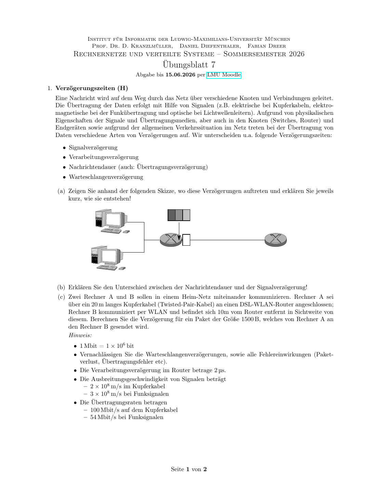

# Uebungsblatt 7 - 中德对照解答

## 1. Verzoegerungszeiten / 延迟类型



**DE Aufgabenidee:** Signal-, Verarbeitungs-, Uebertragungs- und Warteschlangenverzoegerung unterscheiden und berechnen.

**中文题意：** 标出网络中不同延迟出现的位置，并计算一个家庭网络中的包传输延迟。

**(a)**  
**DE:** Signalverzoegerung entsteht auf der Leitung durch endliche Ausbreitungsgeschwindigkeit. Verarbeitungsverzoegerung entsteht in Router, Switch oder Endgeraet beim Pruefen und Weiterleiten. Nachrichtendauer oder Uebertragungsverzoegerung ist die Zeit, um alle Bits auf den Link zu schieben. Warteschlangenverzoegerung entsteht, wenn Pakete vor einem Ausgangsport warten.

**中文：** 信号传播延迟发生在线路上，因为电信号、无线信号或光信号传播速度有限。处理延迟发生在路由器、交换机或终端设备中，例如检查首部、查表转发。报文持续时间/发送延迟是把整个包的所有 bit 推到链路上所需的时间。排队延迟发生在输出端口前面有其他包等待发送时。

**(b)**  
**DE:** Nachrichtendauer haengt von Paketgroesse und Datenrate ab: `L/R`. Signalverzoegerung haengt von Strecke und Ausbreitungsgeschwindigkeit ab: `d/v`.

**中文：** 报文持续时间取决于包大小和链路速率，公式是 `L/R`。信号传播延迟取决于距离和传播速度，公式是 `d/v`。前者关心“包有多大、链路多快”，后者关心“路有多长、信号跑多快”。

**(c)** Paket: `1500 B = 12000 bit`.

| Abschnitt | Rechnung | Zeit |
|---|---:|---:|
| A -> Router, Senden | `12000 / 100 Mbit/s` | `120 us` |
| A -> Router, Signal | `20 / (2*10^8)` | `0.1 us` |
| Router Verarbeitung | gegeben | `2 us` |
| Router -> B, Senden | `12000 / 54 Mbit/s` | `222.22 us` |
| Router -> B, Signal | `10 / (3*10^8)` | `0.033 us` |
| Summe | | `344.35 us` |

**中文计算说明：** 1500 B 等于 12000 bit。先在 100 Mbit/s 铜缆上发送，需要 `12000 / 100000000 = 120 us`；20 m 铜缆传播时间只有 `0.1 us`。路由器处理给定为 `2 us`。无线段速率为 54 Mbit/s，所以发送时间约 `222.22 us`；10 m 无线传播时间约 `0.033 us`。总延迟约 `344.35 us`，主要由发送延迟决定，传播延迟很小。

## 2. Paket- und Leitungsvermittlung / 分组交换与电路交换

**(a)** Bei fester, dauerhafter Datenrate ist Leitungsvermittlung gut geeignet, weil reservierte Kapazitaet kontinuierlich genutzt wird und kaum Warteschlangen entstehen.

**(b)** Obwohl die Linkkapazitaet groesser als die Summe der mittleren Datenraten ist, koennen Paketverluste bei kurzzeitigen Bursts auftreten, wenn mehrere Quellen gleichzeitig senden und Routerpuffer ueberlaufen.

**中文：**  
**(a)** 如果应用长时间以固定速率发送数据，电路交换更合适，因为预留出来的带宽会被持续使用，时延稳定，也不容易排队。  
**(b)** 即使每条链路的总容量大于所有应用的平均速率之和，分组交换中仍可能因为瞬时突发而丢包。例如多个应用同时把包打到同一个输出端口，缓冲区被填满，就会发生丢包。

## 3. Fenstergoesse beim Sliding Window

Gegeben: Datenkanal `64 kbit/s`, PDU `512 B = 4096 bit`, ACK `8 B = 64 bit`, Signalverzoegerung je Richtung `270 ms`.

Zeit bis ACK fuer erste PDU beim Sender:

```text
T = 64 ms + 270 ms + 1 ms + 270 ms = 605 ms
```

Effektive Rate: `min(64 kbit/s, w * 4096 bit / 0.605 s)`.

| Fenster | Rate | Effizienz |
|---:|---:|---:|
| 1 | `6.77 kbit/s` | `10.6 %` |
| 7 | `47.39 kbit/s` | `74.0 %` |
| 15 | `64 kbit/s` | `100 %` |

Minimale Fenstergroesse fuer volle Auslastung:

```text
ceil(64000 * 0.605 / 4096) = ceil(9.45) = 10
```

**中文计算说明：** 一个数据 PDU 是 `512 B = 4096 bit`，在 64 kbit/s 链路上发送需要 `64 ms`。ACK 是 `8 B = 64 bit`，发送需要 `1 ms`。加上去程和回程传播延迟各 `270 ms`，第一个 ACK 回到发送端大约需要 `605 ms`。窗口大小为 `w` 时，在这段等待时间内最多能发 `w` 个 PDU，所以有效速率约为 `w * 4096 / 0.605`。当这个值达到链路速率 64 kbit/s 后就不能再提高，因此窗口为 10 时刚好能把信道打满。

## 4. Staukontrolle bei TCP / TCP Slow Start

Gegeben: RTD `200 ms`, Einweg `100 ms`, 15 Segmente a `500 B`, Threshold unerreichbar.

**(a)** Slow Start sendet pro RTT: `1, 2, 4, 8` Segmente, zusammen `15`. CongWin entwickelt sich also `1 -> 2 -> 4 -> 8 -> 16`.

**中文：** Slow Start 每个 RTT 让拥塞窗口大约翻倍，所以四轮可以分别发送 `1, 2, 4, 8` 个段，正好覆盖 15 个段。拥塞窗口变化为 `1 -> 2 -> 4 -> 8 -> 16`。

**(b)**  
**DE:** Bei `R = 20 kB/s` dauert ein Segment `500/20000 = 25 ms`. Einschliesslich 3-Way-Handshake bis Server senden kann grob `300 ms`, danach vier Slow-Start-Runden. Die letzte Runde enthaelt 8 Segmente und braucht wegen Serialisierung `8*25 ms = 200 ms` plus Wegzeit. Ohne Slow Start mit Fenster 20 koennen alle 15 Segmente sofort in einer Sendefolge gesendet werden: `15*25 ms + 100 ms` nach Verbindungsaufbau.

**中文：** 当速率 `R = 20 kB/s` 时，一个 500 B 的段发送时间是 `500 / 20000 = 25 ms`。从客户端 SYN 开始算，三次握手到服务器可以开始发送，大约需要 `300 ms`。之后 Slow Start 需要四轮发送：第 1 轮发 1 个，第 2 轮发 2 个，第 3 轮发 4 个，第 4 轮发 8 个。最后一轮因为 8 个段要排队串行发出，所以仅发送就要 `8 * 25 ms = 200 ms`，再加上最后一个段到客户端的传播时间。若没有 Slow Start，固定窗口为 20，则 15 个段可以连续发出，发送时间为 `15 * 25 ms = 375 ms`，再加上最后一个段传播到客户端的 `100 ms`。

Kurzform:

| Fall | Dauer ab SYN, grob |
|---|---:|
| mit Slow Start | `300 ms + 3*200 ms + 200 ms + 100 ms = 1200 ms` |
| Fenster 20 | `300 ms + 375 ms + 100 ms = 775 ms` |

**(c)** Bei `R = 500 kB/s` dauert ein Segment `1 ms`; dann dominiert RTT:

| Fall | Dauer ab SYN, grob |
|---|---:|
| mit Slow Start | `300 ms + 3*200 ms + 8 ms + 100 ms = 1008 ms` |
| Fenster 20 | `300 ms + 15 ms + 100 ms = 415 ms` |

**中文：** 当 `R = 500 kB/s` 时，一个段只需要 `500 / 500000 = 1 ms` 发送，发送时间已经很小，主要耗时变成 RTT 和握手等待。Slow Start 仍然要等多轮 RTT，所以约 `1008 ms`；固定窗口 20 可以一次连续发送完 15 个段，所以约 `415 ms`。

**Wissen / 知识点：** 带宽大、RTT 大时，窗口机制非常关键；Slow Start 的指数增长避免一开始压垮网络，但会增加短连接时延。
