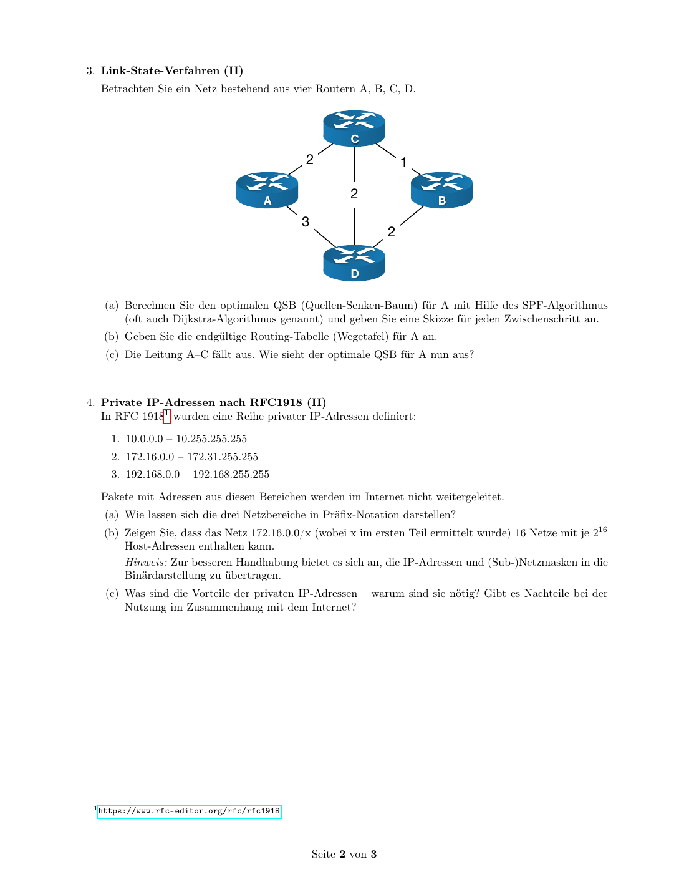
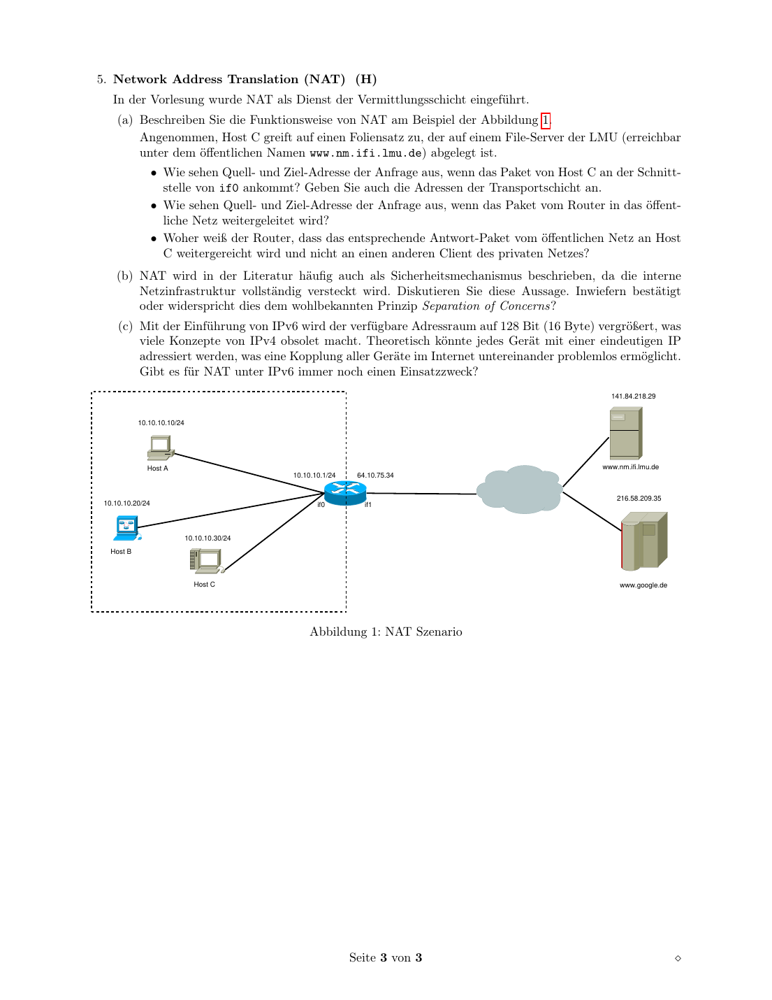

# Uebungsblatt 8 - 中德对照解答

## 1. Addressierung in Rechnernetzen / 网络地址划分


**(a)**  
**DE:** Klassenbasierte Adressierung benutzt feste Klassen A/B/C. CIDR benutzt flexible Praefixlaengen wie `/16`, `/21`, `/24`. Vorteile sind bessere Ausnutzung des Adressraums und Routing-Aggregation.

**中文：** 分类地址使用固定的 A/B/C 类网络边界；CIDR 使用灵活的前缀长度，例如 `/16`、`/21`、`/24`。CIDR 的好处是地址空间利用率更高，并且可以把多个网络聚合成较短前缀，减小路由表。

**(b)**  
**DE:** Der gegebene Block ist `131.42.0.0/16`. Man waehlt zuerst das groesste Subnetz, danach die mittelgrossen und zuletzt die kleinen Subnetze.

**中文：** 给定地址块是 `131.42.0.0/16`。划分时先放最大的 32000 主机子网，再放 15 个 2000 主机子网，最后放 8 个 250 主机子网，这样不容易产生碎片。

| Zweck | Subnetz | Maske | nutzbarer Bereich | Broadcast |
|---|---|---|---|---|
| 32000 Hosts | `131.42.0.0/17` | `255.255.128.0` | `131.42.0.1 - 131.42.127.254` | `131.42.127.255` |
| 2000 Hosts 1-15 | `131.42.128.0/21` bis `131.42.240.0/21` in 8er-Schritten | `255.255.248.0` | je `x.1 - x+7.254` | je `x+7.255` |
| 250 Hosts 1-8 | `131.42.248.0/24` bis `131.42.255.0/24` | `255.255.255.0` | je `.1 - .254` | je `.255` |

**DE:** Die 15 `/21`-Netze starten im dritten Oktett bei `128,136,144,...,240`.

**中文：** `/21` 每个块跨 8 个第三字节的值，所以 15 个 `/21` 子网的第三字节起点是 `128, 136, 144, ..., 240`。剩下的 `248-255` 正好给 8 个 `/24` 子网。

## 2. Hierarchische Vergabe von IP-Adressen

**(a)**  
**DE:** Die Maske `255.255.0.0` fuer `160.229.0.0` entspricht:

**中文：** 子网掩码 `255.255.0.0` 表示前 16 位是网络前缀，所以 CIDR 写法为：

```text
160.229.0.0/16
```

**(b)**  
**DE:** Aufteilung gemaess Abbildung:

**中文：** 根据图中的提示，E 和 F 各拿一个 `/18`，G 拿后半个 `/17`，三者合起来覆盖整个 `/16`：

| Router | Netz |
|---|---|
| E | `160.229.0.0/18` |
| F | `160.229.64.0/18` |
| G | `160.229.128.0/17` |

**(c)**  
**DE:** Der F-Bereich `160.229.64.0/18` wird gleichmaessig auf vier Router verteilt.

**中文：** F 的范围是 `160.229.64.0/18`，大小为 64 个 C 类块。平均分给 4 个路由器，每个得到 16 个 C 类块，也就是 `/20`：

| Router | Netz |
|---|---|
| A | `160.229.64.0/20` |
| B | `160.229.80.0/20` |
| C | `160.229.96.0/20` |
| D | `160.229.112.0/20` |

## 3. Link-State-Verfahren / Dijkstra



**DE:** Kanten aus der Skizze: `A-C=1`, `C-B=2`, `A-B=2`, `A-D=3`, `D-B=2`.

**中文：** 从图中读出的链路权重为：`A-C=1`，`C-B=2`，`A-B=2`，`A-D=3`，`D-B=2`。

**DE:** SPF/Dijkstra von A:

**中文：** 从 A 出发运行 Dijkstra/SPF，每一步固定当前距离最小的未确定节点：

| Schritt | fest | Distanzen |
|---|---|---|
| Start | A | B=2, C=1, D=3 |
| 1 | C | B bleibt 2, D=3 |
| 2 | B | D bleibt 3 |
| 3 | D | fertig |

Routing-Tabelle fuer A:

| Ziel | Kosten | Next Hop |
|---|---:|---|
| B | 2 | B |
| C | 1 | C |
| D | 3 | D |

**DE:** Faellt `A-C` aus, ist C am besten ueber `A-B-C` erreichbar, Kosten `4`; B bleibt `2`, D bleibt `3`.

**中文：** 如果 `A-C` 链路失效，A 到 C 的最短路径变为 `A-B-C`，总代价 `2+2=4`。到 B 仍然直接走，代价 2；到 D 仍然直接走，代价 3。

## 4. Private IP-Adressen nach RFC1918

**(a) Praefixe**

| Bereich | Praefix |
|---|---|
| 10.0.0.0 - 10.255.255.255 | `10.0.0.0/8` |
| 172.16.0.0 - 172.31.255.255 | `172.16.0.0/12` |
| 192.168.0.0 - 192.168.255.255 | `192.168.0.0/16` |

**(b)**  
**DE:** `172.16.0.0/12` laesst im zweiten Oktett vier Bits variieren: 16 bis 31, also 16 Netze der Form `/16`. Jedes `/16` hat `2^16` Adressen.

**中文：** `172.16.0.0/12` 固定前 12 位，因此第二个字节的后 4 位可以变化，从 16 到 31，共 16 个 `/16` 网络。每个 `/16` 还剩 16 位主机位，所以包含 `2^16` 个地址。

**(c)**  
**DE:** Vorteile: spart oeffentliche IPv4-Adressen, erlaubt interne Struktur, einfache Wiederverwendung. Nachteile: direkte Erreichbarkeit aus dem Internet fehlt; NAT erschwert Ende-zu-Ende-Kommunikation.

**中文：** 私有地址的优点是节省公网 IPv4 地址、允许内部网络重复使用地址并隐藏内部结构。缺点是私网主机不能被公网直接访问，通常需要 NAT，这会破坏端到端通信模型。

## 5. Network Address Translation / NAT



**DE:** Beispiel: Host C `10.10.10.30` greift auf `www.nm.ifi.lmu.de = 141.84.218.29` zu; der NAT-Router hat oeffentlich `64.10.75.34`.

**中文：** 示例：Host C 的私有地址是 `10.10.10.30`，访问 LMU 文件服务器 `141.84.218.29`；NAT 路由器的公网地址是 `64.10.75.34`。

| Ort | Quell-IP:Port | Ziel-IP:Port |
|---|---|---|
| an if0 | `10.10.10.30:ephemeral` | `141.84.218.29:80/443` |
| nach NAT an if1 | `64.10.75.34:nat-port` | `141.84.218.29:80/443` |

**DE:** Der Router merkt sich in der NAT-Tabelle die Zuordnung `nat-port -> 10.10.10.30:ephemeral`.

**中文：** 路由器在 NAT 表中记录公网端口到内网主机和内网临时端口的映射，例如 `nat-port -> 10.10.10.30:ephemeral`。返回包到达公网端口后，路由器就能查表转发给 Host C，而不是其他内网主机。

**DE:** NAT als Sicherheit: Es versteckt interne Adressen, ist aber keine vollwertige Firewall. Als Sicherheitsmechanismus verletzt es teilweise Separation of Concerns, weil Adressuebersetzung und Zugriffskontrolle vermischt werden.

**中文：** NAT 有一定“隐藏内部结构”的效果，但它不是完整的防火墙。把 NAT 当成安全机制，会把地址转换和访问控制混在一起，某种程度上违背 Separation of Concerns。IPv6 地址空间足够大，不再需要为了省地址使用 NAT；但在策略控制、多宿主或前缀转换等特殊场景下仍可能出现类似 NAT 的机制。
