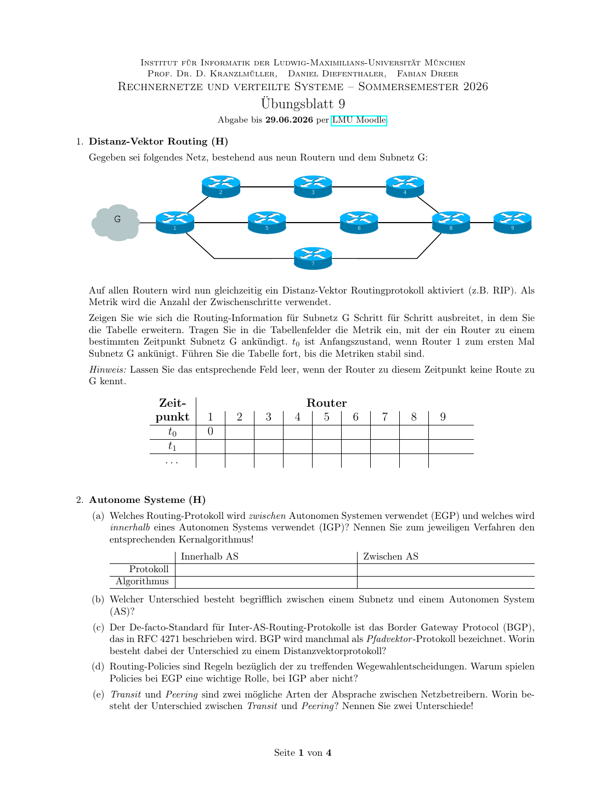

# Uebungsblatt 9 - 中德对照解答

## 1. Distanz-Vektor Routing / 距离向量路由



**DE Aufgabenidee:** Subnetz G ist an Router 1 angeschlossen. Die Routinginformation breitet sich hopweise aus.

**中文题意：** 从路由器 1 开始，按 RIP/距离向量方式逐轮传播到子网 G 的距离。

**DE:** Topologie aus der Abbildung: `1-2-3-4-8-9`, `1-5-6-8`, `1-7-8`, und `1-G`.

**中文：** 图中的拓扑可以读成三条从 1 到 8 的路径以及 8 到 9：上路 `1-2-3-4-8-9`，中路 `1-5-6-8`，下路 `1-7-8`，并且子网 G 直接连在路由器 1 上。

| Zeitpunkt | R1 | R2 | R3 | R4 | R5 | R6 | R7 | R8 | R9 |
|---|---:|---:|---:|---:|---:|---:|---:|---:|---:|
| t0 | 0 |  |  |  |  |  |  |  |  |
| t1 | 0 | 1 |  |  | 1 |  | 1 |  |  |
| t2 | 0 | 1 | 2 |  | 1 | 2 | 1 | 2 |  |
| t3 | 0 | 1 | 2 | 3 | 1 | 2 | 1 | 2 | 3 |

**DE:** Danach ist die Tabelle stabil.

**中文：** 到 `t3` 时所有路由器都已经得到到 G 的最短 hop 距离，之后表不再变化。

**Wissen / 知识点：** 距离向量协议每轮只从邻居学习；距离以 hop 数逐步增加，因此信息以“波纹”方式传播。

## 2. Autonome Systeme / 自治系统

| | Innerhalb AS | Zwischen AS |
|---|---|---|
| Protokoll | RIP, OSPF, IS-IS | BGP |
| Algorithmus | Distanzvektor oder Link-State/SPF | Pfadvektor |

**(b)**  
**DE:** Ein Subnetz ist ein adressierbarer IP-Adressbereich. Ein autonomes System ist eine administrativ zusammenhaengende Menge von Netzen und Routern unter gemeinsamer Routing-Policy.

**中文：** 子网是一个可以用 IP 前缀表示的地址范围；自治系统 AS 是由同一组织管理、采用共同路由策略的一组网络和路由器。一个 AS 可以包含很多子网。

**(c)**  
**DE:** Beim Distanzvektor wird hauptsaechlich Distanz/Metrik zum Ziel ausgetauscht. Beim Pfadvektor enthaelt die Route den AS-Pfad, also die Folge autonomer Systeme. Dadurch koennen Schleifen erkannt und Policies angewendet werden.

**中文：** 距离向量主要通告“到目标的距离/度量”；路径向量会携带完整或部分 AS 路径，也就是经过哪些自治系统。这样可以检测环路，也便于按商业或管理策略选择路径。

**(d)**  
**DE:** EGP muss wirtschaftliche, rechtliche und organisatorische Beziehungen beachten. IGP arbeitet innerhalb einer Organisation und optimiert meist technische Metriken.

**中文：** EGP 运行在不同组织之间，必须考虑商业关系、合同、政策和法律要求；IGP 在同一个组织内部运行，通常主要优化技术指标，例如跳数、代价或延迟。

**(e)**  
**DE:** Transit bedeutet, dass ein Anbieter Verkehr zu fremden Zielen weiterleitet, oft bezahlt und mit globaler Erreichbarkeit. Peering bedeutet, dass zwei Netze Verkehr fuer ihre eigenen Kunden austauschen, oft gegenseitig und ohne Transit fuer Dritte.

**中文：** Transit 是一个网络付费让另一个网络帮它到达更广泛的互联网；Peering 是两个网络相互交换彼此客户的流量。区别包括是否付费、是否提供第三方转发、覆盖范围是否全球。

## 3. Wegewahl mit IPv6 / IPv6 路由选择


**DE:** Gegeben sind Kundennetze:

**中文：** 图中已经给出四个客户子网：

| Subnetz | Praefix |
|---|---|
| 1 | `2001:1337:e15b:ac14::/64` |
| 2 | `2001:1337:dead:beef::/64` |
| 3 | `2001:1337:e7:67::/64` |
| 4 | `2001:1337:c01d:bee2::/64` |

**(a) Sinnvolle Linknetze aus `2001:1337::/32` / 从 `2001:1337::/32` 中选取链路网段**

**中文说明：** 路由器之间的点到点/以太网链路也需要 IPv6 前缀。题目没有指定这些前缀，因此只要从 ISP 的 `/32` 地址块里选取不冲突、结构清晰的 `/64` 即可。

| Link | Praefix |
|---|---|
| Internet-D | `2001:1337:0:fffe::/64` |
| D-A | `2001:1337:0:da::/64` |
| A-B | `2001:1337:0:ab::/64` |
| B-C | `2001:1337:0:bc::/64` |

**(b) Beispiele fuer Router C / Router C 地址示例**

**中文说明：** Router C 同时连接客户子网 4 和 B-C 链路，因此它在不同接口上可以有不同 IPv6 地址。作为子网 4 的默认网关时使用子网 4 的地址；和 B 通信时使用 B-C 链路上的地址。

| Zweck | Adresse |
|---|---|
| Default-Gateway in Subnetz 4 | `2001:1337:c01d:bee2::1` |
| Zieladresse, wenn C an B auf dem Link B-C sendet | z.B. B: `2001:1337:0:bc::1` |
| Absenderadresse von C auf Link B-C | `2001:1337:0:bc::2` |

**(c) Adressen fuer Router B / Router B 的地址**

**中文说明：** Router B 连接 A-B、B-C 和客户子网 3，所以需要在三个接口上分别配置地址。

| Interface | Adresse |
|---|---|
| zu A | `2001:1337:0:ab::2/64` |
| zu C | `2001:1337:0:bc::1/64` |
| Subnetz 3 | `2001:1337:e7:67::1/64` |

**(d) Routingtabelle Router B / Router B 路由表**

**中文说明：** 直接相连的网络下一跳写“direkt”；左侧客户网和互联网方向走 A；右侧客户网走 C；其他所有未知目标用默认路由 `::/0` 指向互联网方向。

| Ziel | Gateway | Interface |
|---|---|---|
| `2001:1337:0:ab::/64` | direkt | zu A |
| `2001:1337:0:bc::/64` | direkt | zu C |
| `2001:1337:e7:67::/64` | direkt | Subnetz 3 |
| `2001:1337:c01d:bee2::/64` | `2001:1337:0:bc::2` | zu C |
| `2001:1337:dead:beef::/64` | `2001:1337:0:ab::1` | zu A |
| `2001:1337:e15b:ac14::/64` | `2001:1337:0:ab::1` | zu A |
| `::/0` | `2001:1337:0:ab::1` | Richtung Internet |

## 4. IPv6-Adressen / IPv6 地址

| Adresse | gueltig? | anderes Format |
|---|---|---|
| `fe80:0000:0000:0000:0250:56ff:fe03:0001` | ja | `fe80::250:56ff:fe03:1` |
| `::1` | ja | `0000:0000:0000:0000:0000:0000:0000:0001` |
| `545f:75aa:20a0:4cd6:1733:9bde:c5:d57a` | ja | `545f:75aa:20a0:4cd6:1733:9bde:00c5:d57a` |
| `cbd7:1295:0x34:1da1:000c:0000:c068:c6b5` | nein | `0x34` ist keine IPv6-Hextet-Notation |
| `26e0:dfcc:1000:0001:704c:0000:8bd:5093` | ja | `26e0:dfcc:1000:1:704c:0:8bd:5093` |
| `cbd7::c5::1` | nein | `::` darf nur einmal vorkommen |

## 5. Fragmentierung / IPv4 与 IPv6 分片


**(a)**  
**DE:** IPv4-Header `20 B`, erster Link MTU `1500 B`: maximale IPv4-Nutzdaten pro Paket `1480 B`.

**中文：** IPv4 首部按 20 B 计算，第一段链路 MTU 为 1500 B，所以一个 IPv4 包最多携带 `1500 - 20 = 1480 B` 的 IPv4 负载。

**(b)**  
**DE:** Auf dem letzten Link ist MTU `500 B`; IPv4-Nutzdaten pro Fragment maximal `floor((500-20)/8)*8 = 480 B`. Ein `1480 B`-Paket wird zu `480+480+480+40`. Bis mindestens `5000 B` Nutzdaten bei hella angekommen sind: 3 volle Originalpakete `= 4440 B` plus 2 Fragmente des 4. Pakets `= 960 B`, also mindestens `14` Fragmente.

**中文：** 最后一段链路 MTU 为 500 B，扣掉 20 B IPv4 首部，还剩 480 B；IPv4 分片偏移必须按 8 B 对齐，480 正好满足。一个 1480 B 的原始 IPv4 负载会分成 `480+480+480+40` 四片。收到 3 个完整原始包是 `3*1480=4440 B`，还不到 5000 B；第四个原始包再收到两个 480 B 分片后达到 5400 B，因此最少收到 `3*4+2=14` 个分片。

**(c)** Fuer 8000 B IPv4-Nutzdaten sendet hugo `5 * 1480 B + 600 B`. Hella empfaengt:

| Originalpaket | Fragment-Nutzdaten | IP-Laenge | Offset | MF |
|---:|---:|---:|---:|---|
| je 1-5 | 480 | 500 | 0 | 1 |
| je 1-5 | 480 | 500 | 60 | 1 |
| je 1-5 | 480 | 500 | 120 | 1 |
| je 1-5 | 40 | 60 | 180 | 0 |
| 6 | 480 | 500 | 0 | 1 |
| 6 | 120 | 140 | 60 | 0 |

Insgesamt `22` IPv4-Fragmente.

**(d) IPv6 / IPv6 情况**

**DE:** Router fragmentieren bei IPv6 nicht. hugo erhaelt zuerst `Packet Too Big` mit MTU 600, danach bei erneut zu grossem Paket noch eine Meldung mit MTU 500. Danach fragmentiert die Quelle selbst.

**中文：** IPv6 中间路由器不负责分片。如果包太大，路由器会丢弃并返回 ICMPv6 `Packet Too Big`。hugo 先会收到 MTU 600 的提示，如果之后仍超过下一段 500 MTU，还会收到 MTU 500 的提示。之后源主机根据路径 MTU 自己分片。

IPv6 Header `40 B`, Fragment Extension Header `8 B`, maximale Fragment-Nutzdaten:

```text
floor((500 - 40 - 8)/8)*8 = 448 B
```

Fuer `8000 B`: `17 * 448 B + 384 B`, also 18 Fragmente. Laenge der ersten 17 IPv6-Pakete: `40+8+448 = 496 B`; letztes: `40+8+384 = 432 B`.

## 6. Count to Infinity


**DE:** Ausgang: Distanzen zu Subnetz A: A=0, B=1, C=2, D=3. Nach Ausfall A-B und ohne Gegenmassnahme lernen B, C, D gegenseitig immer groessere scheinbare Distanzen.

**中文：** 初始时到子网 A 的距离是 A=0，B=1，C=2，D=3。A-B 断开后，如果没有额外机制，B、C、D 会互相误以为对方还有通往 A 的路，于是距离逐步增大，形成 Count-to-Infinity。

| Runde | B | C | D |
|---:|---:|---:|---:|
| 0 | 1 | 2 | 3 |
| 1 | 3 | 2 | 3 |
| 2 | 3 | 4 | 3 |
| 3 | 5 | 4 | 5 |
| 4 | 5 | 6 | 5 |
| ... | ... | ... | ... |
| bis >15 | unerreichbar | unerreichbar | unerreichbar |

**DE:** Mit Split Horizon annonciert ein Router eine Route nicht an den Nachbarn, von dem er sie gelernt hat. Dadurch wird die Schleife B-C-D deutlich schneller gebrochen.

**中文：** 使用 Split Horizon 时，路由器不会把从某个邻居学来的路由再通告回这个邻居。这样可以避免“你从我这里学到路，再告诉我你有路”的循环，明显缓解 Count-to-Infinity。

**Wissen / 知识点：** Count-to-Infinity 是距离向量协议的经典问题；Split Horizon、Poison Reverse、Hold-down Timer 都是缓解手段。
