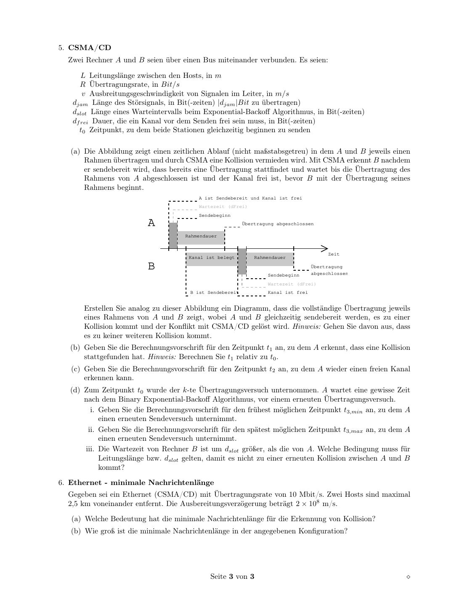

# Uebungsblatt 10 - 中德对照解答

## 1. Zusammenspiel von IPv4 und ARP / IPv4 与 ARP


**(a)(b) Beispielhafte IP- und MAC-Vergabe / IP 与 MAC 分配示例**

**DE:** Die folgende Vergabe ist nur ein konsistentes Beispiel; andere eindeutige Hostadressen und MAC-Adressen waeren ebenfalls korrekt.

**中文：** 下表只是一个一致的分配示例。只要每个接口在对应子网内有合法且不冲突的 IP，每个接口 MAC 唯一，其他分配也可以。

| Interface | IP | MAC |
|---|---|---|
| Host A | `192.168.1.101/24` | `00:00:00:00:01:0A` |
| Host B | `192.168.1.102/24` | `00:00:00:00:01:0B` |
| Router R1 links | `192.168.1.1/24` | `00:00:00:00:01:01` |
| Router R1 mitte | `192.168.2.1/24` | `00:00:00:00:02:01` |
| Host C | `192.168.2.101/24` | `00:00:00:00:02:0C` |
| Host D | `192.168.2.102/24` | `00:00:00:00:02:0D` |
| Router R2 mitte | `192.168.2.2/24` | `00:00:00:00:02:02` |
| Router R2 rechts | `192.168.3.1/24` | `00:00:00:00:03:01` |
| Host E | `192.168.3.101/24` | `00:00:00:00:03:0E` |
| Host F | `192.168.3.102/24` | `00:00:00:00:03:0F` |

**(c) Paket von E nach B, ARP bekannt / ARP 已知时从 E 到 B**

**DE:** IP-Quelle und IP-Ziel bleiben Ende-zu-Ende gleich.

**中文：** IP 源地址和目的地址表示端到端通信，因此从 E 到 B 的整个过程中保持不变：

```text
Src-IP = 192.168.3.101
Dst-IP = 192.168.1.102
```

**DE:** Nur die MAC-Adressen wechseln je Hop.

**中文：** MAC 地址只在当前链路内有效，所以每经过一跳都会换成“当前发送接口 MAC”和“下一跳接口 MAC”：

| Hop | Src-MAC | Dst-MAC |
|---|---|---|
| E -> R2 rechts | `00:...:03:0E` | `00:...:03:01` |
| R2 mitte -> R1 mitte | `00:...:02:02` | `00:...:02:01` |
| R1 links -> B | `00:...:01:01` | `00:...:01:0B` |

**(d) ARP-Tabelle bei E leer / E 的 ARP 表为空**

**DE:** E erkennt: B liegt nicht im eigenen `/24`, also muss das Paket an Default-Gateway `192.168.3.1`. E sendet ARP-Broadcast:

**中文：** E 发现 B 的 IP 不在自己的 `192.168.3.0/24` 子网内，因此不能直接发给 B，而要先发给默认网关 `192.168.3.1`。由于 E 的 ARP 表为空，它先广播询问网关的 MAC：

```text
Who has 192.168.3.1? Tell 192.168.3.101
```

**DE:** R2 antwortet mit MAC `00:...:03:01`. Danach laeuft die Uebertragung wie in (c). Falls Router-ARP-Tabellen ebenfalls leer waeren, wuerden R2 und R1 auf ihren jeweiligen Ausgangsnetzen ebenfalls ARP-Anfragen stellen.

**中文：** R2 回复自己的右侧接口 MAC `00:...:03:01`。之后 E 就能把 IP 包封装进以太网帧发给 R2。若路由器的 ARP 表也为空，R2、R1 在各自下一跳链路上也要先 ARP 查询。

## 2. Hub oder Switch? / 如何区分 Hub 和 Switch

**(a)**  
**DE:** Aufbau: drei Rechner A, B, C an das unbekannte Geraet. Starte Wireshark auf C. Lasse A B anpingen. Bei einem Hub sieht C die Unicast-Frames zwischen A und B, weil alles an alle Ports wiederholt wird. Bei einem Switch sieht C nach dem Lernen der MAC-Adressen diese Unicast-Frames nicht.

**中文：** 实验搭建：三台电脑 A、B、C 接到未知设备上，在 C 上打开 Wireshark，让 A ping B。如果设备是 Hub，它会把帧复制到所有端口，所以 C 能看到 A 和 B 之间的单播帧。如果是 Switch，学习到 MAC 表后只会把单播帧转发到目标端口，C 看不到这些单播帧。

**(b)**  
**DE:** Forwarding-Table-Aging: A pingt B, damit der Switch `MAC_A -> Port_A` lernt. Dann A schweigen lassen. C sendet in steigenden Zeitabstaenden ein Frame an MAC_A. Solange der Eintrag existiert, wird nur an A-Port weitergeleitet; ist er geloescht, floodet der Switch. Durch binaere Suche ueber die Wartezeit bestimmt man den Aging Timeout effizient.

**中文：** 测转发表老化时间：先让 A ping B，使交换机学习 `MAC_A -> A端口`。然后让 A 静默。C 隔不同等待时间后向 `MAC_A` 发送帧。如果表项还在，交换机只转发到 A 端口；如果表项已过期，交换机会泛洪，B 的抓包器就能看到。用二分法调整等待时间，可以高效逼近老化时间。

## 3. Fehlererkennung und -korrektur / 差错检测与纠正

**(a) ASCII / ASCII 编码**

**中文说明：** 题目 (a) 要求用 7-bit ASCII；题目 (d) 的 Internet checksum 提示需要每个字符补成 8 bit，所以表中同时列出 7-bit 和 8-bit。

| Zeichen | 7-bit ASCII | 8-bit ASCII |
|---|---|---|
| R | `1010010` | `01010010` |
| N | `1001110` | `01001110` |
| V | `1010110` | `01010110` |
| S | `1010011` | `01010011` |

**(b) Hamming-Distanzen, 7-bit / 7 位码字的汉明距离**

**中文说明：** 汉明距离就是两个等长比特串中不同位置的个数。例如 R=`1010010`，V=`1010110`，只有一个位置不同，所以距离为 1。

| Paar | Distanz |
|---|---:|
| R-N | 3 |
| R-V | 1 |
| R-S | 1 |
| N-V | 2 |
| N-S | 4 |
| V-S | 2 |

**(c) Paritaetsmatrix mit gerader Paritaet**

| Zeichen | Bits | Zeilenparitaet |
|---|---|---:|
| R | `1010010` | 1 |
| N | `1001110` | 0 |
| V | `1010110` | 0 |
| S | `1010011` | 0 |
| Spaltenparitaet | `0011001` | 1 |

**DE:** Ein 1-Bit-Fehler erzeugt genau eine falsche Zeile und eine falsche Spalte; der Schnittpunkt ist korrigierbar. Ein 2-Bit-Fehler erzeugt meist mehrere Paritaetsverletzungen und ist erkennbar, aber nicht eindeutig korrigierbar. Nicht erkannt werden koennen bestimmte Muster mit gerader Fehlerzahl pro betroffener Zeile und Spalte, z.B. vier Ecken eines Rechtecks.

**中文：** 单比特错误会导致恰好一行和一列的奇偶校验错误，交点就是出错位置，因此可以纠正。两个比特错误通常能检测出来，但无法唯一定位。若错误模式让每个受影响行和列都有偶数个错误，例如矩形四个角同时翻转，则可能检测不出来。

**(d) Internet-Checksumme, 8-bit ASCII / Internet 校验和**

**中文说明：** Internet checksum 使用 16-bit 字相加后取反。`RNVS` 用 8-bit ASCII 分成两个 16-bit 字：`RN` 和 `VS`。

16-bit-Worte:

```text
RN = 01010010 01001110 = 0x524E
VS = 01010110 01010011 = 0x5653
Summe = 0xA8A1
Checksumme = Einerkomplement = 0x575E
```

**DE:** Der Empfaenger addiert Datenworte plus Checksumme:

**中文：** 接收端把两个数据字和校验和一起按一补码加法相加：

```text
0x524E + 0x5653 + 0x575E = 0xFFFF
```

**DE:** Damit ist die Nachricht nach der Internet-Checksumme korrekt.

**中文：** 结果为全 1，即 `0xFFFF`，说明按 Internet checksum 检查时消息正确。

**(e) CRC mit G = x^16 + x^14 + x^11 + x^7 + x^6 + x^5 + 1**

**DE:** Generatorbits:

**中文：** 生成多项式对应的二进制除数为：

```text
10100100011100001
```

**DE:** Ueber `RNVS` in 7-bit ASCII (`1010010100111010101101010011`) ergibt die Division modulo 2 den Rest:

**中文：** 对 7-bit ASCII 的 `RNVS` 比特串 `1010010100111010101101010011` 进行模 2 除法，得到 16 位 CRC 余数：

```text
0100100100011011 = 0x491B
```

## 4. CRC

**(a i)**  
**DE:** `G = x^3 + 1` hat Grad 3 und wird durch 4 Bits dargestellt:

**中文：** `G = x^3 + 1` 的最高次数是 3，所以对应 4 位二进制多项式：

```text
1001
```

**(a ii)**  
**DE:** An die Nachricht `110011` werden drei Nullen angehaengt und dann wird durch `1001` geteilt. Rest:

**中文：** 原消息是 `110011`，因为生成多项式次数为 3，所以先在末尾补 3 个 0，再用 `1001` 做模 2 除法。余数为：

```text
101
```

**DE:** Zu uebertragende Bitfolge:

**中文：** 最终发送的比特串是原消息加 CRC 余数：

```text
110011101
```

**(a iii)**  
**DE:** Die empfangene Folge `10011001` geteilt durch `1001` ergibt Rest `000`; daran sieht man die Korrektheit.

**中文：** 接收到的 `10011001` 用同一个生成多项式 `1001` 去除，如果余数为 `000`，说明 CRC 检查通过。

## 5. CSMA/CD



**(a)**  
**DE:** A und B starten gleichzeitig, die Signale laufen aufeinander zu, eine Kollision entsteht. Jede Station erkennt die Kollision, sobald das fremde Signal ankommt, sendet ein Jam-Signal, wartet Interframe Gap und Binary Exponential Backoff, danach sendet der Gewinner erneut.

**中文：** A 和 B 同时开始发送，两个信号在总线上相向传播并发生冲突。每个站点在收到对方信号时检测到碰撞，然后发送 jam 信号，等待帧间隔和二进制指数退避时间。退避结束后，等待时间较短的一方先重新发送。

**(b)**  
**DE:** A erkennt die Kollision nach der Ausbreitungszeit von B nach A:

**中文：** A 检测到碰撞需要等 B 的信号传播到 A，因此相对 `t0` 的时间为：

```text
t1 - t0 = L / v
```

**(c)**  
**DE:** A sieht den Kanal sicher wieder frei, wenn auch das letzte Jam-Bit von B angekommen ist:

**中文：** A 要确认信道重新空闲，至少要等对方的碰撞/干扰信号也传播回来。因此包含往返传播时间和 jam 信号持续时间：

```text
t2 - t0 = 2L/v + d_jam/R
```

**(d)**  
**DE:** Beim k-ten Versuch waehlt A `K` aus `0 ... 2^k-1` (praktisch begrenzt). Mit Warteintervall `d_slot`:

**中文：** 第 k 次发送尝试失败后，A 按二进制指数退避从 `0 ... 2^k-1` 中选择一个随机等待槽数。最早情况是选 0，最晚情况是选最大值：

```text
t3,min = t2 + d_frei/R
t3,max = t2 + d_frei/R + (2^k - 1) * d_slot/R
```

**DE:** Wenn B genau ein Slotintervall laenger wartet, muss A's erneuter Sendebeginn bei B ankommen, bevor B sendet. Bedingung:

**中文：** 如果 B 比 A 多等一个 slot，为了避免再次碰撞，A 的重新发送信号必须在 B 开始发送前传播到 B。因此 slot 时间至少要覆盖往返传播延迟：

```text
d_slot/R >= 2L/v
```

also in Bitzeiten:

```text
d_slot >= 2LR/v
```

## 6. Ethernet - minimale Nachrichtenlaenge

**(a)**  
**DE:** Die minimale Rahmenlaenge stellt sicher, dass ein Sender noch sendet, wenn eine Kollision vom entferntesten Punkt zurueckwirkt. Sonst koennte er eine Kollision nicht erkennen.

**中文：** 最小帧长的意义是：即使碰撞发生在最远端，碰撞信号返回发送端时，发送端仍然还在发送。否则发送端已经发完帧，就无法检测到碰撞。

**(b)**  
**DE:** Abstand `2.5 km`, Ausbreitung `2*10^8 m/s`:

**中文：** 最大距离是 `2.5 km = 2500 m`，信号传播速度是 `2*10^8 m/s`：

```text
tau = 2500 / (2*10^8) = 12.5 us
2tau = 25 us
R * 2tau = 10 Mbit/s * 25 us = 250 bit
```

**DE:** Theoretisches Minimum dieser Konfiguration: `250 bit`, also `31.25 B`, praktisch auf mindestens 32 Byte aufzurunden. Klassisches Ethernet verwendet 64 Byte Mindestframegroesse.

**中文：** 所以这个给定配置下的理论最小长度是 `250 bit = 31.25 B`，实际至少向上取整到 32 B。经典以太网标准使用 64 B 最小帧长，留有更保守的碰撞检测余量。

**Wissen / 知识点：** ARP 解析的是“下一跳”的 MAC，不是最终目标的 MAC；IP 地址端到端基本不变，MAC 地址每一跳都会换。
