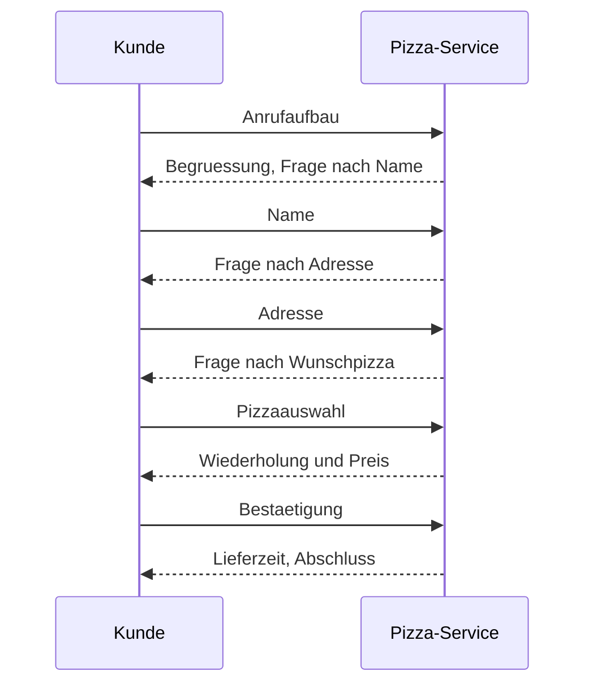
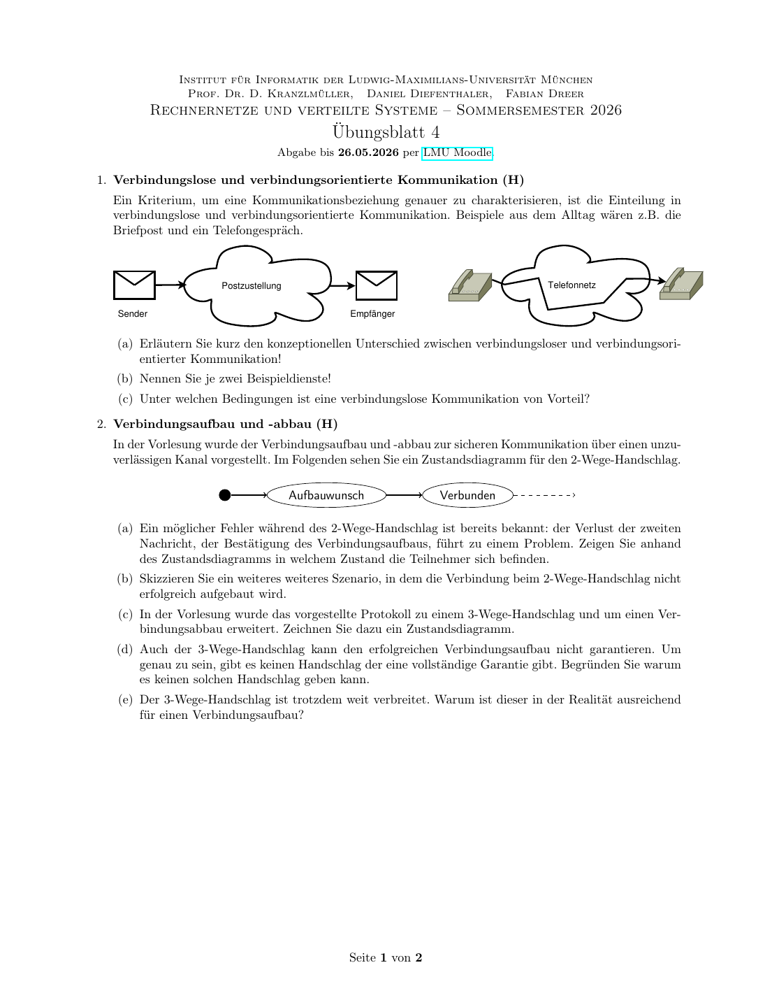
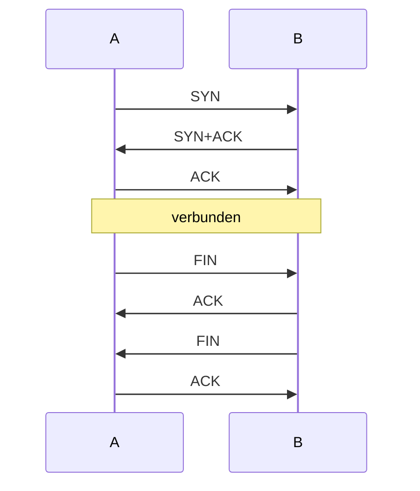

# 基础、协议与分布式系统

## 知识点总结

- 协议规定消息格式、顺序、语义和错误处理。
- 分布式系统关注多个节点协同以及通信不可靠带来的状态一致性问题。
- 无连接通信每个包独立发送；面向连接通信先建立逻辑状态。

## 完整题目与解答汇总

### 题目 1: 1. Grundlagen (H)

**类型：** 作业  

**来源说明：** Uebungsblatt 01, Aufgabe 1  


#### 题目中文翻译 / 中文题意

用两位古代学者通过信鸽远程下棋的例子，说明分布式系统中消息丢失、重复、延迟、乱序或损坏会带来的问题，并提出避免方法。

#### 德文原题

```text
1. Grundlagen (H)
Zwei Gelehrte der Antike spielen gerne Schach miteinander. Weil sie nicht in der selben Stadt wohnen,
teilen sie einander die Spielzüge über Brieftauben mit. Gegenüber dem Spiel an einem gemeinsamen
Spielbrett ergeben sich ähnliche Herausforderungen, wie in verteilten Systemen.
(a) Nennen Sie fünf Probleme (z.B. plausible Vorfälle, oder Wissenslücken), die einen reibungslosen
Spielverlauf stören können! Nennen Sie auch ihre Folge.
(b) Geben Sie für jeden der Störfälle einen Vorschlag zu seiner Vermeidung an!
```

#### 解答

**1. Grundlagen / 分布式系统基础**

**DE Aufgabenidee:** Zwei Gelehrte spielen Schach per Brieftauben. Gesucht sind Stoerfaelle und Gegenmassnahmen.

**中文题意：** 用“信鸽下棋”类比分布式系统通信，列出问题、后果和避免方法。

**中文解题思路：** 这道题不是要谈真实的鸽子，而是要把“远程下棋”抽象成两个分布式节点通过不可靠信道交换消息。只要消息可能丢失、延迟、重复、乱序或损坏，就会出现和分布式系统类似的问题。

| Stoerfall / 问题 | Folge / 后果 | Vermeidung / 缓解 |
|---|---|---|
| Brief geht verloren / 消息丢失 | Zug kommt nie an / 对方不知道走法 | Quittung, Timeout, erneutes Senden / ACK、超时重传 |
| Brief kommt doppelt an / 重复消息 | Zug wird evtl. zweimal ausgefuehrt / 可能重复执行 | Sequenznummern / 序列号 |
| Briefe kommen vertauscht an / 乱序 | falsche Spielstellung / 状态错误 | Nummerierte Zuege, nur erwartete Nummer akzeptieren / 按序号接收 |
| Brief wird verfaelscht / 内容损坏 | falscher Zug / 错误执行 | Pruefsumme, Signatur, Plausibilitaetscheck / 校验和或签名 |
| Sehr lange Laufzeit / 延迟大 | beide warten, unklarer Zustand / 双方等待 | Fristen, Statusanfragen, erneute Synchronisation / 超时与状态同步 |

**Wissen / 知识点：** 分布式系统的核心困难是“不共享内存、不共享时钟、通信不可靠”。因此协议需要确认、重传、编号、校验和状态同步。

**备注：** 本题归入本知识点；题目中文翻译/题意、德文原题、解答和来源已保留。


---

### 题目 2: 1. Der Pizzadienst (H)

**类型：** 作业  

**来源说明：** Uebungsblatt 02, Aufgabe 1  


#### 题目中文翻译 / 中文题意

用电话订披萨设计一个协议：画订餐顺序图，加入底层配送服务，区分控制数据和有效载荷，并讨论改用 Messenger 时分层如何变化。

#### 德文原题

```text
1. Der Pizzadienst (H)
Ein Protokoll ist eine Spezifikation von Vorschriften zum Informationsaustausch.
Beschreiben Sie im Folgenden ein Protokoll zur Bestellung einer Pizza (Pizzaprotokoll), beim Pizza-
Service Ihres Vertrauens! Indem Sie auf die Technologie „Telefon” zurückgreifen, haben Sie eine Möglich-
keit gefunden Nachrichten mit Ihrem Pizza-Service auszutauschen.
Pizza Protokoll Pizza Protokoll
Telefonnetz
(a) Ohne ein Bestellprotokoll herrscht Stille im Hörer. Damit Ihre Bestellung erfolgreich abgeschlossen
werden kann, müssen Sie dem Pizza-Service Ihren Namen, Ihre Adresse und Ihre Wunschpizza
mitteilen.
Zeichnen Sie ein Sequenzdiagramm, das einen vollständigen Bestellvorgang am Telefon darstellt!
Beachten Sie dabei:
• Markieren Sie das Ende jeder Phase der Kommunikation!
• Der Kunde übermittelt bestimmte Informationen genau dann, wenn er danach gefragt wird!
(b) Leider kommt die Pizza nicht durch die Telefonleitung. Erweitern Sie das Modell um einen zugrunde
liegenden Dienst, mit dem der Lieferprozess realisiert wird. Berücksichtigen Sie hierbei das aus der
Vorlesung bekannte Prinzip der Schichtung.
(c) In der Vorlesung wurde die Unterscheidung in Steuerdaten und Nutzdaten diskutiert. Finden Sie
hierzu Beispiele im Pizza-Service-Modell.
(d) Wie wirkt es sich auf die anderen Schichten aus, wenn Sie über einen Messengerdienst wie Signal
oder WhatsApp statt einem Telefonanruf bestellen? Erläutern Sie außerdem kurz, inwiefern die
Schichtentrennung hiervon betroffen ist.
```

#### 解答

**1. Der Pizzadienst / 披萨协议**


**DE Aufgabenidee:** Ein Protokoll fuer eine Pizza-Bestellung per Telefon beschreiben und auf Schichtung, Steuerdaten/Nutzdaten und Messenger-Alternativen beziehen.

**中文题意：** 用电话订披萨类比通信协议、分层、控制数据和有效载荷。

**(a) Sequenzdiagramm / 顺序图**



**DE:** Jede Phase endet mit einer Rueckfrage, Bestaetigung oder dem Abschluss. Der Kunde sendet die Informationen erst dann, wenn danach gefragt wird.

**中文：** 每一阶段以确认、下一问题或结束语收尾；客户只在被询问时发送相应信息。这体现了协议的“状态”和“消息顺序”。

**(b) Schichtung / 分层**

| Schicht | Pizza-Modell | 网络类比 |
|---|---|---|
| Anwendung | Bestellung, Name, Adresse, Pizza | 应用协议 |
| Kommunikationsdienst | Telefon oder Messenger | 传输/会话服务 |
| Lieferdienst | Kurier bringt Pizza | 底层承载服务 |
| Infrastruktur | Telefonnetz, Strassen | 网络基础设施 |

**(c) Steuerdaten und Nutzdaten / 控制数据与有效载荷**

Nutzdaten: gewünschte Pizza, Adresse, Name.  
Steuerdaten: Begruessung, Fragen, Wiederholung, Preis, Lieferzeit, Bestaetigung, Gespraechsende.

中文：真正想传达的业务内容是“谁、送到哪里、要什么披萨”；为了让流程可靠进行的询问、确认、结束语等是控制信息。

**(d) Messenger statt Telefon / 用即时通信代替电话**

**DE:** Die Semantik der Bestellung bleibt gleich, aber der darunterliegende Dienst wechselt von synchroner Sprache zu asynchronen Nachrichten. Nachrichten koennen spaeter gelesen werden, Lesebestaetigungen haben und Medien enthalten. Die Schichtentrennung bleibt erhalten, solange die Anwendung nur den Dienst "Nachrichten austauschen" benutzt.

**中文：** 订披萨这层语义不变，但底层服务从同步电话变成异步消息。消息可能延迟、可能有已读回执，也可以包含图片或菜单链接。分层思想仍然成立：只要上层看到的是“可以交换消息”的服务，上层披萨协议不需要关心底层是电话、Signal 还是 WhatsApp。

**备注：** 本题归入本知识点；题目中文翻译/题意、德文原题、解答和来源已保留。


---

### 题目 3: 2. Rechnernetze und verteilte Systeme (H)

**类型：** 作业  

**来源说明：** Uebungsblatt 02, Aufgabe 2  


#### 题目中文翻译 / 中文题意

判断给定系统是计算机网络还是分布式系统，并说明理由，例如 MWN、Messenger、WWW、SuperMUC-NG 等。

#### 德文原题

```text
2. Rechnernetze und verteilte Systeme (H)
In der Vorlesung haben wir die Begriffe Rechnernetz und verteiltes System kennen gelernt. Ein Rechner-
netz ist immer die Voraussetzung für ein verteiltes System.
Ordnen Sie die folgenden Systeme als Rechnernetz oder als verteiltes System ein. Begründen Sie ihre
Antwort kurz.
Hinweis: ein System kann – abhängig von der Sichtweise – durchaus sowohl ein Rechnernetz als auch
ein verteiltes System sein.
(a) Das MWN (Münchner Wissenschaftsnetz)
(b) Ein Messenger wie Signal, Threema oder WhatsApp
(c) Das World Wide Web
(d) Der SuperMUC-NG
(e) Ihr eigenes Beispiel
```

#### 解答

**2. Rechnernetze und verteilte Systeme / 计算机网络与分布式系统**

| System | Einordnung | Begruendung |
|---|---|---|
| MWN | Rechnernetz | 提供连接与转发，是通信基础设施 |
| Messenger | Verteiltes System, nutzt Rechnernetz | 多服务器/客户端协作提供统一消息服务 |
| World Wide Web | beides | 基于互联网连接，同时由浏览器、服务器、DNS、CDN 等组成分布式系统 |
| SuperMUC-NG | Verteiltes System, intern auch Netz | 多节点并行计算，对用户表现为一台高性能系统 |
| Beispiel: Cloud-Speicher | Verteiltes System | 多副本、多服务器提供文件服务 |

**Wissen / 知识点：** Rechnernetz 强调“通信连接”；verteiltes System 强调“多个计算节点协作，对外提供统一服务”。

**备注：** 本题归入本知识点；题目中文翻译/题意、德文原题、解答和来源已保留。


---

### 题目 4: 1. Verbindungslose und verbindungsorientierte Kommunikation (H)

**类型：** 作业  

**来源说明：** Uebungsblatt 04, Aufgabe 1  


#### 题目中文翻译 / 中文题意

比较无连接通信和面向连接通信，给出例子，并说明无连接通信在哪些情况下有优势。

#### 德文原题

```text
1. Verbindungslose und verbindungsorientierte Kommunikation (H)
Ein Kriterium, um eine Kommunikationsbeziehung genauer zu charakterisieren, ist die Einteilung in
verbindungslose und verbindungsorientierte Kommunikation. Beispiele aus dem Alltag wären z.B. die
Briefpost und ein Telefongespräch.
Postzustellung Telefonnetz
Sender Empfänger
(a) Erläutern Sie kurz den konzeptionellen Unterschied zwischen verbindungsloser und verbindungsori-
entierter Kommunikation!
(b) Nennen Sie je zwei Beispieldienste!
(c) Unter welchen Bedingungen ist eine verbindungslose Kommunikation von Vorteil?
```

#### 解答

**1. Verbindungslose und verbindungsorientierte Kommunikation**



**中文题意：** 比较无连接通信和面向连接通信。

**(a)**  
**DE:** Verbindungsorientiert bedeutet, dass vor der Datenuebertragung ein logischer Zustand aufgebaut wird, z.B. bei einem Telefonat oder bei TCP. Danach koennen Sequenznummern, ACKs und ein geordneter Abbau genutzt werden. Verbindungslos bedeutet, dass jedes Paket einzeln adressiert und ohne vorherigen Verbindungsaufbau gesendet wird, z.B. bei Briefpost, IP oder UDP.

**中文：** 面向连接通信会先建立一个逻辑连接状态，例如电话或 TCP，之后可以使用序列号、确认和连接释放。无连接通信不预先建立连接，每个包都独立携带目的地址并被单独转发，例如信件、IP 或 UDP。

**(b) Beispiele**

| Art | Beispiele |
|---|---|
| verbindungsorientiert | TCP, Telefonat |
| verbindungslos | UDP, IP-Datagramm, Briefpost |

**(c)**  
**DE:** Verbindungslos ist vorteilhaft bei kurzen Nachrichten, geringer Latenz, vielen Empfaengern, tolerierbarem Verlust oder wenn die Anwendung selbst Zuverlaessigkeit regelt.

**中文：** 无连接通信适合短消息、低延迟、多接收者、能容忍丢包，或者应用层自己实现可靠性的场景。它省去了连接建立开销。

**备注：** 本题归入本知识点；题目中文翻译/题意、德文原题、解答和来源已保留。


---

### 题目 5: 2. Verbindungsaufbau und -abbau (H)

**类型：** 作业  

**来源说明：** Uebungsblatt 04, Aufgabe 2  


#### 题目中文翻译 / 中文题意

分析 2-way handshake 的失败场景，画 3-way handshake 与连接释放状态/时序图，并解释为什么任何有限握手都不能绝对保证成功。

#### 德文原题

```text
2. Verbindungsaufbau und -abbau (H)
In der Vorlesung wurde der Verbindungsaufbau und -abbau zur sicheren Kommunikation über einen unzu-
verlässigen Kanal vorgestellt. Im Folgenden sehen Sie ein Zustandsdiagramm für den 2-Wege-Handschlag.
Aufbauwunsch Verbunden
(a) Ein möglicher Fehler während des 2-Wege-Handschlag ist bereits bekannt: der Verlust der zweiten
Nachricht, der Bestätigung des Verbindungsaufbaus, führt zu einem Problem. Zeigen Sie anhand
des Zustandsdiagramms in welchem Zustand die Teilnehmer sich befinden.
(b) Skizzieren Sie ein weiteres weiteres Szenario, in dem die Verbindung beim 2-Wege-Handschlag nicht
erfolgreich aufgebaut wird.
(c) In der Vorlesung wurde das vorgestellte Protokoll zu einem 3-Wege-Handschlag und um einen Ver-
bindungsabbau erweitert. Zeichnen Sie dazu ein Zustandsdiagramm.
(d) Auch der 3-Wege-Handschlag kann den erfolgreichen Verbindungsaufbau nicht garantieren. Um
genau zu sein, gibt es keinen Handschlag der eine vollständige Garantie gibt. Begründen Sie warum
es keinen solchen Handschlag geben kann.
(e) Der 3-Wege-Handschlag ist trotzdem weit verbreitet. Warum ist dieser in der Realität ausreichend
für einen Verbindungsaufbau?
```

#### 解答

**2. Verbindungsaufbau und -abbau**

**(a)**  
**DE:** Beim 2-Wege-Handshake sendet A einen Aufbauwunsch, B bestaetigt. Geht Bs Bestaetigung verloren, ist B im Zustand "verbunden", A wartet weiter oder laeuft in einen Timeout. Es entsteht Zustandsinkonsistenz.

**中文：** 二次握手中 A 发送连接请求，B 回复确认。如果 B 的确认丢失，B 会认为连接已经建立，而 A 仍在等待确认或最终超时，因此双方状态不一致。

**(b)**  
**DE:** Ein weiteres Szenario ist der Verlust des Aufbauwunsches von A. Dann wartet A auf eine Bestaetigung, B weiss aber nichts vom Verbindungsaufbau. Auch ein altes Duplikat eines Aufbauwunsches kann bei B eine Scheinverbindung erzeugen.

**中文：** 另一个错误场景是 A 的连接请求丢失：A 等待 ACK，但 B 完全不知道这次连接。也可能是旧的重复连接请求到达 B，导致 B 误以为要建立新连接。

**(c) 3-Wege-Handshake und Abbau**



**(d)**  
**DE:** Keine endliche Folge von Nachrichten kann absolute Gewissheit garantieren, weil immer die letzte Bestaetigung verloren gehen koennte. Dann weiss der Sender der letzten Nachricht nicht sicher, ob der andere sie erhalten hat. Das ist das klassische Two-Generals-Problem.

**中文：** 任何有限次握手都无法提供绝对保证，因为最后一条确认消息仍然可能丢失。发送最后一条消息的一方永远无法确定对方是否收到了它。这就是经典的“两将军问题”。

**(e)**  
**DE:** In der Praxis reicht der 3-Wege-Handshake, weil Sequenznummern, Timeouts, Wiederholungen und die begrenzte Lebensdauer alter Pakete das Risiko stark begrenzen.

**中文：** 实践中三次握手足够好，因为序列号、超时、重传以及旧包生命周期限制可以把错误连接的概率降得很低。

**备注：** 本题归入本知识点；题目中文翻译/题意、德文原题、解答和来源已保留。


---

### 题目 6: Frage 3 / 第3题

**类型：** 考卷  

**来源说明：** Klausur 2017, Frage 3  


#### 题目中文翻译 / 中文题意

以下关于协议的哪些陈述是正确的？
IP提供面向连接的服务和路由功能。
DHCP为路由器和三层交换机的配置提供功能。
TCP作为具有错误检测和确认的面向连接协议，提供通过未知网络可靠传输数据的功能。
使用滑动窗口方法的传输协议可以通过单向连接高效传输大量数据。

#### 德文原题

```text
### Frage 3 / 第3题

**Welche der folgenden Aussagen über Protokolle sind wahr?**  
**以下关于协议的哪些陈述是正确的？**

- ○ IP stellt verbindungsorientierte Dienste und Routing-Fähigkeiten zur Verfügung.
    - IP提供面向连接的服务和路由功能。
- ○ DHCP stellt Funktionen für die Konfiguration von Routern und Layer 3-Switches zur Verfügung.
    - DHCP为路由器和三层交换机的配置提供功能。
- ☒ TCP als verbindungsorientiertes Protokoll mit Fehlererkennung und Quittungen stellt die zuverlässige Übertragung von Daten über unbekannte Netze zur Verfügung.
    - TCP作为具有错误检测和确认的面向连接协议，提供通过未知网络可靠传输数据的功能。
- ☒ Ein Transportprotokoll mit Sliding-Window-Verfahren stellt die effiziente Übertragung großer Datenmengen auch über unidirektionale Verbindungen zur Verfügung.
    - 使用滑动窗口方法的传输协议可以通过单向连接高效传输大量数据。
```

#### 解答

**参考答案 / Lösung:**

- ✗ 第一项错误：IP是无连接的协议
- ✗ 第二项错误：DHCP用于自动分配IP地址给终端设备，不是配置路由器
- ✓ 第三项正确：TCP确实是可靠的面向连接协议
- ✗ 第四项错误：滑动窗口能提高大量数据传输效率，但可靠的 Sliding Window 需要反向确认（ACK/NACK）通道；题干说“也能通过单向连接”是不正确的。

---

**备注：** 本题归入本知识点；题目中文翻译/题意、德文原题、解答和来源已保留。


---

### 题目 7: Frage 7 / 第7题

**类型：** 考卷  

**来源说明：** Klausur 2017, Frage 7  


#### 题目中文翻译 / 中文题意

面向连接的协议（带确认和顺序保证）有哪些要求和缺点？
信令数据造成开销。
数据块丢失的可能性更大。
数据块必须带有序列号。

#### 德文原题

```text
### Frage 7 / 第7题

**Welche Anforderungen und Nachteile ergeben sich bei einem verbindungsorientierten Protokoll mit Quittungen und Reihenfolgesicherung?**  
**面向连接的协议（带确认和顺序保证）有哪些要求和缺点？**

- ☒ Signalisierungsdaten verursachen Overhead.
    - 信令数据造成开销。
- ○ Der Verlust von Daten-Blöcken wird wahrscheinlicher.
    - 数据块丢失的可能性更大。
- ☒ Daten-Blöcke müssen mit einer Sequenznummer versehen werden.
    - 数据块必须带有序列号。
```

#### 解答

**参考答案 / Lösung:**

- ✓ 第一项正确：ACK、序列号等都是额外开销
- ✗ 第二项错误：可靠协议反而减少丢失（会重传）
- ✓ 第三项正确：需要序列号来保证顺序和检测丢失

---

**备注：** 本题归入本知识点；题目中文翻译/题意、德文原题、解答和来源已保留。


---

### 题目 8: Frage 2 / 第2题

**类型：** 考卷  

**来源说明：** Klausur 2018, Frage 2  


#### 题目中文翻译 / 中文题意

面向连接的服务总是具有以下哪些特性？
消息传递的最大时间是有保证的。
可以省略连接建立。
这些服务总是属于传输层。
在两个端点之间建立通信通道。

#### 德文原题

```text
### Frage 2 / 第2题

**Welche der folgenden Eigenschaften haben verbindungsorientierte Dienste immer?**  
**面向连接的服务总是具有以下哪些特性？**

- ○ Die maximale Zeit für die Zustellung einer Nachricht wird garantiert.
    - 消息传递的最大时间是有保证的。
- ○ Auf einen Verbindungsaufbau kann verzichtet werden.
    - 可以省略连接建立。
- ○ Die Dienste sind immer der Transportschicht zuzuordnen.
    - 这些服务总是属于传输层。
- ☒ Es wird ein Kommunikationskanal zwischen zwei Endpunkten eingerichtet.
    - 在两个端点之间建立通信通道。
```

#### 解答

**解析：**

- ✗ 第一项错误：面向连接不保证时间限制（那是实时服务的特性）
- ✗ 第二项错误：面向连接服务必须先建立连接
- ✗ 第三项错误：面向连接服务可以在多层存在（如ATM在第2层）
- ✓ 第四项正确：面向连接服务的核心特征就是建立通信通道

---

**备注：** 本题归入本知识点；题目中文翻译/题意、德文原题、解答和来源已保留。


---
