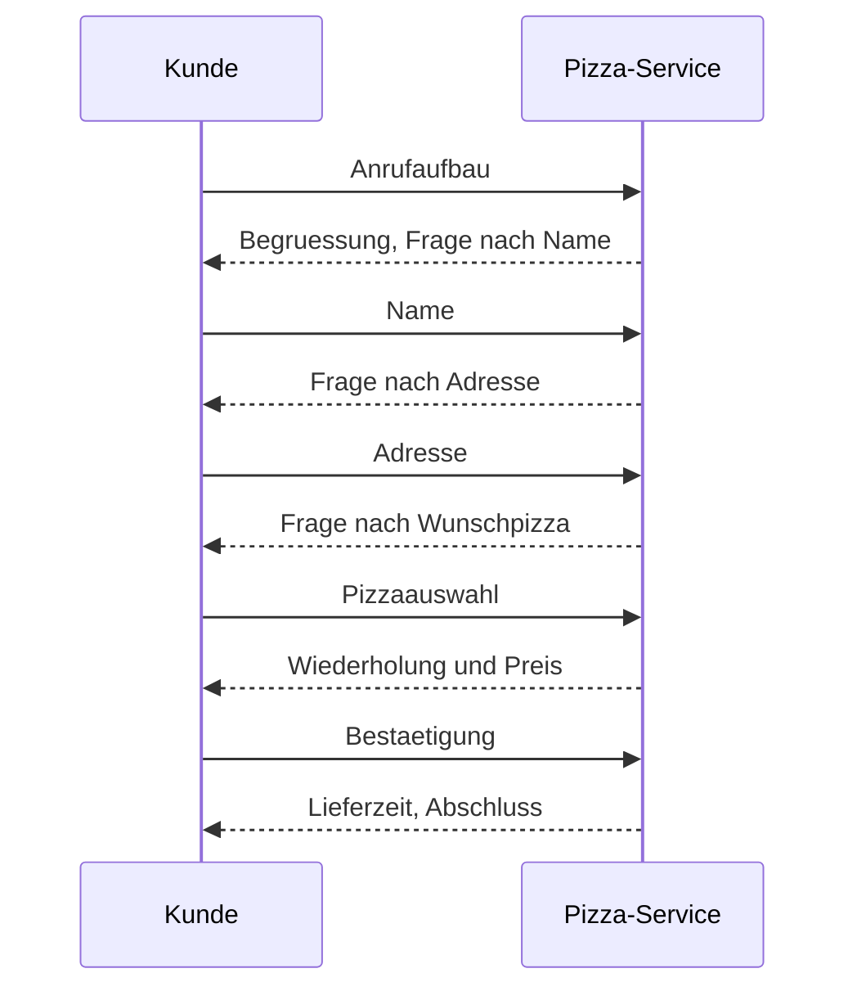
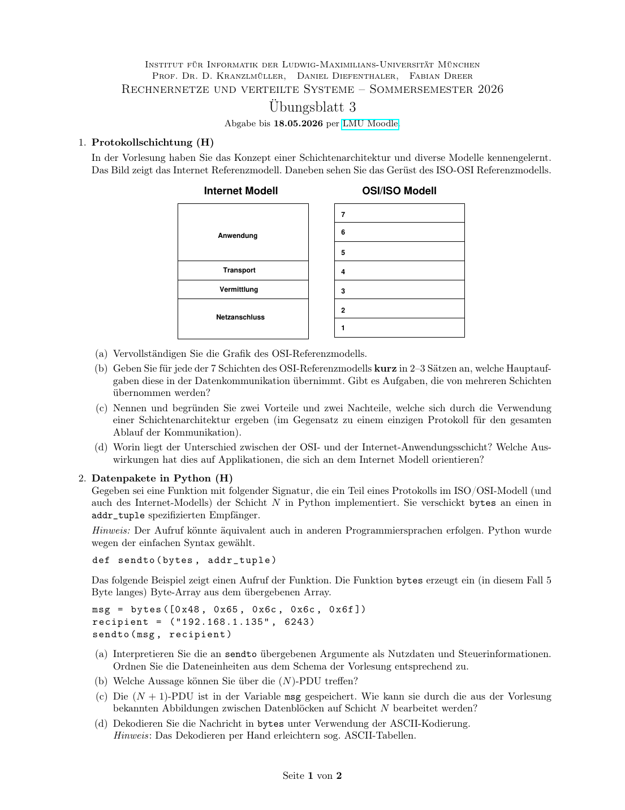
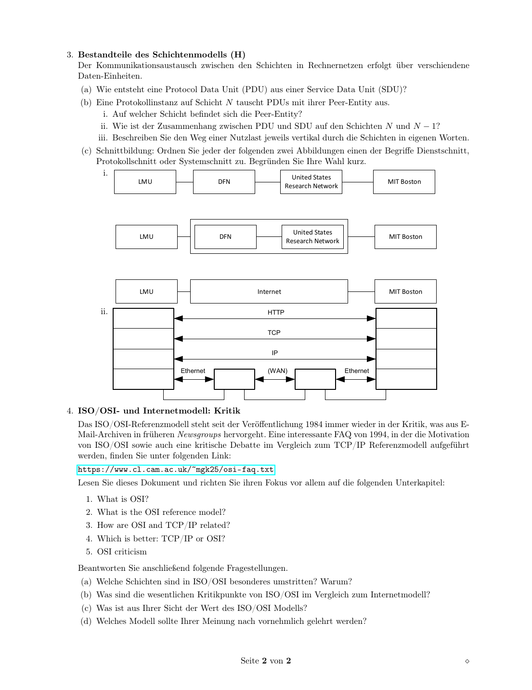

# 分层模型：OSI、Internet、PDU 与接口

## 知识点总结

- OSI 七层与 Internet 模型是高频基础。
- PDU = SDU + PCI；发送向下封装，接收向上解封装。
- Dienstschnitt、Protokollschnitt、Systemschnitt 要结合图判断。

## 完整题目与解答汇总

### 题目 1: 1. Der Pizzadienst (H)

**类型：** 作业  

**来源说明：** Uebungsblatt 02, Aufgabe 1  


#### 题目中文翻译 / 中文题意

用电话订披萨设计一个协议：画订餐顺序图，加入底层配送服务，区分控制数据和有效载荷，并讨论改用 Messenger 时分层如何变化。

#### 德文原题

```text
1. Der Pizzadienst (H)
Ein Protokoll ist eine Spezifikation von Vorschriften zum Informationsaustausch.
Beschreiben Sie im Folgenden ein Protokoll zur Bestellung einer Pizza (Pizzaprotokoll), beim Pizza-
Service Ihres Vertrauens! Indem Sie auf die Technologie „Telefon” zurückgreifen, haben Sie eine Möglich-
keit gefunden Nachrichten mit Ihrem Pizza-Service auszutauschen.
Pizza Protokoll Pizza Protokoll
Telefonnetz
(a) Ohne ein Bestellprotokoll herrscht Stille im Hörer. Damit Ihre Bestellung erfolgreich abgeschlossen
werden kann, müssen Sie dem Pizza-Service Ihren Namen, Ihre Adresse und Ihre Wunschpizza
mitteilen.
Zeichnen Sie ein Sequenzdiagramm, das einen vollständigen Bestellvorgang am Telefon darstellt!
Beachten Sie dabei:
• Markieren Sie das Ende jeder Phase der Kommunikation!
• Der Kunde übermittelt bestimmte Informationen genau dann, wenn er danach gefragt wird!
(b) Leider kommt die Pizza nicht durch die Telefonleitung. Erweitern Sie das Modell um einen zugrunde
liegenden Dienst, mit dem der Lieferprozess realisiert wird. Berücksichtigen Sie hierbei das aus der
Vorlesung bekannte Prinzip der Schichtung.
(c) In der Vorlesung wurde die Unterscheidung in Steuerdaten und Nutzdaten diskutiert. Finden Sie
hierzu Beispiele im Pizza-Service-Modell.
(d) Wie wirkt es sich auf die anderen Schichten aus, wenn Sie über einen Messengerdienst wie Signal
oder WhatsApp statt einem Telefonanruf bestellen? Erläutern Sie außerdem kurz, inwiefern die
Schichtentrennung hiervon betroffen ist.
```

#### 解答

**1. Der Pizzadienst / 披萨协议**


**DE Aufgabenidee:** Ein Protokoll fuer eine Pizza-Bestellung per Telefon beschreiben und auf Schichtung, Steuerdaten/Nutzdaten und Messenger-Alternativen beziehen.

**中文题意：** 用电话订披萨类比通信协议、分层、控制数据和有效载荷。

**(a) Sequenzdiagramm / 顺序图**



**DE:** Jede Phase endet mit einer Rueckfrage, Bestaetigung oder dem Abschluss. Der Kunde sendet die Informationen erst dann, wenn danach gefragt wird.

**中文：** 每一阶段以确认、下一问题或结束语收尾；客户只在被询问时发送相应信息。这体现了协议的“状态”和“消息顺序”。

**(b) Schichtung / 分层**

| Schicht | Pizza-Modell | 网络类比 |
|---|---|---|
| Anwendung | Bestellung, Name, Adresse, Pizza | 应用协议 |
| Kommunikationsdienst | Telefon oder Messenger | 传输/会话服务 |
| Lieferdienst | Kurier bringt Pizza | 底层承载服务 |
| Infrastruktur | Telefonnetz, Strassen | 网络基础设施 |

**(c) Steuerdaten und Nutzdaten / 控制数据与有效载荷**

Nutzdaten: gewünschte Pizza, Adresse, Name.  
Steuerdaten: Begruessung, Fragen, Wiederholung, Preis, Lieferzeit, Bestaetigung, Gespraechsende.

中文：真正想传达的业务内容是“谁、送到哪里、要什么披萨”；为了让流程可靠进行的询问、确认、结束语等是控制信息。

**(d) Messenger statt Telefon / 用即时通信代替电话**

**DE:** Die Semantik der Bestellung bleibt gleich, aber der darunterliegende Dienst wechselt von synchroner Sprache zu asynchronen Nachrichten. Nachrichten koennen spaeter gelesen werden, Lesebestaetigungen haben und Medien enthalten. Die Schichtentrennung bleibt erhalten, solange die Anwendung nur den Dienst "Nachrichten austauschen" benutzt.

**中文：** 订披萨这层语义不变，但底层服务从同步电话变成异步消息。消息可能延迟、可能有已读回执，也可以包含图片或菜单链接。分层思想仍然成立：只要上层看到的是“可以交换消息”的服务，上层披萨协议不需要关心底层是电话、Signal 还是 WhatsApp。

**备注：** 本题归入本知识点；题目中文翻译/题意、德文原题、解答和来源已保留。


---

### 题目 2: 1. Protokollschichtung (H)

**类型：** 作业  

**来源说明：** Uebungsblatt 03, Aufgabe 1  


#### 题目中文翻译 / 中文题意

补全 OSI 七层模型，说明各层主要任务，分析分层架构优缺点，并比较 OSI 应用层与 Internet 模型应用层。

#### 德文原题

```text
1. Protokollschichtung (H)
In der Vorlesung haben Sie das Konzept einer Schichtenarchitektur und diverse Modelle kennengelernt.
Das Bild zeigt das Internet Referenzmodell. Daneben sehen Sie das Gerüst des ISO-OSI Referenzmodells.
Internet Modell OSI/ISO Modell
7
6
Anwendung
5
Transport 4
Vermittlung 3
2
Netzanschluss
1
(a) Vervollständigen Sie die Grafik des OSI-Referenzmodells.
(b) Geben Sie für jede der 7 Schichten des OSI-Referenzmodells kurz in 2–3 Sätzen an, welche Hauptauf-
gaben diese in der Datenkommunikation übernimmt. Gibt es Aufgaben, die von mehreren Schichten
übernommen werden?
(c) Nennen und begründen Sie zwei Vorteile und zwei Nachteile, welche sich durch die Verwendung
einer Schichtenarchitektur ergeben (im Gegensatz zu einem einzigen Protokoll für den gesamten
Ablauf der Kommunikation).
(d) Worin liegt der Unterschied zwischen der OSI- und der Internet-Anwendungsschicht? Welche Aus-
wirkungen hat dies auf Applikationen, die sich an dem Internet Modell orientieren?
```

#### 解答

**1. Protokollschichtung / 协议分层**



**(a) OSI-Modell / OSI 七层**

| Nr. | Deutsch | 中文 |
|---:|---|---|
| 7 | Anwendung | 应用层 |
| 6 | Darstellung | 表示层 |
| 5 | Sitzung | 会话层 |
| 4 | Transport | 传输层 |
| 3 | Vermittlung | 网络/网际层 |
| 2 | Sicherung | 数据链路层 |
| 1 | Bituebertragung | 物理层 |

**(b) Aufgaben / 任务**

**DE:** Die Anwendungsschicht stellt konkrete Anwendungsprotokolle bereit. Die Darstellungsschicht behandelt Kodierung, Datenformat und Verschluesselung. Die Sitzungsschicht verwaltet Dialoge und Sitzungen. Die Transportschicht bietet Ende-zu-Ende-Kommunikation zwischen Prozessen. Die Vermittlungsschicht uebernimmt Adressierung und Routing. Die Sicherungsschicht uebertraegt Frames auf einem lokalen Link. Die Bituebertragungsschicht uebertraegt Signale.

**中文：** 应用层提供具体应用协议；表示层处理编码、格式、加密；会话层管理会话状态；传输层提供端到端进程通信；网络层负责寻址和路由；链路层负责本地链路上的帧传输、MAC、差错检测；物理层负责信号、电气/光学/无线传输。可靠性、分段、寻址等功能可能在多层出现，但作用范围不同。

**(c) Vorteile/Nachteile / 优缺点**

**DE:** Vorteile sind Modularitaet, Austauschbarkeit und Standardisierung; jede Schicht muss nur den Dienst der darunterliegenden Schicht kennen. Nachteile sind zusaetzliche Header, Verarbeitungsaufwand und manchmal doppelte Funktionen.

**中文：** 优点是模块化、可替换、易标准化；每层只依赖下层服务。缺点是会有额外头部和处理开销；严格分层有时导致信息重复或性能优化困难。

**(d) OSI vs Internet-Anwendungsschicht**

**DE:** Das Internetmodell fasst OSI-Schichten 5-7 meist zur Anwendungsschicht zusammen. Anwendungen muessen daher Funktionen wie Darstellung, Verschluesselung oder Sitzungsverwaltung oft selbst oder ueber Bibliotheken leisten.

**中文：** Internet 模型通常把 OSI 的第 5 到第 7 层合并为应用层。因此表示、加密、会话管理等功能往往由应用程序自身或应用库来完成。

**备注：** 本题归入本知识点；题目中文翻译/题意、德文原题、解答和来源已保留。


---

### 题目 3: 2. Datenpakete in Python (H)

**类型：** 作业  

**来源说明：** Uebungsblatt 03, Aufgabe 2  


#### 题目中文翻译 / 中文题意

根据 Python `sendto(bytes, addr_tuple)` 示例，识别 Nutzdaten、控制信息、PDU/SDU/ICI，并解码字节消息。

#### 德文原题

```text
2. Datenpakete in Python (H)
Gegeben sei eine Funktion mit folgender Signatur, die ein Teil eines Protokolls im ISO/OSI-Modell (und
auch des Internet-Modells) der Schicht N in Python implementiert. Sie verschickt bytes an einen in
addr_tuple spezifizierten Empfänger.
Hinweis: Der Aufruf könnte äquivalent auch in anderen Programmiersprachen erfolgen. Python wurde
wegen der einfachen Syntax gewählt.
def sendto ( bytes , addr_tuple )
Das folgende Beispiel zeigt einen Aufruf der Funktion. Die Funktion bytes erzeugt ein (in diesem Fall 5
Byte langes) Byte-Array aus dem übergebenen Array.
msg = bytes ([0 x48 , 0 x65 , 0 x6c , 0 x6c , 0 x6f ])
recipient = ("192.168.1.135" , 6243)
sendto ( msg , recipient )
(a) Interpretieren Sie die an sendto übergebenen Argumente als Nutzdaten und Steuerinformationen.
Ordnen Sie die Dateneinheiten aus dem Schema der Vorlesung entsprechend zu.
(b) Welche Aussage können Sie über die (N )-PDU treffen?
(c) Die (N + 1)-PDU ist in der Variable msg gespeichert. Wie kann sie durch die aus der Vorlesung
bekannten Abbildungen zwischen Datenblöcken auf Schicht N bearbeitet werden?
(d) Dekodieren Sie die Nachricht in bytes unter Verwendung der ASCII-Kodierung.
Hinweis: Das Dekodieren per Hand erleichtern sog. ASCII-Tabellen.
```

#### 解答

**2. Datenpakete in Python / Python 数据包**

Gegeben:

```python
msg = bytes([0x48, 0x65, 0x6c, 0x6c, 0x6f])
recipient = ("192.168.1.135", 6243)
sendto(msg, recipient)
```

**(a)**  
**DE:** `msg` ist Nutzdaten/SDU der Schicht N; `recipient` ist Schnittstelleninformation/ICI, denn sie steuert, wohin gesendet wird.

**中文：** `msg` 是第 N 层要传送的有效载荷，也就是 `(N)-SDU`。`recipient` 包含目的 IP 和端口，用来告诉服务应该发往哪里，因此属于接口控制信息 `(N)-ICI`。

**(b)**  
**DE:** Die `(N)-PDU` besteht aus `(N)-PCI + (N)-SDU`. Aus dem Funktionsaufruf allein sieht man die fertige PDU nicht, weil Header/PCI intern von `sendto` erzeugt werden.

**中文：** `(N)-PDU` 由本层控制信息 `(N)-PCI` 加上本层服务数据单元 `(N)-SDU` 构成。函数调用中只能看到 SDU 和目的信息，看不到完整 PDU，因为首部通常在 `sendto` 内部生成。

**(c)**  
**DE:** Die `(N+1)-PDU` in `msg` wird auf Schicht N als `(N)-SDU` behandelt und durch Encapsulation mit `(N)-PCI` zu einer `(N)-PDU`.

**中文：** 上一层交下来的 `(N+1)-PDU` 到了第 N 层后，被第 N 层当作自己的 `(N)-SDU`。第 N 层再加上自己的 PCI 进行封装，得到 `(N)-PDU`。

**(d)** ASCII:

```text
0x48 0x65 0x6c 0x6c 0x6f = Hello
```

**备注：** 本题归入本知识点；题目中文翻译/题意、德文原题、解答和来源已保留。


---

### 题目 4: 3. Bestandteile des Schichtenmodells (H)

**类型：** 作业  

**来源说明：** Uebungsblatt 03, Aufgabe 3  


#### 题目中文翻译 / 中文题意

解释 PDU 如何由 SDU 加 PCI 形成，说明对等实体、层间封装关系，并判断图中的 Dienstschnitt、Protokollschnitt 或 Systemschnitt。

#### 德文原题

```text
3. Bestandteile des Schichtenmodells (H)
Der Kommunikationsaustausch zwischen den Schichten in Rechnernetzen erfolgt über verschiendene
Daten-Einheiten.
(a) Wie entsteht eine Protocol Data Unit (PDU) aus einer Service Data Unit (SDU)?
(b) Eine Protokollinstanz auf Schicht N tauscht PDUs mit ihrer Peer-Entity aus.
i. Auf welcher Schicht befindet sich die Peer-Entity?
ii. Wie ist der Zusammenhang zwischen PDU und SDU auf den Schichten N und N − 1?
iii. Beschreiben Sie den Weg einer Nutzlast jeweils vertikal durch die Schichten in eigenen Worten.
(c) Schnittbildung: Ordnen Sie jeder der folgenden zwei Abbildungen einen der Begriffe Dienstschnitt,
Protokollschnitt oder Systemschnitt zu. Begründen Sie Ihre Wahl kurz.
i.
United States
LMU DFN MIT Boston
Research Network
United States
LMU DFN MIT Boston
Research Network
LMU Internet MIT Boston
ii. HTTP
TCP
IP
Ethernet (WAN) Ethernet
```

#### 解答

**3. Bestandteile des Schichtenmodells / 分层模型的数据单元**



**(a)**  
**DE:** Eine PDU entsteht, indem eine Schicht zu einer SDU eigene Protokollkontrollinformationen (PCI, Header/Trailer) hinzufuegt.

**中文：** PDU 的形成过程就是封装：某一层把上层交来的 SDU 加上自己的控制信息 PCI，例如首部或尾部，形成该层的协议数据单元 PDU。

**(b)**

1. **DE:** Die Peer-Entity befindet sich auf derselben Schicht N im anderen System.  
   **中文：** 对等实体位于另一台系统的同一层 N。
2. **DE:** Die `(N)-PDU` wird fuer Schicht `N-1` zur `(N-1)-SDU`.  
   **中文：** 第 N 层的 PDU 交给下一层后，会被第 `N-1` 层当作 SDU。
3. **DE:** Beim Senden wandern Anwendungsdaten nach unten, jede Schicht kapselt ein. Beim Empfangen wandern Daten nach oben, jede Schicht entfernt und interpretiert ihren Header.  
   **中文：** 发送时数据自上而下，每层添加自己的头部；接收时数据自下而上，每层解释并去掉自己的头部。

**(c) Schnittarten**

**DE:** Die Abbildung mit LMU/DFN/MIT beschreibt Systemschnitte, weil reale Systeme oder Netze voneinander abgegrenzt werden. Die Abbildung HTTP/TCP/IP/Ethernet zeigt Dienstschnitte zwischen Schichten und Protokollschnitte horizontal zwischen Peer-Protokollen.

**中文：** LMU/DFN/MIT 那张图强调不同真实系统或网络之间的边界，因此对应系统切分。HTTP/TCP/IP/Ethernet 那张图中，垂直方向的层间边界是服务接口，水平方向同层实体之间的逻辑通信是协议接口。

**备注：** 本题归入本知识点；题目中文翻译/题意、德文原题、解答和来源已保留。


---

### 题目 5: 4. ISO/OSI- und Internetmodell: Kritik

**类型：** 作业  

**来源说明：** Uebungsblatt 03, Aufgabe 4  


#### 题目中文翻译 / 中文题意

阅读 OSI FAQ，分析 OSI 模型中有争议的层、OSI 与 TCP/IP 的主要批评点，以及 OSI 模型的教学价值。

#### 德文原题

```text
4. ISO/OSI- und Internetmodell: Kritik
Das ISO/OSI-Referenzmodell steht seit der Veröffentlichung 1984 immer wieder in der Kritik, was aus E-
Mail-Archiven in früheren Newsgroups hervorgeht. Eine interessante FAQ von 1994, in der die Motivation
von ISO/OSI sowie auch eine kritische Debatte im Vergleich zum TCP/IP Referenzmodell aufgeführt
werden, finden Sie unter folgenden Link:
https://www.cl.cam.ac.uk/~mgk25/osi-faq.txt
Lesen Sie dieses Dokument und richten Sie ihren Fokus vor allem auf die folgenden Unterkapitel:
1. What is OSI?
2. What is the OSI reference model?
3. How are OSI and TCP/IP related?
4. Which is better: TCP/IP or OSI?
5. OSI criticism
Beantworten Sie anschließend folgende Fragestellungen.
(a) Welche Schichten sind in ISO/OSI besonderes umstritten? Warum?
(b) Was sind die wesentlichen Kritikpunkte von ISO/OSI im Vergleich zum Internetmodell?
(c) Was ist aus Ihrer Sicht der Wert des ISO/OSI Modells?
(d) Welches Modell sollte Ihrer Meinung nach vornehmlich gelehrt werden?
```

#### 解答

**4. ISO/OSI-Kritik / 对 OSI 的批评**

**(a)**  
**DE:** Besonders umstritten sind Sitzung und Darstellung, weil viele reale Internetanwendungen diese Aufgaben selbst oder gar nicht getrennt implementieren.

**中文：** 最有争议的是会话层和表示层，因为许多真实的互联网应用并不会把这些功能独立成层，而是由应用自己、库或具体协议一起完成。

**(b)**  
**DE:** Kritikpunkte: zu komplex, spaet standardisiert, wenig implementierungsnah, teilweise schwerfaellige Protokollfamilie; TCP/IP war pragmatischer und frueher breit eingesetzt.

**中文：** 批评点包括：模型和协议族过于复杂，标准化较晚，离实际实现较远，工程上不够轻量。TCP/IP 更务实，也更早被广泛部署。

**(c)**  
**DE:** Der Wert des OSI-Modells liegt in seiner Rolle als didaktisches Referenzmodell mit klaren Begriffen fuer Kapselung, Schnittstellen und Verantwortlichkeiten.

**中文：** OSI 的价值主要在教学和概念整理：它清楚地区分封装、接口、层次职责，帮助理解网络系统如何分工。

**(d)**  
**DE:** Fuer reale Protokolle sollte das Internetmodell im Vordergrund stehen; das OSI-Modell bleibt ein begriffliches Werkzeug. Am besten werden beide gemeinsam gelehrt.

**中文：** 实际协议学习应以 Internet 模型为主，因为真实互联网主要按 TCP/IP 工作；OSI 模型适合作为概念工具。最好的教学方式是两者结合。

**Wissen / 知识点：** OSI 是解释分层的“地图”，TCP/IP 是互联网工程中真正主导的协议族。

**备注：** 本题归入本知识点；题目中文翻译/题意、德文原题、解答和来源已保留。


---

### 题目 6: Frage 1 / 第1题

**类型：** 考卷  

**来源说明：** Klausur 2017, Frage 1  


#### 题目中文翻译 / 中文题意

以下关于OSI模型的哪些陈述是正确的？
ISO/OSI第1至4层包含面向应用的协议。
传输层协议的任务是实现端到端通信。
路由选择由网络层协议负责。
对于中间传输系统，ISO/OSI第1-3层是相关的。

#### 德文原题

```text
### Frage 1 / 第1题

**Welche der folgenden Aussagen zum OSI-Modell sind korrekt?**  
**以下关于OSI模型的哪些陈述是正确的？**

- ○ Die ISO/OSI-Schichten 1 bis 4 enthalten anwendungsorientierte Protokolle.
    - ISO/OSI第1至4层包含面向应用的协议。
- ○ Aufgaben von Transportschicht-Protokollen ist es, eine Ende-zu-Ende-Kommunikation zu ermöglichen.
    - 传输层协议的任务是实现端到端通信。
- ☒ Für Wegwahl/Routing sind Protokolle der Vermittlungsschicht zuständig.
    - 路由选择由网络层协议负责。
- ☒ Für zwischengelagerte Transitsysteme sind die ISO/OSI-Schichten 1-3 relevant.
    - 对于中间传输系统，ISO/OSI第1-3层是相关的。
```

#### 解答

**参考答案 / Lösung:**

- ✗ 第一项错误：第1-4层是传输导向的，第5-7层才是应用导向的
- ✓ 第二项正确：传输层确实负责端到端通信（但原卷未选）
- ✓ 第三项正确：路由是网络层（第3层）的功能
- ✓ 第四项正确：路由器等中间设备只处理第1-3层

---

**备注：** 本题归入本知识点；题目中文翻译/题意、德文原题、解答和来源已保留。


---

### 题目 7: Frage 2 / 第2题

**类型：** 考卷  

**来源说明：** Klausur 2017, Frage 2  


#### 题目中文翻译 / 中文题意

以下哪些功能和描述与层名称的对应关系是正确的？
数据链路层：这里将数据分割成数据信息序列，并发送到由端口标识的目标。
网络层：这里组织网络单元的全局寻址，并确定到特定参与者的最佳路径。
传输层：这里通过物理介质传输数据。
应用层：这里通过套接字将数据传递给TCP/IP协议栈或相应地取回。

#### 德文原题

```text
### Frage 2 / 第2题

**Welche der folgenden Zuordnungen von Funktionen und Beschreibungen zu Namen von Schichten treffen zu?**  
**以下哪些功能和描述与层名称的对应关系是正确的？**

- ○ Sicherungsschicht: Hier werden Daten zu einer Sequenz von Dateninformationen segmentiert und an durch Ports identifizierte Ziele geschickt.
    - 数据链路层：这里将数据分割成数据信息序列，并发送到由端口标识的目标。
- ☒ Vermittlungsschicht: Hier wird die globale Adressierung von Netzwerkeinheiten organisiert, sowie der beste Weg zu einem bestimmten Teilnehmer ermittelt.
    - 网络层：这里组织网络单元的全局寻址，并确定到特定参与者的最佳路径。
- ○ Transportschicht: Hier werden die Daten über ein physisches Medium transportiert.
    - 传输层：这里通过物理介质传输数据。
- ○ Anwendungsschicht: Hier werden die Daten über einen Socket an den TCP/IP-Stack übergeben oder wieder entsprechend abgeholt.
    - 应用层：这里通过套接字将数据传递给TCP/IP协议栈或相应地取回。
```

#### 解答

**参考答案 / Lösung:**

- ✗ 第一项错误：描述的是传输层的功能（端口、分段）
- ✓ 第二项正确：网络层负责全局寻址（IP地址）和路由
- ✗ 第三项错误：物理介质传输是物理层的功能
- ✗ 第四项错误：Socket操作属于传输层接口

---

**备注：** 本题归入本知识点；题目中文翻译/题意、德文原题、解答和来源已保留。


---

### 题目 8: Frage 11 / 第11题

**类型：** 考卷  

**来源说明：** Klausur 2017, Frage 11  


#### 题目中文翻译 / 中文题意

协议数据单元（PDU）是如何从服务数据单元（SDU）产生的？

#### 德文原题

```text
### Frage 11 / 第11题

**Wie entsteht eine Protocol Data Unit (PDU) aus einer Service Data Unit (SDU)?**  
**协议数据单元（PDU）是如何从服务数据单元（SDU）产生的？**
```

#### 解答

**参考答案 / Lösung:**  
通过添加协议控制信息（PCI）。

**Hinzufügen von PCI (Protocol Control Information)**

PDU = SDU + PCI（头部/尾部）

---

**备注：** 本题归入本知识点；题目中文翻译/题意、德文原题、解答和来源已保留。


---

### 题目 9: Frage 12 / 第12题

**类型：** 考卷  

**来源说明：** Klausur 2017, Frage 12  


#### 题目中文翻译 / 中文题意

第N层的协议实例与其对等实体交换PDU。
对等实体位于哪一层？

#### 德文原题

```text
### Frage 12 / 第12题

**Eine Protokollinstanz der Schicht N tauscht PDUs mit ihrer Peer-Entity aus.**  
**第N层的协议实例与其对等实体交换PDU。**

**(a) Auf welcher Schicht befindet sich die Peer-Entity?**  
**对等实体位于哪一层？**
```

#### 解答

**参考答案 / Lösung:** **Schicht N / 第N层**

对等实体总是在同一层。

**(b) An welche Schicht wird die PDU aus Schicht N übergeben?**  
**第N层的PDU被传递给哪一层？**

**参考答案 / Lösung:** **Schicht N-1 / 第N-1层**

PDU向下传递给下一层。

---

**备注：** 本题归入本知识点；题目中文翻译/题意、德文原题、解答和来源已保留。


---

### 题目 10: Frage 13 / 第13题

**类型：** 考卷  

**来源说明：** Klausur 2017, Frage 13  


#### 题目中文翻译 / 中文题意

给出以下协议所属的ISO/OSI层名称。
| Protokoll / 协议                                | Abk. / 缩写 | Schichtname / 层名称                       |
| Address Resolution Protocol / 地址解析协议          | ARP       | Sicherungsschicht / 数据链路层 (Layer 2) |
| Open Shortest Path First / 开放最短路径优先           | OSPF      | Vermittlungsschicht / 网络层 (Layer 3) |
| Internet Control Message Protocol / 互联网控制消息协议 | ICMP      | Vermittlungsschicht / 网络层 (Layer 3) |
| Domain Name System / 域名系统                     | DNS       | Anwendungsschicht / 应用层 (Layer 7)   |
备注：
ARP：在IP地址和MAC地址之间转换，工作在第2层
OSPF：路由协议，工作在第3层
ICMP：网络诊断和错误报告，工作在第3层
DNS：域名解析服务，工作在第7层

#### 德文原题

```text
### Frage 13 / 第13题

**Geben Sie zu folgenden Protokollen den Namen der Schicht aus dem ISO/OSI-Schichtenmodell an, in dem das jeweilige Protokoll anzusiedeln ist.**  
**给出以下协议所属的ISO/OSI层名称。**

| Protokoll / 协议                                | Abk. / 缩写 | Schichtname / 层名称                       |
| --------------------------------------------- | --------- | --------------------------------------- |
| Address Resolution Protocol / 地址解析协议          | ARP       | **Sicherungsschicht / 数据链路层** (Layer 2) |
| Open Shortest Path First / 开放最短路径优先           | OSPF      | **Vermittlungsschicht / 网络层** (Layer 3) |
| Internet Control Message Protocol / 互联网控制消息协议 | ICMP      | **Vermittlungsschicht / 网络层** (Layer 3) |
| Domain Name System / 域名系统                     | DNS       | **Anwendungsschicht / 应用层** (Layer 7)   |

**备注：**

- ARP：在IP地址和MAC地址之间转换，工作在第2层
- OSPF：路由协议，工作在第3层
- ICMP：网络诊断和错误报告，工作在第3层
- DNS：域名解析服务，工作在第7层

---

## 3 Schnittbildung (4 Punkte)

## 3 接口划分（4分）

---
```

#### 解答

**Frage 13 / 第13题**

**Geben Sie zu folgenden Protokollen den Namen der Schicht aus dem ISO/OSI-Schichtenmodell an, in dem das jeweilige Protokoll anzusiedeln ist.**  
**给出以下协议所属的ISO/OSI层名称。**

| Protokoll / 协议                                | Abk. / 缩写 | Schichtname / 层名称                       |
| --------------------------------------------- | --------- | --------------------------------------- |
| Address Resolution Protocol / 地址解析协议          | ARP       | **Sicherungsschicht / 数据链路层** (Layer 2) |
| Open Shortest Path First / 开放最短路径优先           | OSPF      | **Vermittlungsschicht / 网络层** (Layer 3) |
| Internet Control Message Protocol / 互联网控制消息协议 | ICMP      | **Vermittlungsschicht / 网络层** (Layer 3) |
| Domain Name System / 域名系统                     | DNS       | **Anwendungsschicht / 应用层** (Layer 7)   |

**备注：**

- ARP：在IP地址和MAC地址之间转换，工作在第2层
- OSPF：路由协议，工作在第3层
- ICMP：网络诊断和错误报告，工作在第3层
- DNS：域名解析服务，工作在第7层

---

**3 Schnittbildung (4 Punkte)**

**3 接口划分（4分）**

---

**备注：** 本题归入本知识点；题目中文翻译/题意、德文原题、解答和来源已保留。


---

### 题目 11: Frage 1 / 第1题

**类型：** 考卷  

**来源说明：** Klausur 2018, Frage 1  


#### 题目中文翻译 / 中文题意

以下关于OSI参考模型的哪些陈述是正确的？
ISO/OSI第1至4层包含面向应用的协议。
传输层协议的任务是实现端到端通信。
路由选择由网络层协议负责。
对于中间传输系统，ISO/OSI第1-3层是相关的。

#### 德文原题

```text
### Frage 1 / 第1题

**Welche der folgenden Aussagen zum OSI-Referenzmodell sind korrekt?**  
**以下关于OSI参考模型的哪些陈述是正确的？**

- ○ Die ISO/OSI-Schichten 1 bis 4 enthalten anwendungsorientierte Protokolle.
    - ISO/OSI第1至4层包含面向应用的协议。
- ☒ Aufgabe von Protokollen der Transportschicht ist es, eine Ende-zu-Ende-Kommunikation zu ermöglichen.
    - 传输层协议的任务是实现端到端通信。
- ☒ Für Wegewahl/Routing sind Protokolle der Vermittlungsschicht zuständig.
    - 路由选择由网络层协议负责。
- ☒ Für zwischengelagerte Transitsysteme sind die ISO/OSI-Schichten 1 bis 3 relevant.
    - 对于中间传输系统，ISO/OSI第1-3层是相关的。
```

#### 解答

**解析：**

- ✗ 第一项错误：第1-4层是传输导向的，第5-7层才是应用导向的
- ✓ 第二项正确：传输层（第4层）负责端到端通信
- ✓ 第三项正确：路由是网络层（第3层）的核心功能
- ✓ 第四项正确：路由器等中间设备只处理物理层、数据链路层和网络层

---

**备注：** 本题归入本知识点；题目中文翻译/题意、德文原题、解答和来源已保留。


---

### 题目 12: Frage 11 / 第11题

**类型：** 考卷  

**来源说明：** Klausur 2018, Frage 11  


#### 题目中文翻译 / 中文题意

协议数据单元（PDU）是如何从服务数据单元（SDU）产生的？

#### 德文原题

```text
### Frage 11 / 第11题

**Wie entsteht eine Protocol Data Unit (PDU) aus einer Service Data Unit (SDU)?**  
**协议数据单元（PDU）是如何从服务数据单元（SDU）产生的？**
```

#### 解答

**Lösung / 答案：**

**通过添加协议控制信息（PCI, Protocol Control Information）。**

PDU = PCI + SDU

PCI通常包括头部（Header）和/或尾部（Trailer），包含地址、序列号、校验和等控制信息。

---

**备注：** 本题归入本知识点；题目中文翻译/题意、德文原题、解答和来源已保留。


---

### 题目 13: Frage 12 / 第12题

**类型：** 考卷  

**来源说明：** Klausur 2018, Frage 12  


#### 题目中文翻译 / 中文题意

第N层的协议实例与其对等实体交换PDU。
对等实体位于哪一层？

#### 德文原题

```text
### Frage 12 / 第12题

**Eine Protokollinstanz der Schicht N tauscht PDUs mit ihrer Peer-Entity aus.**  
**第N层的协议实例与其对等实体交换PDU。**

**(a) Auf welcher Schicht befindet sich die Peer-Entity?**  
**对等实体位于哪一层？**
```

#### 解答

**Lösung / 答案：** **Schicht N / 第N层**

对等实体（Peer Entity）总是在远程系统的同一层。

**(b) An welche Schicht wird die PDU aus Schicht N übergeben?**  
**第N层的PDU被传递给哪一层？**

**Lösung / 答案：** **Schicht N-1 / 第N-1层**

PDU向下传递给下一层，作为下一层的SDU。

---

**备注：** 本题归入本知识点；题目中文翻译/题意、德文原题、解答和来源已保留。


---

### 题目 14: Frage 13 / 第13题

**类型：** 考卷  

**来源说明：** Klausur 2018, Frage 13  


#### 题目中文翻译 / 中文题意

接口划分：将以下两幅图分别归类为服务接口、协议接口或系统接口。
(a) 图示：LMU → DFN → United States Research Network → MIT Boston（逐级抽象）

#### 德文原题

```text
### Frage 13 / 第13题

**Schnittbildung: Ordnen Sie jeder der folgenden zwei Abbildungen einen der Begriffe Dienstschnitt, Protokollschnitt oder Systemschnitt zu.**  
**接口划分：将以下两幅图分别归类为服务接口、协议接口或系统接口。**

**(a) 图示：LMU → DFN → United States Research Network → MIT Boston（逐级抽象）**
```

#### 解答

**Lösung / 答案：** **Systemschnitt / 系统接口**

**Begründung / 理由：**

- 显示了实际的物理系统边界
- 端系统和传输系统（网络）是可识别的
- 关注物理组件之间的边界

**(b) 图示：显示HTTP、TCP、IP、Ethernet、(WAN)等协议层**

**Lösung / 答案：** **Protokollschnitt / 协议接口**

**Begründung / 理由：**

- 显示了对等实体之间的通信
- 同层协议之间的逻辑通信
- 关注协议层之间的水平通信

---

**III. Domain Name System (DNS)**

---

**备注：** 本题归入本知识点；题目中文翻译/题意、德文原题、解答和来源已保留。


---
