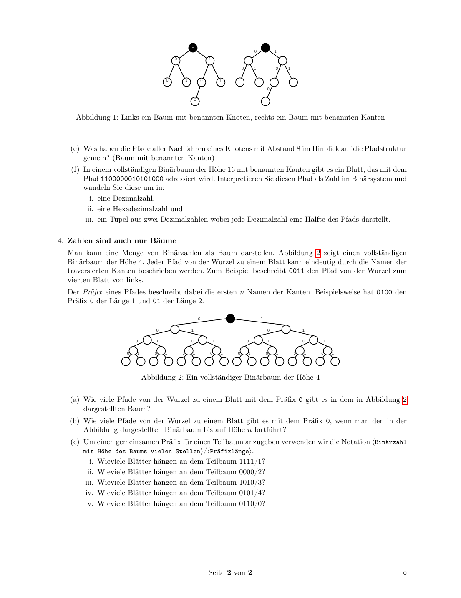

# 进制、图树与前缀地址

## 知识点总结

- 进制转换、完全图边数、树高度和前缀子树是地址学习的基础。
- 前缀越长，范围越小；前缀越短，聚合范围越大。

## 完整题目与解答汇总

### 题目 1: 1. Anforderungen des Internets (H)

**类型：** 作业  

**来源说明：** Uebungsblatt 00, Aufgabe 1  


#### 题目中文翻译 / 中文题意

设计互联网连接结构：比较全互联网络和每个节点最多连接 5 个下级节点的层次结构，分别计算 8 个、300 个以及 N 个参与者所需连接数。

#### 德文原题

```text
1. Anforderungen des Internets (H)
Im Internet macht es den Anschein, als wären alle Geräte unmittelbar miteinander verbunden.
(a) Angenommen Sie müssen ein Netz entwerfen, in dem jedes Endgerät mit jedem anderen verkabelt
ist, d.h. komplett vermascht.
Wie viele Verbindungen benötigen Sie für:
• 8 Teilnehmer?
• 300 Teilnehmer?
• N Teilnehmer?
(b) Stattdessen sollen jetzt immer maximal fünf Geräte direkt mit einem Knoten, aber nicht unterein-
ander, verbunden sein. Maximal fünf dieser Knoten sind wiederum mit einem Knoten verbunden,
usw. Wie viele Verbindungen benötigt man hier für:
• 8 Teilnehmer?
• 300 Teilnehmer?
• N Teilnehmer? Gehen Sie von N = 5a mit a ∈ N aus.
```

#### 解答

**1. Anforderungen des Internets / 互联网的连接需求**

**DE Aufgabenidee:** In einem vollvermaschten Netz ist jedes Endgeraet direkt mit jedem anderen verbunden. Danach wird eine hierarchische Struktur betrachtet, in der jeweils hoechstens 5 Geraete/Knoten an einen Knoten angeschlossen sind.

**中文题意：** 比较全互联网络和 5 叉层次结构所需连接数。

**Loesung / 解答**

**(a) Vollvermaschung / 全互联**

**DE:** Bei `N` Teilnehmern braucht man fuer jedes ungeordnete Paar genau eine Verbindung:

**中文：** 有 `N` 个参与者时，每两个不同参与者之间需要一条连接，也就是从 `N` 个点中任选 2 个点：

```text
K_N = N * (N - 1) / 2
```

| Teilnehmer | Verbindungen |
|---:|---:|
| 8 | 28 |
| 300 | 44850 |
| N | `N(N-1)/2` |

**(b) Hierarchie mit maximal 5 Kindern / 每层最多 5 个子节点**

**DE:** Wenn `N = 5^a` gilt, hat ein vollstaendiger 5-aerer Baum mit `N` Blaettern:

**中文：** 如果 `N = 5^a`，可以看成一棵满 5 叉树。最底层有 `N` 个终端，上一层有 `N/5` 个节点，再上一层有 `N/25` 个节点，以此类推。树中每个非根节点对应一条到父节点的连接：

```text
N + N/5 + N/25 + ... + 5 = 5(N - 1)/4
```

**DE:** Das Ergebnis ist die Zahl der Verbindungen.

**中文：** 所以上式就是所需连接总数。对于不是精确 5 的幂的情况，例如 8 和 300，可以按每层向上取整估算。

| Teilnehmer | Verbindungen |
|---:|---:|
| 8 | `8 + ceil(8/5) = 10` |
| 300 | `300 + 60 + 12 + 3 = 375` |
| `N = 5^a` | `5(N-1)/4` |

**Wissen / 知识点：** 全互联的边数是二次增长 `O(N^2)`；树形/层次结构近似线性增长 `O(N)`，所以互联网必须分层、聚合和路由，而不可能让所有终端物理直连。

**备注：** 本题归入本知识点；题目中文翻译/题意、德文原题、解答和来源已保留。


---

### 题目 2: 2. Das Stellenwertsystem (H)

**类型：** 作业  

**来源说明：** Uebungsblatt 00, Aufgabe 2  


#### 题目中文翻译 / 中文题意

复习位值计数系统：写出十六进制数字，转换若干十进制数到十六进制、八进制和二进制，并分析 `2^32 - 1` 的二进制位数。

#### 德文原题

```text
2. Das Stellenwertsystem (H)
Zahlensysteme bestehen aus einem Alphabet (Ziffern) und einer Menge von Regeln wie Wörter (Zahlen)
gebildet werden. Bei dem in Europa gängigen Stellenwertsystem werden Zahlen von links nach rechts
mit den Koeffizienten der Zerlegung in eine Summe von Potenzen einer gewählten Basis, meist 10,
aufgeschrieben. Die erste Ziffer ist demnach der Koeffizient der höchsten verwendeten Potenz und mit
jeder weiteren Ziffer wird der Exponent um 1 verringert. Ein Komma (,) markiert den Vorzeichenwechsel
des Exponenten. Wird kein Vorzeichenwechsel benötigt, so ist der Exponent des letzten Summanden, der
Ziffer ganz rechts, stets 0. Die Folgende Tabelle zeigt gängige Stellenwertzahlensysteme in der Informatik.
Bezeichnung Basis Ziffern (→ aufsteigende Wertigkeit)
Dezimalsystem zehn 0 1 2 3 4 5 6 7 8 9
Oktalsystem acht 0 1 2 3 4 5 6 7
Dualsystem/Binärsystem zwei 0 1
Tabelle 1: Zahlensysteme werden häufig entsprechend der Mächtigkeit ihres Alphabets benannt.
Beim Arbeiten mit verschiedenen Zahlensystemen ist es wichtig stets sicherzustellen, dass klar ist mit
welchem Zahlensystem eine Zahl dargestellt wird. Die allgemeine Notation ist die Zahl in runden Klam-
mern und die Basis in Dezimalschreibweise als Index der abschließenden Klammer. Um zum Beispiel zu
verdeutlichen, dass man das Dezimalsystem benutzt schreibt man (7) .
10
(a) Welche Ziffern werden normalerweise für das Hexadezimalsystem verwendet? Schreiben Sie alle mit
aufsteigender Wertigkeit auf!
(b) Schreiben Sie die Zahlen 2, 4, 8, 10 je im Hexadezimal-, Oktal- und Binärsystem auf!
(c) Konvertieren Sie die folgenden Zahlen je in das Binärsystem und das Hexadezimalsystem!
16, 127, 168, 172, 192, 255
(d) Wieviele Stellen hat die Zahl 232 − 1 in Binärdarstellung? Wieviele davon sind 1 wieviele 0?
```

#### 解答

**2. Das Stellenwertsystem / 位值计数系统**

**(a) Hexadezimalziffern / 十六进制数字**

```text
0 1 2 3 4 5 6 7 8 9 A B C D E F
```

**(b) 2, 4, 8, 10 in verschiedenen Basen / 不同进制表示**

| Dezimal | Hex | Oktal | Binaer |
|---:|---:|---:|---:|
| 2 | 2 | 2 | 10 |
| 4 | 4 | 4 | 100 |
| 8 | 8 | 10 | 1000 |
| 10 | A | 12 | 1010 |

**(c) Umrechnung / 转换**

| Dezimal | Binaer | Hex |
|---:|---:|---:|
| 16 | 10000 | 10 |
| 127 | 1111111 | 7F |
| 168 | 10101000 | A8 |
| 172 | 10101100 | AC |
| 192 | 11000000 | C0 |
| 255 | 11111111 | FF |

**(d) `2^32 - 1`**

**DE:** `2^32 - 1` ist binaer 32-mal die Ziffer `1`.

**中文：** `2^32` 在二进制中是 `1` 后面 32 个 `0`，减去 1 后就变成 32 个连续的 `1`：

```text
11111111111111111111111111111111
```

Also: 32 Stellen, 32 Einsen, 0 Nullen.

**Wissen / 知识点：** 十六进制每位对应 4 个二进制位；IPv4 地址常用 8 位分组，因此 `255 = 11111111 = FF` 很常见。

**备注：** 本题归入本知识点；题目中文翻译/题意、德文原题、解答和来源已保留。


---

### 题目 3: 3. Rechnen in unterschiedlichen Zahlensystemen

**类型：** 作业  

**来源说明：** Uebungsblatt 00, Aufgabe 3  


#### 题目中文翻译 / 中文题意

在二进制、八进制、十进制和十六进制中进行乘法和幂运算，理解基数幂在对应进制中的表示。

#### 德文原题

```text
3. Rechnen in unterschiedlichen Zahlensystemen
Die größte Herausforderung beim Arbeiten mit Binärzahlen ist, dass es kaum ein Zahlensystem gibt, bei
dem die Anzahl der gültigen Ziffern schneller wächst. Zum Beispiel ist (100) die kleinste dreistellige
10
(natürliche) Zahl im Dezimalsystem, während ihre Binärdarstellung bereits sieben Stellen benötigt.
Zahlensystem Zahl multipliziert mit Faktor
(1) (2) (8) (10) (16)
10 10 10 10 10
Dezimalsystem zwei 2 4 16 20 32
acht 8 16 64 80 128
Oktalsystem zwei 2 4 20 24 40
acht 10 20 100 120 200
Tabelle 2: Multiplikation (cid:104)Zahl(cid:105) ∗ (cid:104)Faktor(cid:105)
(a) Tabelle 2 zeigt die Ergebnisse für die Berechnungen (1, 2, 8, 10, 16) · (2, 8) im Dezimal und Oktal-
system. Führen Sie die selbe Rechnung für das Binär- und Hexadezimalsystem durch!
(b) Ergebnisse der folgenden Terme im angegeben Zahlensystem auf . . .
i. Als Binärzahl: 22, 23, 24, 25, 26, 27
ii. Als Oktalzahl: 82, 83, 84, 85, 86, 87
iii. Als Dezimalzahl: 102, 103, 104, 105, 106, 107
iv. Als Hexadezimalzahl: 162, 163, 164, 165, 166, 167
```

#### 解答

**3. Rechnen in unterschiedlichen Zahlensystemen / 不同进制计算**

**(a) Multiplikationstabelle / 乘法表**

**中文说明：** 表中“Zahl dez.”是原数的十进制值，结果分别写成二进制和十六进制。比如十进制 16 乘以 8 得到 128，二进制是 `10000000`，十六进制是 `80`。

| Zahl dez. | Faktor | Binaer-Ergebnis | Hex-Ergebnis |
|---:|---:|---:|---:|
| 1 | 2 | 10 | 2 |
| 2 | 2 | 100 | 4 |
| 8 | 2 | 10000 | 10 |
| 10 | 2 | 10100 | 14 |
| 16 | 2 | 100000 | 20 |
| 1 | 8 | 1000 | 8 |
| 2 | 8 | 10000 | 10 |
| 8 | 8 | 1000000 | 40 |
| 10 | 8 | 1010000 | 50 |
| 16 | 8 | 10000000 | 80 |

**(b) Potenzen / 幂**

**中文说明：** 在某个基数 `b` 的进制中，`b^k` 的表示就是 `1` 后面跟 `k` 个 `0`。因此四行看起来形式相同，只是每一行所在的进制不同。

| Ausdruck | Ergebnis im geforderten System |
|---|---|
| `2^2 ... 2^7` binaer | `100, 1000, 10000, 100000, 1000000, 10000000` |
| `8^2 ... 8^7` oktal | `100, 1000, 10000, 100000, 1000000, 10000000` |
| `10^2 ... 10^7` dezimal | `100, 1000, 10000, 100000, 1000000, 10000000` |
| `16^2 ... 16^7` hex | `100, 1000, 10000, 100000, 1000000, 10000000` |

**Wissen / 知识点：** 在基数为 `b` 的系统中，`b^k` 写成 `1` 后面跟 `k` 个零。

**备注：** 本题归入本知识点；题目中文翻译/题意、德文原题、解答和来源已保留。


---

### 题目 4: 2. Von Netzen und Bäumen

**类型：** 作业  

**来源说明：** Uebungsblatt 01, Aufgabe 2  


#### 题目中文翻译 / 中文题意

复习图和树：画 4 个节点的全互联图，列举 4 个节点树的形状，并计算二叉树在给定高度下的最少/最多节点数。

#### 德文原题

```text
2. Von Netzen und Bäumen
Im letzten Arbeitsblatt haben wir schon einige Berechnungen über die Anzahl an Verbindungen in Netzen
angestellt. Hier konzentrieren wir uns weiter auf Bäume als Struktur.
Ein Netz bzw. Graph besteht aus einer Menge von Knoten und Kanten zwischen zwei Knoten. Der Grad
eines Knotens ist die Anzahl der Kanten die in ihm enden. Ein Pfad zwischen zwei Knoten ist eine Menge
von Kanten und beschreibt einen Weg zwischen zwei Knoten.
Ein Baum ist ein Graph in dem es von jedem Knoten zu jedem Knoten einen Pfad gibt und man keine
Kreise mit den vorhandenen Kanten bilden kann. Die Knoten eines Baumes mit Grad 1 heißen Blatt,
alle anderen innere Knoten. Benutzt man Bäume um eine Struktur darzustellen, so wird meistens ein
Knoten des Baums als Wurzel bezeichnet. Die Anzahl der Kanten im Pfad von einem Knoten zur Wurzel
ist der Abstand des Knotens zur Wurzel. Die Höhe eines Baums ist der größte Abstand. Zwischen den
Knoten spricht man von Verwandschaftsbeziehungen: Von den beiden Knoten einer Kante ist der mit
dem (um 1) längeren Pfad zur Wurzel ein Nachfahre, Nachfolger oder auch Kind des anderen Knotens.
Der Knoten mit dem kürzeren Abstand heißt Vorgänger, Vorfahre oder auch Vater.
(a) Zeichnen Sie einen vollvermaschten Graphen mit 4 Knoten!
(b) Ein Baum mit insgesamt 4 Knoten kann vier verschiedene Formen haben. Eine mit Höhe 3, zwei
mit Höhe 2 und eine Mit Höhe 1. Zeichnen Sie für jede Art ein Beispiel!
(c) Binärbäume zeichnen sich dadurch aus, dass jeder Knoten höchstens 2 Kinder hat.
i. Aus wievielen Knoten besteht ein Binärbaum der Höhe 5 mindestens?
ii. Aus wievielen Knoten besteht ein Binärbaum der Höhe 2 höchstens?
```

#### 解答

**2. Von Netzen und Baeumen / 图和树**

**(a) Vollvermaschter Graph mit 4 Knoten / 4 个点全互联**

**DE:** Ein vollvermaschter Graph mit 4 Knoten ist der vollstaendige Graph `K4`.

**中文：** 4 个节点的完全图 `K4` 有 `4*3/2 = 6` 条边，每个节点度数为 3。

**(b) Baeume mit 4 Knoten / 4 个节点树的形状**

**DE:** Die vier Formen kann man nach der Hoehe und der Verteilung der Kinder beschreiben.

**中文：** 四种有根树形态可按高度描述：

1. Hoehe 3: 一条链 `root - a - b - c`。
2. Hoehe 2: 根有一个孩子，该孩子有两个孩子。
3. Hoehe 2: 根有两个孩子，其中一个孩子再有一个孩子。
4. Hoehe 1: 根直接连接三个叶子，星形结构。

**(c) Binaerbaeume / 二叉树**

**DE:** Ein Binaerbaum hat pro Knoten hoechstens zwei Kinder.

**中文：** 二叉树中每个节点最多有 2 个孩子，因此最少节点数对应“一条链”，最多节点数对应“每层都满”。

1. Hoehe 5 mindestens: 最少是一条长度为 5 的链，所以有 `5 + 1 = 6` 个节点。
2. Hoehe 2 hoechstens: 满二叉树节点数 `1 + 2 + 4 = 7`。

**Wissen / 知识点：** 高度为 `h` 的二叉树最少 `h+1` 个节点，最多 `2^(h+1)-1` 个节点；高度为 `h` 的满二叉树有 `2^h` 个叶子。

**备注：** 本题归入本知识点；题目中文翻译/题意、德文原题、解答和来源已保留。


---

### 题目 5: 3. Adressierung in Bäumen (H)

**类型：** 作业  

**来源说明：** Uebungsblatt 01, Aufgabe 3  


#### 题目中文翻译 / 中文题意

研究二叉树中的寻址：根据节点名或边名写路径，判断路径是否能说明节点类型，并把二进制路径转换成十进制、十六进制和字节元组。

#### 德文原题

```text
3. Adressierung in Bäumen (H)
Abbildung 1 zeigt zwei Binärbäume mit unterschiedlichen Namensschemata. Einmal sind die Knoten
und einmal die Kanten benannt. Den Schemata gemein ist, dass sie lediglich die Verzweigungsmöglich-
keiten berücksichtigen. Um einen Knoten eindeutig zu identifizieren, muss man den Pfad von der Wurzel
bis zum gesuchten Knoten aufschreiben. Während die Wurzel bei benannten Knoten dementsprechend
mit 1 eindeutig identifizierbar wird, ist der Pfad bei benannten Kanten (cid:15) (das leere Wort). In einem
vollständigen Baum haben die Wurzel und jeder innere Knoten die maximale Anzahl Kinder.
(a) Wieviele Blätter hat jeder der Bäume in Abbildung 1?
(b) Wie lauten in beiden Beispielen die Pfade zu den Knoten mit Abstand 3?
(c) Kann man aus dem Pfad “11” ablesen ob es sich um einen inneren Knoten oder ein Blatt handelt?
Begründen Sie Ihre Antwort.
(d) Schreiben Sie analog zum hier behandelten Beispiel mit benannten Kanten einen Pfad für einen
beliebigen Knoten mit Abstand 8 in einem Binärbaum auf.

1
0 1
0 1
0 1 0 1
0 1 0 1
0
0
Abbildung 1: Links ein Baum mit benannten Knoten, rechts ein Baum mit benannten Kanten
(e) Was haben die Pfade aller Nachfahren eines Knotens mit Abstand 8 im Hinblick auf die Pfadstruktur
gemein? (Baum mit benannten Kanten)
(f) In einem vollständigen Binärbaum der Höhe 16 mit benannten Kanten gibt es ein Blatt, das mit dem
Pfad 1100000010101000 adressiert wird. Interpretieren Sie diesen Pfad als Zahl im Binärsystem und
wandeln Sie diese um in:
i. eine Dezimalzahl,
ii. eine Hexadezimalzahl und
iii. ein Tupel aus zwei Dezimalzahlen wobei jede Dezimalzahl eine Hälfte des Pfads darstellt.
```

#### 解答

**3. Adressierung in Baeumen / 树中的寻址**



**(a)** 图中两个二叉树高度为 3，因此叶子数为 `2^3 = 8`。

**(b)** Abstand 3 bedeutet: 从根到该节点经过 3 条边。  
Bei benannten Knoten / 若节点命名：路径是经过的节点名序列。  
Bei benannten Kanten / 若边命名：路径是 3 位二进制串：

```text
000, 001, 010, 011, 100, 101, 110, 111
```

**(c)**  
**DE:** Aus dem Pfad `11` allein kann man nicht allgemein erkennen, ob es ein innerer Knoten oder ein Blatt ist. Das haengt von der Hoehe des Baums ab.  
**中文：** 只看路径 `11` 不能判断这个节点是不是叶子，必须知道整棵树的高度。如果树高度为 2，它是叶子；如果树更高，它可能还是内部节点。

**(d)** Ein beliebiger Knoten mit Abstand 8 kann z.B. so adressiert werden:

```text
10110010
```

**(e)**  
**DE:** Alle Nachfahren eines Knotens mit Pfad `p` haben `p` als Praefix.  
**中文：** 路径为 `p` 的节点，其所有后代地址都以 `p` 开头。这就是“前缀表示一个子树”的含义。

**(f)** Pfad:

```text
1100000010101000
```

| Format | Wert |
|---|---|
| Dezimal | 49320 |
| Hexadezimal | C0A8 |
| Tupel zweier 8-Bit-Haelften | `(192, 168)` |

**Wissen / 知识点：** 树路径与二进制前缀完全对应，这正是 IP 前缀、路由聚合、CIDR 的直观基础。

**备注：** 本题归入本知识点；题目中文翻译/题意、德文原题、解答和来源已保留。


---

### 题目 6: 4. Zahlen sind auch nur Bäume

**类型：** 作业  

**来源说明：** Uebungsblatt 01, Aufgabe 4  


#### 题目中文翻译 / 中文题意

把二进制数看成完整二叉树中的路径，计算给定前缀下有多少叶子节点。

#### 德文原题

```text
4. Zahlen sind auch nur Bäume
Man kann eine Menge von Binärzahlen als Baum darstellen. Abbildung 2 zeigt einen vollständigen
Binärbaum der Höhe 4. Jeder Pfad von der Wurzel zu einem Blatt kann eindeutig durch die Namen der
traversierten Kanten beschrieben werden. Zum Beispiel beschreibt 0011 den Pfad von der Wurzel zum
vierten Blatt von links.
Der Präfix eines Pfades beschreibt dabei die ersten n Namen der Kanten. Beispielsweise hat 0100 den
Präfix 0 der Länge 1 und 01 der Länge 2.
0 1
0 1 0 1
0 1 0 1 0 1 0 1
0 1 0 1 0 1 0 1 0 1 0 1 0 1 0 1
Abbildung 2: Ein vollständiger Binärbaum der Höhe 4
(a) Wie viele Pfade von der Wurzel zu einem Blatt mit dem Präfix 0 gibt es in dem in Abbildung 2
dargestellten Baum?
(b) Wie viele Pfade von der Wurzel zu einem Blatt gibt es mit dem Präfix 0, wenn man den in der
Abbildung dargestellten Binärbaum bis auf Höhe n fortführt?
(c) Um einen gemeinsamen Präfix für einen Teilbaum anzugeben verwenden wir die Notation (cid:104)Binärzahl
mit Höhe des Baums vielen Stellen(cid:105)/(cid:104)Präfixlänge(cid:105).
i. Wieviele Blätter hängen an dem Teilbaum 1111/1?
ii. Wieviele Blätter hängen an dem Teilbaum 0000/2?
iii. Wieviele Blätter hängen an dem Teilbaum 1010/3?
iv. Wieviele Blätter hängen an dem Teilbaum 0101/4?
v. Wieviele Blätter hängen an dem Teilbaum 0110/0?
```

#### 解答

**4. Zahlen sind auch nur Baeume / 数字也是树**

高度 4 的完整二叉树有 `2^4 = 16` 个叶子。固定长度为 `l` 的前缀后，还剩 `4-l` 位可变。

**DE:** Ein Praefix legt die ersten Bits des Pfads fest; alle verbleibenden Bits koennen frei gewaehlt werden.

**中文：** 前缀固定了路径最前面的若干位，后面的位可以任意变化，所以叶子数量按 `2^(总高度 - 前缀长度)` 计算。

**(a)** Praefix `0`: `2^(4-1) = 8` Pfade.

**(b)** Bei Hoehe `n`: `2^(n-1)` Pfade.

**(c)** Fuer Hoehe 4 gilt:

| Teilbaum | Praefixlaenge | Blaetter |
|---|---:|---:|
| `1111/1` | 1 | 8 |
| `0000/2` | 2 | 4 |
| `1010/3` | 3 | 2 |
| `0101/4` | 4 | 1 |
| `0110/0` | 0 | 16 |

**Wissen / 知识点：** 前缀越长，子树越小；高度固定为 `n` 时，前缀长度 `l` 对应 `2^(n-l)` 个叶子。

**备注：** 本题归入本知识点；题目中文翻译/题意、德文原题、解答和来源已保留。


---
