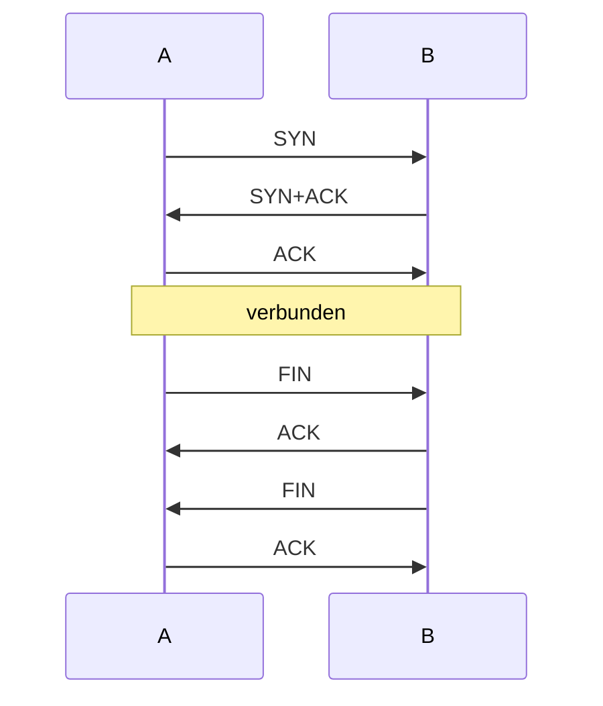
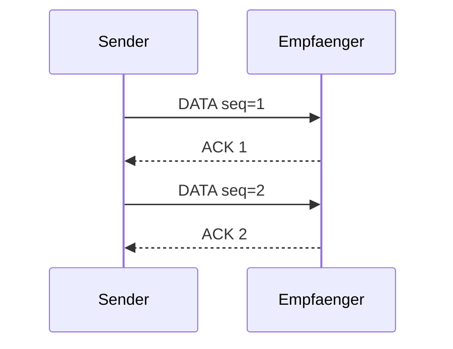
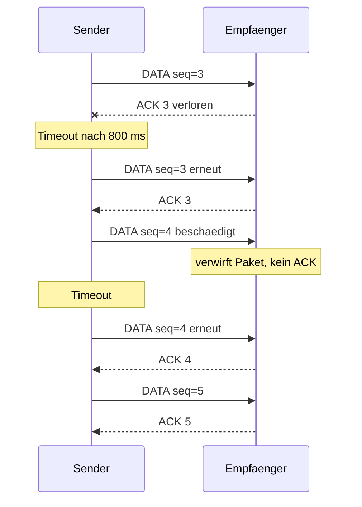
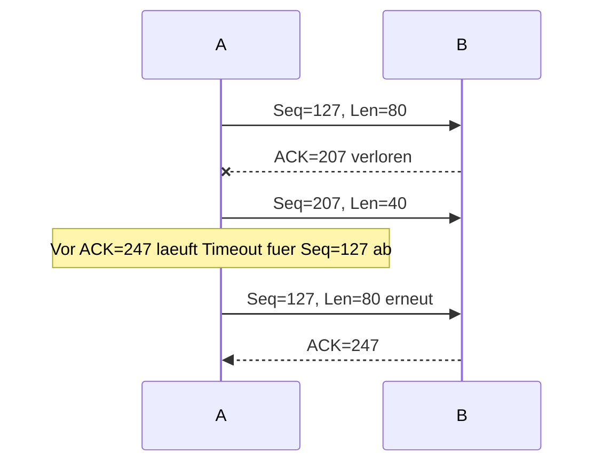
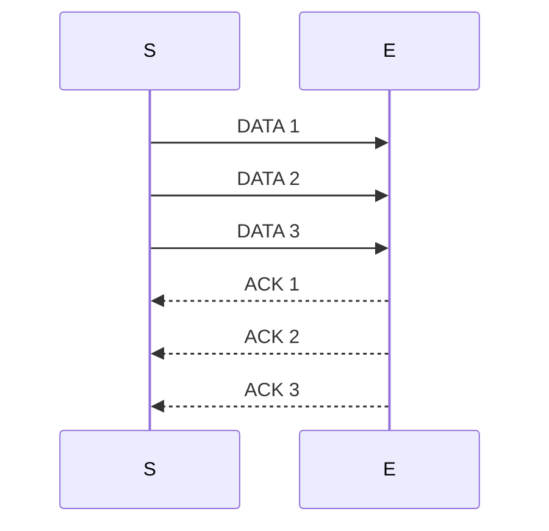
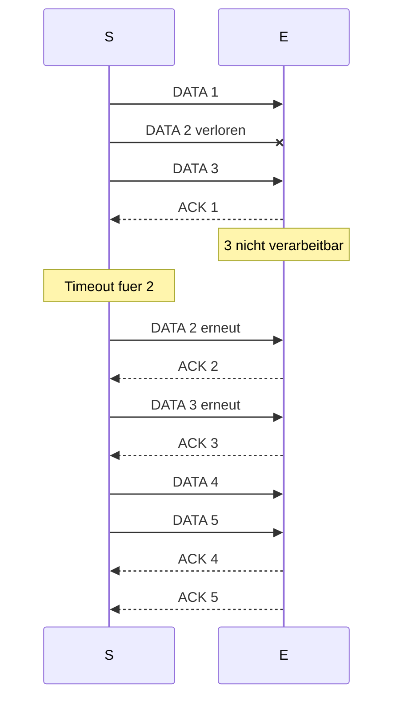
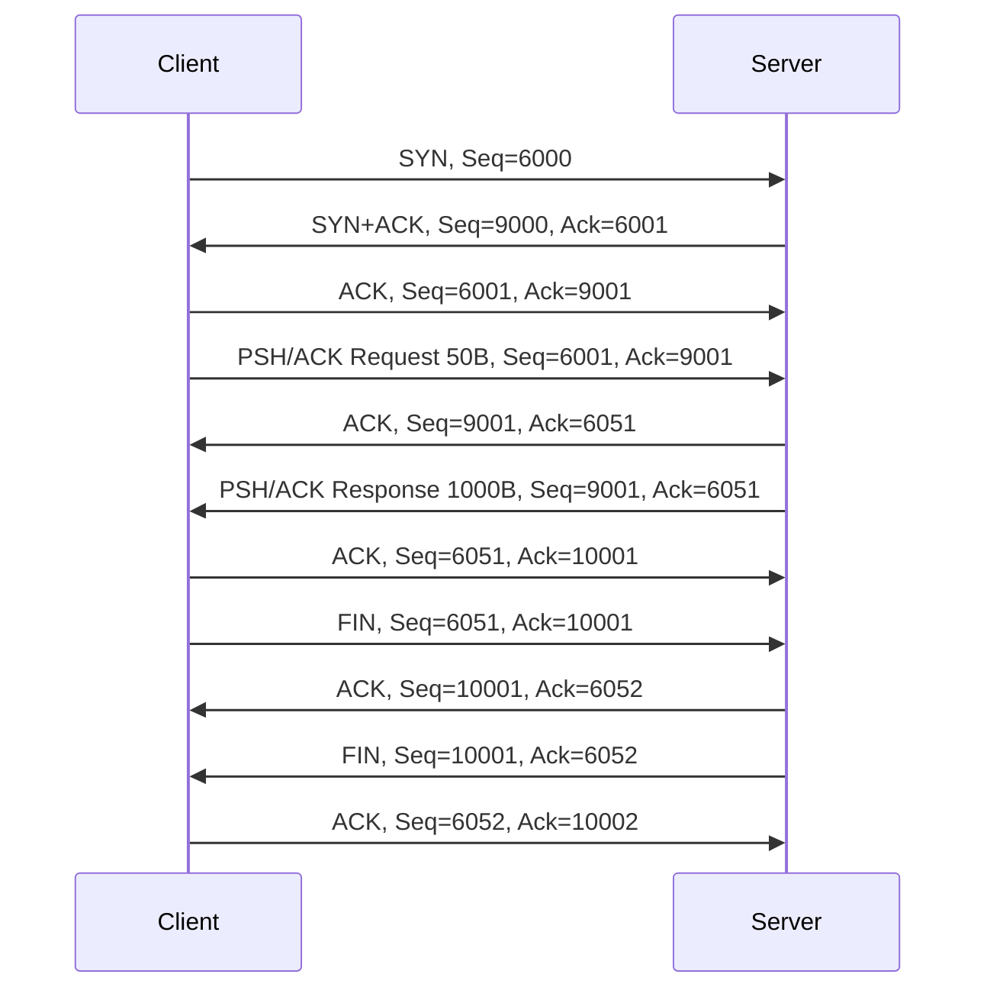

# 传输层：UDP、TCP、序列号与滑动窗口

## 知识点总结

- UDP 无连接、报文式、无可靠性保证。
- TCP 面向连接、字节流、用 Seq/ACK/窗口实现可靠传输。
- ACK 号表示下一个期望字节。

## 完整题目与解答汇总

### 题目 1: 3. RFC 768 (H)

**类型：** 作业  

**来源说明：** Uebungsblatt 02, Aufgabe 3  


#### 题目中文翻译 / 中文题意

阅读 RFC 768，说明 UDP 描述了什么、核心特性是什么，并分析如果用 UDP 订披萨会遇到哪些可靠性问题。

#### 德文原题

```text
3. RFC 768 (H)
Um eine Standardisierung der Techniken und Entwicklungen des Internets (ursprünglich Arpanet) zu er-
möglichen, organisiert die IETF (Internet Engineering Task Force) eine Standardisierungsform, die RFCs
(Request for Comments). Ein RFC beginnt mit dem Aufruf ein Architekturproblem bei Rechnernetzen
zu lösen, als Aufforderung zur Einreichung von Kommentaren.
Durch Entwicklung, Prüfung und Implementierung des RFCs wird dieser vom Entwurf zum Standard.
Über RFCs werden Technologien wie TCP, IP, HTTP als offene Standards definiert.
RFC 768 aus dem Jahr 1980 ist ein einfaches aber oft implementiertes RFC. Es wird später in der
Vorlesung noch genauer beleuchtet. Verschaffen Sie sich einen Überblick zum RFC 768 (https://tools.
ietf.org/html/rfc768) und beantworten Sie folgende Fragen:
(a) Erklären Sie was RFC 768 beschreibt und wofür es verwendet wird.
(b) Welches für das Protokoll zentrale Merkmal erwähnt das Dokument?
(c) Angenommen Sie möchten nun eine Pizza wie in Aufgabe 1 über RFC 768 statt per Telefon bestellen.
Die technischen Einzelheiten können dabei vernachlässigt werden. Welche Schwierigkeiten ergeben
sich nun durch die Eigenschaften des Protokolls gegenüber einer Telefonverbindung?
```

#### 解答

**3. RFC 768 / UDP**

**(a)**  
**DE:** RFC 768 beschreibt das User Datagram Protocol (UDP). UDP dient dazu, Datagramme zwischen Prozessen ueber Ports zu transportieren.

**中文：** RFC 768 描述的是 UDP 用户数据报协议。UDP 的作用是在主机上的进程之间传输数据报，端口号用于区分不同进程或服务。

**(b)**  
**DE:** Zentrales Merkmal: verbindungslos, minimaler Header, keine Garantie fuer Zustellung, Reihenfolge oder Duplikatfreiheit. Optional wird eine Checksumme genutzt.

**中文：** 核心特征是无连接、首部很小、不保证送达、不保证顺序、不保证没有重复。UDP 可以使用校验和检测错误，但不会自动重传。

**(c)** Pizza ueber UDP:

| Schwierigkeit | Bedeutung im Pizza-Modell |
|---|---|
| Paketverlust | Bestellung oder Adresse kann fehlen |
| keine Reihenfolgegarantie | Pizzaauswahl kommt vor Name/Adresse an |
| keine Verbindung | Restaurant weiss nicht sicher, ob Kunde noch erreichbar ist |
| keine automatische Wiederholung | Anwendung muss selbst ACK/Retry bauen |

**Wissen / 知识点：** UDP ist einfach und schnell, aber Zuverlaessigkeit muss die Anwendung selbst herstellen.

**备注：** 本题归入本知识点；题目中文翻译/题意、德文原题、解答和来源已保留。


---

### 题目 2: 2. Datenpakete in Python (H)

**类型：** 作业  

**来源说明：** Uebungsblatt 03, Aufgabe 2  


#### 题目中文翻译 / 中文题意

根据 Python `sendto(bytes, addr_tuple)` 示例，识别 Nutzdaten、控制信息、PDU/SDU/ICI，并解码字节消息。

#### 德文原题

```text
2. Datenpakete in Python (H)
Gegeben sei eine Funktion mit folgender Signatur, die ein Teil eines Protokolls im ISO/OSI-Modell (und
auch des Internet-Modells) der Schicht N in Python implementiert. Sie verschickt bytes an einen in
addr_tuple spezifizierten Empfänger.
Hinweis: Der Aufruf könnte äquivalent auch in anderen Programmiersprachen erfolgen. Python wurde
wegen der einfachen Syntax gewählt.
def sendto ( bytes , addr_tuple )
Das folgende Beispiel zeigt einen Aufruf der Funktion. Die Funktion bytes erzeugt ein (in diesem Fall 5
Byte langes) Byte-Array aus dem übergebenen Array.
msg = bytes ([0 x48 , 0 x65 , 0 x6c , 0 x6c , 0 x6f ])
recipient = ("192.168.1.135" , 6243)
sendto ( msg , recipient )
(a) Interpretieren Sie die an sendto übergebenen Argumente als Nutzdaten und Steuerinformationen.
Ordnen Sie die Dateneinheiten aus dem Schema der Vorlesung entsprechend zu.
(b) Welche Aussage können Sie über die (N )-PDU treffen?
(c) Die (N + 1)-PDU ist in der Variable msg gespeichert. Wie kann sie durch die aus der Vorlesung
bekannten Abbildungen zwischen Datenblöcken auf Schicht N bearbeitet werden?
(d) Dekodieren Sie die Nachricht in bytes unter Verwendung der ASCII-Kodierung.
Hinweis: Das Dekodieren per Hand erleichtern sog. ASCII-Tabellen.
```

#### 解答

**2. Datenpakete in Python / Python 数据包**

Gegeben:

```python
msg = bytes([0x48, 0x65, 0x6c, 0x6c, 0x6f])
recipient = ("192.168.1.135", 6243)
sendto(msg, recipient)
```

**(a)**  
**DE:** `msg` ist Nutzdaten/SDU der Schicht N; `recipient` ist Schnittstelleninformation/ICI, denn sie steuert, wohin gesendet wird.

**中文：** `msg` 是第 N 层要传送的有效载荷，也就是 `(N)-SDU`。`recipient` 包含目的 IP 和端口，用来告诉服务应该发往哪里，因此属于接口控制信息 `(N)-ICI`。

**(b)**  
**DE:** Die `(N)-PDU` besteht aus `(N)-PCI + (N)-SDU`. Aus dem Funktionsaufruf allein sieht man die fertige PDU nicht, weil Header/PCI intern von `sendto` erzeugt werden.

**中文：** `(N)-PDU` 由本层控制信息 `(N)-PCI` 加上本层服务数据单元 `(N)-SDU` 构成。函数调用中只能看到 SDU 和目的信息，看不到完整 PDU，因为首部通常在 `sendto` 内部生成。

**(c)**  
**DE:** Die `(N+1)-PDU` in `msg` wird auf Schicht N als `(N)-SDU` behandelt und durch Encapsulation mit `(N)-PCI` zu einer `(N)-PDU`.

**中文：** 上一层交下来的 `(N+1)-PDU` 到了第 N 层后，被第 N 层当作自己的 `(N)-SDU`。第 N 层再加上自己的 PCI 进行封装，得到 `(N)-PDU`。

**(d)** ASCII:

```text
0x48 0x65 0x6c 0x6c 0x6f = Hello
```

**备注：** 本题归入本知识点；题目中文翻译/题意、德文原题、解答和来源已保留。


---

### 题目 3: 2. Verbindungsaufbau und -abbau (H)

**类型：** 作业  

**来源说明：** Uebungsblatt 04, Aufgabe 2  


#### 题目中文翻译 / 中文题意

分析 2-way handshake 的失败场景，画 3-way handshake 与连接释放状态/时序图，并解释为什么任何有限握手都不能绝对保证成功。

#### 德文原题

```text
2. Verbindungsaufbau und -abbau (H)
In der Vorlesung wurde der Verbindungsaufbau und -abbau zur sicheren Kommunikation über einen unzu-
verlässigen Kanal vorgestellt. Im Folgenden sehen Sie ein Zustandsdiagramm für den 2-Wege-Handschlag.
Aufbauwunsch Verbunden
(a) Ein möglicher Fehler während des 2-Wege-Handschlag ist bereits bekannt: der Verlust der zweiten
Nachricht, der Bestätigung des Verbindungsaufbaus, führt zu einem Problem. Zeigen Sie anhand
des Zustandsdiagramms in welchem Zustand die Teilnehmer sich befinden.
(b) Skizzieren Sie ein weiteres weiteres Szenario, in dem die Verbindung beim 2-Wege-Handschlag nicht
erfolgreich aufgebaut wird.
(c) In der Vorlesung wurde das vorgestellte Protokoll zu einem 3-Wege-Handschlag und um einen Ver-
bindungsabbau erweitert. Zeichnen Sie dazu ein Zustandsdiagramm.
(d) Auch der 3-Wege-Handschlag kann den erfolgreichen Verbindungsaufbau nicht garantieren. Um
genau zu sein, gibt es keinen Handschlag der eine vollständige Garantie gibt. Begründen Sie warum
es keinen solchen Handschlag geben kann.
(e) Der 3-Wege-Handschlag ist trotzdem weit verbreitet. Warum ist dieser in der Realität ausreichend
für einen Verbindungsaufbau?
```

#### 解答

**2. Verbindungsaufbau und -abbau**

**(a)**  
**DE:** Beim 2-Wege-Handshake sendet A einen Aufbauwunsch, B bestaetigt. Geht Bs Bestaetigung verloren, ist B im Zustand "verbunden", A wartet weiter oder laeuft in einen Timeout. Es entsteht Zustandsinkonsistenz.

**中文：** 二次握手中 A 发送连接请求，B 回复确认。如果 B 的确认丢失，B 会认为连接已经建立，而 A 仍在等待确认或最终超时，因此双方状态不一致。

**(b)**  
**DE:** Ein weiteres Szenario ist der Verlust des Aufbauwunsches von A. Dann wartet A auf eine Bestaetigung, B weiss aber nichts vom Verbindungsaufbau. Auch ein altes Duplikat eines Aufbauwunsches kann bei B eine Scheinverbindung erzeugen.

**中文：** 另一个错误场景是 A 的连接请求丢失：A 等待 ACK，但 B 完全不知道这次连接。也可能是旧的重复连接请求到达 B，导致 B 误以为要建立新连接。

**(c) 3-Wege-Handshake und Abbau**



**(d)**  
**DE:** Keine endliche Folge von Nachrichten kann absolute Gewissheit garantieren, weil immer die letzte Bestaetigung verloren gehen koennte. Dann weiss der Sender der letzten Nachricht nicht sicher, ob der andere sie erhalten hat. Das ist das klassische Two-Generals-Problem.

**中文：** 任何有限次握手都无法提供绝对保证，因为最后一条确认消息仍然可能丢失。发送最后一条消息的一方永远无法确定对方是否收到了它。这就是经典的“两将军问题”。

**(e)**  
**DE:** In der Praxis reicht der 3-Wege-Handshake, weil Sequenznummern, Timeouts, Wiederholungen und die begrenzte Lebensdauer alter Pakete das Risiko stark begrenzen.

**中文：** 实践中三次握手足够好，因为序列号、超时、重传以及旧包生命周期限制可以把错误连接的概率降得很低。

**备注：** 本题归入本知识点；题目中文翻译/题意、德文原题、解答和来源已保留。


---

### 题目 4: 3. Sequenznummern 1 (ohne Sendefenster) (H)

**类型：** 作业  

**来源说明：** Uebungsblatt 04, Aufgabe 3  


#### 题目中文翻译 / 中文题意

在 Stop-and-Wait 协议中使用序列号：画无错传输、ACK 丢失和数据损坏的时序图，并说明双方如何检测错误。

#### 德文原题

```text
3. Sequenznummern 1 (ohne Sendefenster) (H)
In vielen Protokollen werden zur Erkennung von Duplikaten, Reihenfolgeänderungen und Nachrichten-
verlust Sequenznummern eingesetzt. Für diese Aufgabe gelten die folgenden Festlegungen:
• Der Sender benutzt einen Zeitgeber/Timer, um die Zeit bis zum Erhalt der Quittung zu messen. Er
wiederholt die Nachricht, wenn innerhalb eines Zeitintervalls (Timeout) von 800ms keine Quittung
eingetroffen ist.
• Der Empfänger sendet nur positive Einzelquittungen.
• Der Empfänger kann Nachrichten nur verarbeiten, wenn sie in der richtigen Reihenfolge eintreffen.
• Alle Nachrichten (mit Nutzdaten, bzw. nur Quittung) sind gleich groß.
• Die Netzverzögerung beträgt 20 ms und ist konstant für alle Nachrichten.
• Der Sender wartet nach dem Senden jeder Nachricht, bis diese vom Empfänger quittiert wurde.
(a) Unter welchen Bedingungen ist es akzeptabel, nach jeder einzeln gesendeten Nachricht auf eine
Bestätigung/Quittung zu warten? Begründen Sie Ihre Antwort.
(b) Zeichnen Sie ein Sequenzdiagramm, in dem 2 Nachrichten fehlerfrei übertragen werden.
(c) Zeichnen Sie ein Sequenzdiagramm, in dem der Sender 3 weitere Nachrichten sendet, aber die
folgenden Fehlerfälle eintreten:
• Die Quittung für die erste Nachricht geht auf dem Weg zum Sender verloren.
• Die zweite Nachricht kommt beim Empfänger beschädigt an und wird deswegen verworfen.
Geben Sie für jeden dieser Fehlerfälle an, wie der Fehler jeweils auf Sender- und Empfängerseite
erkannt wird!
```

#### 解答

**3. Sequenznummern 1, ohne Sendefenster**

Rahmenbedingungen: Stop-and-Wait, Timeout 800 ms, Netzverzoegerung 20 ms je Richtung.

**(a)**  
**DE:** Warten auf jede Quittung ist akzeptabel, wenn die Datenrate klein, die RTT gering oder Einfachheit wichtiger als Durchsatz ist. Bei grosser Bandbreite oder grosser RTT ist es ineffizient.

**中文：** 每发一个包就等待确认，在数据量小、RTT 小或协议简单性更重要时可以接受。但在大带宽或大 RTT 场景下效率很低，因为链路大部分时间都在空等。

**(b) Zwei fehlerfreie Nachrichten**



ACK fuer eine Nachricht kommt fruehestens nach `20 ms + 20 ms = 40 ms` zurueck, wenn Sende- und Verarbeitungszeiten vernachlaessigt werden.

**(c) Fehlerfaelle**



**DE:** Der Sender erkennt beide Fehlerfaelle ueber Timeout. Der Empfaenger erkennt ein verlorenes ACK nicht direkt, sondern sieht spaeter ein Duplikat von `seq=3`. Eine beschaedigte Nachricht erkennt er ueber Pruefsumme oder Fehlererkennung und verwirft sie.

**中文：** 发送端对 ACK 丢失和数据包损坏的直接表现都是超时。接收端不能直接知道 ACK 丢了，只会之后看到重复的 `seq=3`。对于损坏的数据包，接收端通过校验和或错误检测发现问题并丢弃。

**Wissen / 知识点：** Stop-and-Wait 很简单，但吞吐量受 RTT 限制；序列号用于识别重复包，ACK 丢失和数据丢失在发送端通常都表现为超时。

**备注：** 本题归入本知识点；题目中文翻译/题意、德文原题、解答和来源已保留。


---

### 题目 5: 1. Transportschicht in Pseudocode (H)

**类型：** 作业  

**来源说明：** Uebungsblatt 05, Aufgabe 1  


#### 题目中文翻译 / 中文题意

根据传输层伪代码识别 UDP 风格的 PDU、PCI、ICI、下层接口信息，并判断协议是否面向连接。

#### 德文原题

```text
1. Transportschicht in Pseudocode (H)
Auf Übungsblatt 3 haben wir die Signatur der Funktion sendto behandelt. Diese implementiert einen
Teil eines Protokolls des Internet-Modells der Schicht N . Sie verschickt bytes an einen in addr_tuple
spezifizierten Empfänger.
Die Implementierung sei durch folgenden Pseudocode gegeben.
def sendto ( bytes , ( address , dst_port )):
address_bytes = hton ( address )
destination_port = hton ( dst_port )
source_port = hton ( random ())
length = hton ( len ( bytes ) + 8)
checksum = build_checksum (
length , destination_port , source_port )
PDU = length + destination_port + source_port + checksum + bytes
route_packet ( address_bytes , PDU )
return
Die Funktion hton konvertiert hier jeden beliebigen Typ zu einem für die Übertragung geeigneten Byte-
Format („big-endian”). Gehen Sie wieder von dem folgenden Beispielaufruf aus.
msg = bytes ([0 x48 , 0 x65 , 0 x6c , 0 x6c , 0 x6f ])
recipient = ("192.168.1.135" , 6243)
sendto ( msg , recipient )
(a) Welche Aussage können Sie über die (N )-PDU treffen?
(b) Welche Informationen sind in der (N )-PCI enthalten? Stimmen diese mit der (N )-ICI überein?
(c) Was entspricht (N − 1)-ICI, -ID bzw. -IDU?
(d) Handelt es sich um ein verbindungsorientiertes oder -loses Protokoll?
Gehen Sie von den bisher in der Vorlesung behandelten Protokollen aus. Welches Protokoll der
Transportschicht wird hier skizziert?
```

#### 解答

**1. Transportschicht in Pseudocode**

Pseudocode baut aus Nutzdaten und Ports ein Segment:

```text
PDU = length + destination_port + source_port + checksum + bytes
```

**(a)**  
**DE:** Die `(N)-PDU` ist das erzeugte Transportsegment. Es enthaelt Header/PCI plus Nutzdaten `bytes`.

**中文：** `(N)-PDU` 就是生成出来的传输层报文段。它由传输层首部/控制信息 PCI 加上应用交下来的 `bytes` 有效载荷组成。

**(b)**  
**DE:** `(N)-PCI` enthaelt Laenge, Zielport, Quellport und Checksumme. Die `(N)-ICI` aus dem Aufruf enthaelt Zieladresse und Zielport; sie stimmt also nur teilweise mit der PCI ueberein. Die Zieladresse wird an die darunterliegende Schicht weitergegeben, nicht in den gezeigten Transportheader geschrieben.

**中文：** `(N)-PCI` 包含长度、目的端口、源端口和校验和。函数调用中的 `(N)-ICI` 包含目标地址和目标端口，因此只和 PCI 部分重合。目标 IP 地址不是这个传输层首部的一部分，而是交给下一层用于路由。

**(c)**  
**DE:** `(N-1)-ICI` ist `address_bytes`, weil die untere Schicht wissen muss, wohin sie das Paket routet. `(N-1)-IDU` besteht aus ICI plus der `(N)-PDU`; die `(N-1)-SDU` ist die gesamte Transport-PDU.

**中文：** `(N-1)-ICI` 是 `address_bytes`，因为下一层需要知道目标网络地址来转发包。`(N-1)-IDU` 由这个接口信息加上第 N 层 PDU 组成；对下一层来说，整个传输层 PDU 就是它的 SDU。

**(d)**  
**DE:** Kein Verbindungsaufbau, zufaelliger Quellport, Laenge, Ports und Checksumme: das skizziert UDP, also ein verbindungsloses Transportschichtprotokoll.

**中文：** 这里没有连接建立过程，只构造源端口、目的端口、长度和校验和，非常像 UDP。因此它是无连接的传输层协议。

**备注：** 本题归入本知识点；题目中文翻译/题意、德文原题、解答和来源已保留。


---

### 题目 6: 2. TCP Sequenznummern (H)

**类型：** 作业  

**来源说明：** Uebungsblatt 05, Aufgabe 2  


#### 题目中文翻译 / 中文题意

给定 TCP 已接收字节数、段长度和端口，计算后续段的序列号、ACK 号和端口，并画 ACK 丢失时序图。

#### 德文原题

```text
2. TCP Sequenznummern (H)
Zwei Hosts A und B kommunizieren über eine TCP Verbindung. Host B hat bereits 126 Bytes von Host
A vollständig empfangen und Host A sendet zwei weitere Segmente der Größen 80 sowie 40 Bytes. Die
Sequenznummer des ersten Segments ist 127, der Quellport ist 302 und der Zielport ist 80. Host B sendet
ein Acknowledgement immer, sobald es ein Segment von Host A empfangen hat.
(a) Wie lauten Sequenznummer, Quell- sowie Zielport des zweiten Segments von Host A an B?
(b) Falls das erste Segment vor dem zweiten Segment bei B eintritt, wie lauten im ACK (Quittung) die
ACK-Nr., Quell- und Zielport?
(c) Falls das erste Segment nach dem zweiten Segment bei B eintritt, wie lauten im ACK (Quittung)
die ACK-Nr., Quell- und Zielport?
(d) Angenommen, beide Segmente kommen in der richtigen Reihenfolge von A zu B. Das erste ACK von
B geht verloren und das zweite ACK erreicht A nach dem ersten Timeout-Intervall. Zeichnen Sie
ein Sequenzdiagramm und beschriften Sie jedes versendete Segment vollständig mit Sequenznum-
mer, Anzahl der Nutzdaten-Bytes. Beschriften Sie des Weiteren alle Quittungen (ACKs) mit der
korrekten ACK Nummer.
```

#### 解答

**2. TCP Sequenznummern**

Gegeben: B hat 126 Bytes empfangen. Erstes neues Segment: Seq=127, Laenge 80, Source Port 302, Destination Port 80. Zweites Segment: Laenge 40.

**(a)**  
**DE:** Zweites Segment von A nach B:

**中文：** 第二个段紧跟第一个 80 字节段之后，所以序列号要加 80：

```text
Seq = 127 + 80 = 207
Source Port = 302
Destination Port = 80
```

**(b)**  
**DE:** Wenn Segment 1 zuerst ankommt, bestaetigt B das naechst erwartete Byte:

**中文：** 如果第一个段先到，B 已经连续收到到字节 206，因此下一个期望字节是 207：

```text
ACK-Nr = 207
Source Port = 80
Destination Port = 302
```

**(c)**  
**DE:** Wenn Segment 2 zuerst ankommt, fehlt Byte 127 bis 206. Bei kumulativen ACKs bleibt:

**中文：** 如果第二个段先到，字节 127 到 206 仍然缺失。TCP 的普通 ACK 是累计确认，所以 ACK 号仍然停在 127：

```text
ACK-Nr = 127
Source Port = 80
Destination Port = 302
```

**(d) ACK-Verlust und Timeout**



**备注：** 本题归入本知识点；题目中文翻译/题意、德文原题、解答和来源已保留。


---

### 题目 7: 3. Sequenznummern 2 (mit Sendefenster) (H)

**类型：** 作业  

**来源说明：** Uebungsblatt 05, Aufgabe 3  


#### 题目中文翻译 / 中文题意

在带发送窗口的协议中分析无错传输、消息丢失、NACK、乱序缓存和累计确认优化。

#### 德文原题

```text
3. Sequenznummern 2 (mit Sendefenster) (H)
Im Übungsblatt der letzten Woche wurden Sequenznummern im Fall betrachtet, dass nach jeder Nach-
richt auf die Quittung gewartet werden muss. In dieser Aufgabe können mehrere Nachrichten auf einmal
gesendet werden. Ansonsten gelten die selben Festlegungen, sofern nicht anders angegeben:
• Der Sender benutzt einen Zeitgeber/Timer, um die Zeit bis zum Erhalt der Quittung zu messen. Er
wiederholt die Nachricht, wenn innerhalb eines Zeitintervalls (Timeout) von 800ms keine Quittung
eingetroffen ist.
• Der Empfänger sendet nur positive Einzelquittungen.
• Der Empfänger kann Nachrichten nur verarbeiten, wenn sie in der richtigen Reihenfolge eintreffen.
• Alle Nachrichten (mit Nutzdaten, bzw. nur Quittung) sind gleich groß.
• Die Netzverzögerung beträgt 20ms und ist konstant für alle Nachrichten.
• Der Sender verwendet ein Sendefenster w = 3, das ihm erlaubt 3 Nachrichten auf einmal abzusen-
den, bevor die erste Quittung zurück ist.
(a) Geben Sie ein Sequenzdiagramm für die fehlerfreie Übertragung dreier Nachrichten an. Hinweis:
Bedenken Sie das festgelegte Sendefenster!
(b) Zeichnen Sie ein Sequenzdiagramm, in dem der Sender fünf Nachrichten sendet, aber die zweite
Nachricht auf dem Weg zum Empfänger verloren geht. Führen Sie das Diagramm fort, bis alle
Nachrichten erfolgreich übertragen wurden.
Für die folgenden Teilaufgaben gelten neue Festlegungen:
• Der Sender verwendet ein größeres Sendefenster von w = 5.
• Der Empfänger sendet nun auch negative Quittungen, sollte eine Nachricht fehlerhaft ankommen.
• Der Empfänger kann korrekte Nachrichten, die in der falschen Reihenfolge ankommen, speichern
und später verarbeiten.
(c) Zeichnen Sie ein Sequenzdiagramm, in dem der Sender fünf Nachrichten sendet, aber die dritte
Nachricht fehlerhaft beim Empfänger ankommt.
(d) Welchen Vorteil haben negative Quittungen?
(e) Wie könnte man den Umgang mit positiven Quittungen optimieren, wenn der Empfänger mehrere
Nachrichten quittieren soll?
```

#### 解答

**3. Sequenznummern 2, mit Sendefenster**

**(a)**  
**DE:** Fehlerfrei bei `w=3`: Sender darf `1,2,3` sofort senden; Empfaenger quittiert jedes einzeln.

**中文：** 当发送窗口 `w=3` 且没有错误时，发送方可以不用等 ACK，直接连续发送 1、2、3 三个消息。接收方每收到一个就分别确认。



**(b)**  
**DE:** Nachricht 2 geht verloren, der Empfaenger kann nur in Reihenfolge verarbeiten. Er nimmt 1 an, kann 3 aber nicht verarbeiten; ACK fuer 2 fehlt und der Sender retransmittiert nach Timeout.

**中文：** 如果第 2 个消息丢失，而接收方只能按顺序处理，那么它可以接受 1，但不能处理 3。发送方迟迟收不到 2 的确认，超时后重传 2，然后再恢复后续传输。



**(c)**  
**DE:** Neue Regeln: `w=5`, NACKs und Puffer fuer ausser-der-Reihe. Wenn DATA 3 fehlerhaft ankommt, sendet E `NACK 3`, puffert 4 und 5 und verarbeitet nach erneuter 3.

**中文：** 新规则下窗口为 5，接收方可以发送 NACK，也能缓存乱序到达的正确消息。如果第 3 个消息损坏，接收方发送 `NACK 3`，同时缓存已经正确到达的 4 和 5；等 3 重传成功后再按顺序交付。

**(d)**  
**DE:** Negative Quittungen beschleunigen Wiederholung, weil der Sender nicht erst auf Timeout warten muss.

**中文：** NACK 的优点是发送方不用等超时，就能知道哪个消息出错，从而更快重传。

**(e)**  
**DE:** Positive ACKs kann man kumulativ gestalten: `ACK k` bedeutet, alle Daten bis vor `k` sind korrekt angekommen. Alternativ kann man SACK benutzen.

**中文：** 可以把正确认设计为累计 ACK：`ACK k` 表示 `k` 之前的数据都已正确收到。也可以使用选择确认 SACK，明确指出哪些块已经收到。

**备注：** 本题归入本知识点；题目中文翻译/题意、德文原题、解答和来源已保留。


---

### 题目 8: 4. 3-Way-Handshake und Sequenznummern bei TCP

**类型：** 作业  

**来源说明：** Uebungsblatt 05, Aufgabe 4  


#### 题目中文翻译 / 中文题意

用 Wireshark 分析 TCP 抓包：找出三次握手、连接释放、RTD、绝对/相对序列号，并判断 SSHv2 是否使用 TCP。

#### 德文原题

```text
4. 3-Way-Handshake und Sequenznummern bei TCP
Protokollkonzepte wie 3-Way-Handshaking und Sequenznummern sind Mechanismen für das Verbin-
dungsmanagement und für die zuverlässige Kommunikation. Diese Mechanismen werden z.B. im Trans-
mission Control Protocol (TCP) eingesetzt. Zur Bearbeitung dieser Aufgabe wird die Trace-Datei
trace3.pcap bereitgestellt, die mitgeschnittenen TCP-Verkehr enthält.
Die Datei lässt sich z.B. mit dem freien Programm Wireshark1 öffnen, das den mitgeschnittenen TCP-
Verkehr grafisch aufbereitet anzeigen und filtern kann.
Wireshark stellt die PDUs verschiedener Schichten tabellarisch dar. In dieser Aufgabe soll es um TCP-
PDUs (Segmente) gehen. Sie sind daran zu erkennen, dass in der Protocol -Spalte TCP steht. Die Infor-
mationen der TCP-PCI werden von Wireshark übersichtlich aufbereitet und je Segment dargestellt.
(a) Identifizieren Sie die zum 3-Way-Handshaking Vorgang gehörenden Segmente in trace3.pcap.
(b) Identifizieren Sie die zum Verbindungsabbau gehörigen Segmente.
(c) Berechnen Sie aus den Paketen des 3-Way-Handshake das so genannte Round Trip Delay (RTD).
Das ist die Zeit, die vom Versenden eines Segments bis zum Erhalt einer Antwort vergeht.
(d) Welche absoluten und relativen TCP-Sequenznummern besitzen diese Segmente?
(e) In dem Mitschnitt werden (in der Standardkonfiguration von Wireshark) auch PDUs vom Protokoll
der Anwendungsschicht (SSHv2 ) angezeigt. Nutzt dieses Protokoll auch TCP? Begründen Sie Ihre
Vermutung kurz.
1https://www.wireshark.org/
```

#### 解答

**4. TCP in Wireshark**

**DE:** Ohne die Datei `trace3.pcap` im Arbeitsverzeichnis lassen sich konkrete Paketnummern und Zeiten nicht bestimmen. Vorgehen:

**中文：** 当前工作目录中没有 `trace3.pcap`，所以不能给出具体包号、时间戳和绝对序列号。可以按下面方法在 Wireshark 中分析：

| Teil | Vorgehen |
|---|---|
| 3-Way-Handshake | Filter `tcp.flags.syn == 1`, Segmente `SYN`, `SYN ACK`, `ACK` |
| Verbindungsabbau | Segmente mit `FIN` und abschliessenden ACKs |
| RTD | Zeit zwischen SYN und SYN+ACK oder zwischen SYN+ACK und ACK |
| absolute/relative SeqNr | In Wireshark TCP-Details; relative Nummern starten meist bei 0 |
| SSHv2 nutzt TCP? | Ja, wenn SSHv2-PDUs in TCP-Segmenten mit TCP-Port 22 oder entsprechender Verbindung gekapselt sind |

**Wissen / 知识点：** TCP 的序号按字节编号；ACK 号表示“下一个期望字节”。UDP 是报文式，TCP 是字节流式。

**备注：** 本题归入本知识点；题目中文翻译/题意、德文原题、解答和来源已保留。


---

### 题目 9: 1. TCP-Verbindung (H)

**类型：** 作业  

**来源说明：** Uebungsblatt 06, Aufgabe 1  


#### 题目中文翻译 / 中文题意

画完整 TCP 请求-响应交换，包括三次握手、数据、ACK 和连接释放，并计算有连接/无连接情况下的时间差。

#### 德文原题

```text
1. TCP-Verbindung (H)
Ein Protokoll der Anwendungsschicht (z.B. HTTP) führt einen Anfrage-Antwort-Dialog aus, der über
eine TCP-Verbindung zwischen einem Client- und einem Serverprozess transportiert werden soll. Die
Netzverzögerung zwischen Client und Server betrage 150 ms, unabhängig von der Nachrichtenlänge.
Ferner betragen die Größe der Anfrage (Request) 50 Byte und die Größe der Antwort (Response) 1000
Byte.
Client Server
Request
Response
Abbildung 1: Ein Sequenzdiagramm der Anfrage und der Antwort des Servers.
(a) Zeichnen Sie ein Sequenzdiagramm des gesamten TCP-Austausches zwischen Client und Server!
Beschriften Sie dabei die Pfeile mit den dabei relevanten Teilen der TCP-Segmentstruktur (relevante
Flags, Sequenznummer, ACK-Nummer). Initiale Sequenznummern seien 6000 für den Client und
9000 für den Server.
(b) Zeitverhältnisse
i. Wie lange dauert es, bis die Antwort (Response) beim Client angekommen ist?
ii. Um welchen Faktor schneller wäre der Austausch von Anfrage/Antwort mittels eines verbin-
dungslosen Protokolls?
iii. Wie viel Zeit vergeht vom Versand des ersten bis zum Empfang des letzten Segments?
```

#### 解答

**1. TCP-Verbindung**


**DE:** Gegeben ist ein Request von 50 Byte und eine Response von 1000 Byte ueber TCP. Die Einweg-Netzverzoegerung betraegt 150 ms. Initiale SeqNr: Client 6000, Server 9000.

**中文：** 应用层有一个 50 B 请求和一个 1000 B 响应，通过 TCP 传输。单向网络延迟是 150 ms。客户端初始序列号为 6000，服务器初始序列号为 9000。

**(a) Sequenzdiagramm**



**(b) Zeit**

**DE:** Wenn Sendezeiten vernachlaessigt werden:

**中文：** 如果忽略发送时间和处理时间，只考虑传播延迟：

1. **DE:** Antwort beim Client: 3-Way-Handshake braucht 1 RTT bis Client senden kann (`300 ms`), Request braucht `150 ms` zum Server, Response `150 ms` zum Client. Insgesamt etwa `600 ms`.  
   **中文：** 响应到达客户端：三次握手到客户端能发送请求需要 1 个 RTT，即 `300 ms`；请求到服务器需要 `150 ms`，响应回客户端还要 `150 ms`，总计约 `600 ms`。
2. **DE:** Verbindungslos: Request hin `150 ms`, Response zurueck `150 ms`, also `300 ms`. Faktor `600/300 = 2`.  
   **中文：** 如果使用无连接协议，请求去程 `150 ms`，响应回程 `150 ms`，共 `300 ms`。TCP 方案约慢 `600/300 = 2` 倍。
3. **DE:** Vom ersten SYN bis zum Empfang des letzten TCP-Segments des gezeichneten Austauschs, also inklusive Verbindungsabbau, vergehen etwa `1050 ms`: `600 ms` bis zur Response beim Client, danach fuer den FIN/ACK-Abbau noch etwa `3 * 150 ms`.  
   **中文：** 如果“最后一个段”指整个 TCP 交换图中的最后一个连接释放 ACK，则不是 `600 ms`，而是约 `1050 ms`：响应到客户端需 `600 ms`，随后四次挥手的最后 ACK 到达对端还需约 `3 * 150 ms`。

**备注：** 本题归入本知识点；题目中文翻译/题意、德文原题、解答和来源已保留。


---

### 题目 10: 3. Fenstergröße beim Sliding-Window-Verfahren (H)

**类型：** 作业  

**来源说明：** Uebungsblatt 07, Aufgabe 3  


#### 题目中文翻译 / 中文题意

在卫星链路中计算 Sliding Window 不同窗口大小下的有效传输率和信道利用率，并求满利用所需最小窗口。

#### 德文原题

```text
3. Fenstergröße beim Sliding-Window-Verfahren (H)
Eine Sendestation verschickt PDUs an Satelliten, mit einer maximalen Übertragungsrate von 64 kBit/s
(1 kBit sind 103 Bits). Die Größe der PDUs beträgt 512 Byte und jede PDU, die der Satellit empfängt,
wird einzeln mit einer 8 Byte langen Antwort über einen separaten Rückkanal bestätigt (Quittung), eben-
falls mit einer maximalen Übertragungsrate von 64kBit/s. In diesem Szenario soll das Sliding-Window-
Verfahren (Fenstertechnik) eingesetzt werden, um Flusssteuerung (Flow Control ) zu ermöglichen.
Es sollen folgende Annahmen gelten:
• Die Signalverzögerung zwischen Sender und Satellit beträgt 270 ms.
• Es handelt sich um einen idealen Satellitenkanal, d.h. keine Nachricht geht verloren.
(a) Berechnen Sie jeweils die maximale effektive Übertragungsrate in kBit/s, wenn die Fenstergröße
folgende Werte annimmt:
i. 1 PDU
ii. 7 PDUs
iii. 15 PDUs
Geben Sie zusätzlich die Nutzungseffizienz des Kanals in Prozent an!
(b) Berechnen Sie die minimale Fenstergröße, mit der die Nutzungseffizienz des Kommunikationskanals
zum Satelliten 100% erreicht!
```

#### 解答

**3. Fenstergoesse beim Sliding Window**

Gegeben: Datenkanal `64 kbit/s`, PDU `512 B = 4096 bit`, ACK `8 B = 64 bit`, Signalverzoegerung je Richtung `270 ms`.

Zeit bis ACK fuer erste PDU beim Sender:

```text
T = 64 ms + 270 ms + 1 ms + 270 ms = 605 ms
```

Effektive Rate: `min(64 kbit/s, w * 4096 bit / 0.605 s)`.

| Fenster | Rate | Effizienz |
|---:|---:|---:|
| 1 | `6.77 kbit/s` | `10.6 %` |
| 7 | `47.39 kbit/s` | `74.0 %` |
| 15 | `64 kbit/s` | `100 %` |

Minimale Fenstergroesse fuer volle Auslastung:

```text
ceil(64000 * 0.605 / 4096) = ceil(9.45) = 10
```

**中文计算说明：** 一个数据 PDU 是 `512 B = 4096 bit`，在 64 kbit/s 链路上发送需要 `64 ms`。ACK 是 `8 B = 64 bit`，发送需要 `1 ms`。加上去程和回程传播延迟各 `270 ms`，第一个 ACK 回到发送端大约需要 `605 ms`。窗口大小为 `w` 时，在这段等待时间内最多能发 `w` 个 PDU，所以有效速率约为 `w * 4096 / 0.605`。当这个值达到链路速率 64 kbit/s 后就不能再提高，因此窗口为 10 时刚好能把信道打满。

**备注：** 本题归入本知识点；题目中文翻译/题意、德文原题、解答和来源已保留。


---

### 题目 11: Socket → 2-Tupel → Bestandteile?

**类型：** 考卷  

**来源说明：** Klausur 2015, Abschnitt Socket → 2-Tupel → Bestandteile?  


#### 题目中文翻译 / 中文题意

Socket → 2元组 → 组成部分？

#### 德文原题

```text
### Socket → 2-Tupel → Bestandteile?

**Socket → 2元组 → 组成部分？**
```

#### 解答

**Lösung / 答案：** **(IP-Adresse, Port-Nummer)**

一个完整的TCP连接由5元组标识：(源IP, 源端口, 目标IP, 目标端口, 协议)

---

**备注：** 本题归入本知识点；题目中文翻译/题意、德文原题、解答和来源已保留。


---

### 题目 12: Welches Transportschicht mit DNS?

**类型：** 考卷  

**来源说明：** Klausur 2015, Abschnitt Welches Transportschicht mit DNS?  


#### 题目中文翻译 / 中文题意

DNS使用哪种传输层协议？

#### 德文原题

```text
### Welches Transportschicht mit DNS?

**DNS使用哪种传输层协议？**
```

#### 解答

**Lösung / 答案：**

- **UDP端口53：** 普通DNS查询（默认）
- **TCP端口53：** 区域传输、大响应（>512字节）

---

**III. wie in 2014 (HTTP, ICMP, OSPF, IMAP)**

这似乎是指2014年考过的协议分类题。

|协议|层级|说明|
|---|---|---|
|HTTP|应用层|超文本传输协议|
|ICMP|网络层|Internet控制消息协议|
|OSPF|网络层|开放最短路径优先（链路状态路由）|
|IMAP|应用层|邮件访问协议|

---

**IV. Elektrische Leiter v. Lichtwellenleiter**

**电导体 vs 光纤**

---

**备注：** 本题归入本知识点；题目中文翻译/题意、德文原题、解答和来源已保留。


---

### 题目 13: ADSL协议栈计算题

**类型：** 考卷  

**来源说明：** Klausur 2015, Abschnitt ADSL协议栈计算题  


#### 题目中文翻译 / 中文题意

场景： 通过ATM模拟以太网的ADSL，使用PPPoE隧道建立TCP/IP连接
协议栈：
TCP/UDP (20B/8B) | 用户数据
ATM-H (5B) | ATM负载 (48B) ...

#### 德文原题

```text
### ADSL协议栈计算题

**场景：** 通过ATM模拟以太网的ADSL，使用PPPoE隧道建立TCP/IP连接

**协议栈：**

```
TCP/UDP (20B/8B) | 用户数据
----------------
IP-H (20B)
----------------
PPP-H (5B) | FCS (4B)
----------------
ETH-H (14B) | FCS
----------------
ATM-H (5B) | ATM负载 (48B) ...
```

---
```

#### 解答

**ADSL协议栈计算题**

**场景：** 通过ATM模拟以太网的ADSL，使用PPPoE隧道建立TCP/IP连接

**协议栈：**

```
TCP/UDP (20B/8B) | 用户数据
----------------
IP-H (20B)
----------------
PPP-H (5B) | FCS (4B)
----------------
ETH-H (14B) | FCS
----------------
ATM-H (5B) | ATM负载 (48B) ...
```

---

**备注：** 本题归入本知识点；题目中文翻译/题意、德文原题、解答和来源已保留。


---

### 题目 14: Frage 3 / 第3题

**类型：** 考卷  

**来源说明：** Klausur 2017, Frage 3  


#### 题目中文翻译 / 中文题意

以下关于协议的哪些陈述是正确的？
IP提供面向连接的服务和路由功能。
DHCP为路由器和三层交换机的配置提供功能。
TCP作为具有错误检测和确认的面向连接协议，提供通过未知网络可靠传输数据的功能。
使用滑动窗口方法的传输协议可以通过单向连接高效传输大量数据。

#### 德文原题

```text
### Frage 3 / 第3题

**Welche der folgenden Aussagen über Protokolle sind wahr?**  
**以下关于协议的哪些陈述是正确的？**

- ○ IP stellt verbindungsorientierte Dienste und Routing-Fähigkeiten zur Verfügung.
    - IP提供面向连接的服务和路由功能。
- ○ DHCP stellt Funktionen für die Konfiguration von Routern und Layer 3-Switches zur Verfügung.
    - DHCP为路由器和三层交换机的配置提供功能。
- ☒ TCP als verbindungsorientiertes Protokoll mit Fehlererkennung und Quittungen stellt die zuverlässige Übertragung von Daten über unbekannte Netze zur Verfügung.
    - TCP作为具有错误检测和确认的面向连接协议，提供通过未知网络可靠传输数据的功能。
- ☒ Ein Transportprotokoll mit Sliding-Window-Verfahren stellt die effiziente Übertragung großer Datenmengen auch über unidirektionale Verbindungen zur Verfügung.
    - 使用滑动窗口方法的传输协议可以通过单向连接高效传输大量数据。
```

#### 解答

**参考答案 / Lösung:**

- ✗ 第一项错误：IP是无连接的协议
- ✗ 第二项错误：DHCP用于自动分配IP地址给终端设备，不是配置路由器
- ✓ 第三项正确：TCP确实是可靠的面向连接协议
- ✗ 第四项错误：滑动窗口能提高大量数据传输效率，但可靠的 Sliding Window 需要反向确认（ACK/NACK）通道；题干说“也能通过单向连接”是不正确的。

---

**备注：** 本题归入本知识点；题目中文翻译/题意、德文原题、解答和来源已保留。


---

### 题目 15: Frage 7 / 第7题

**类型：** 考卷  

**来源说明：** Klausur 2017, Frage 7  


#### 题目中文翻译 / 中文题意

面向连接的协议（带确认和顺序保证）有哪些要求和缺点？
信令数据造成开销。
数据块丢失的可能性更大。
数据块必须带有序列号。

#### 德文原题

```text
### Frage 7 / 第7题

**Welche Anforderungen und Nachteile ergeben sich bei einem verbindungsorientierten Protokoll mit Quittungen und Reihenfolgesicherung?**  
**面向连接的协议（带确认和顺序保证）有哪些要求和缺点？**

- ☒ Signalisierungsdaten verursachen Overhead.
    - 信令数据造成开销。
- ○ Der Verlust von Daten-Blöcken wird wahrscheinlicher.
    - 数据块丢失的可能性更大。
- ☒ Daten-Blöcke müssen mit einer Sequenznummer versehen werden.
    - 数据块必须带有序列号。
```

#### 解答

**参考答案 / Lösung:**

- ✓ 第一项正确：ACK、序列号等都是额外开销
- ✗ 第二项错误：可靠协议反而减少丢失（会重传）
- ✓ 第三项正确：需要序列号来保证顺序和检测丢失

---

**备注：** 本题归入本知识点；题目中文翻译/题意、德文原题、解答和来源已保留。


---

### 题目 16: Frage 6 / 第6题

**类型：** 考卷  

**来源说明：** Klausur 2019, Frage 6  


#### 题目中文翻译 / 中文题意

列举攻击者要将TCP段注入现有连接需要知道的两项信息。

#### 德文原题

```text
### Frage 6 / 第6题

**Nennen Sie zwei Informationen, die ein Angreifer wissen muss, um ein TCP-Segment in eine bestehende Verbindung einzuschleusen. (2分)**  
**列举攻击者要将TCP段注入现有连接需要知道的两项信息。**
```

#### 解答

**Lösung / 答案：**（任选两个）

- **Sequenznummer / 序列号** - 必须在接收方的接收窗口内
- **Quell-IP-Adresse / 源IP地址** - 必须匹配连接的客户端/服务器
- **Ziel-IP-Adresse / 目标IP地址**
- **Quell-Port / 源端口**
- **Ziel-Port / 目标端口**
- **Acknowledgement-Nummer / 确认号**

---

**II. Wireshark (8分)**

**给定Wireshark捕获的网络流量表格**

---

**备注：** 本题归入本知识点；题目中文翻译/题意、德文原题、解答和来源已保留。


---
