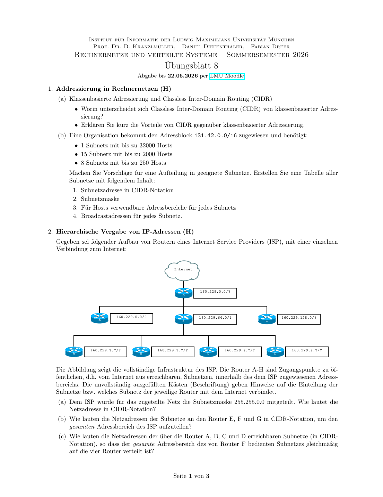

# IP 地址：CIDR、IPv4/IPv6、NAT 与 ARP

## 知识点总结

- CIDR 用可变前缀进行地址分配和聚合。
- ARP 解析下一跳 MAC；NAT/NAPT 改写地址/端口。
- IPv6 地址 128 bit，路由器不做分片。

## 完整题目与解答汇总

### 题目 1: 1. Addressierung in Rechnernetzen (H)

**类型：** 作业  

**来源说明：** Uebungsblatt 08, Aufgabe 1  


#### 题目中文翻译 / 中文题意

比较 CIDR 与分类地址，给 `131.42.0.0/16` 按不同主机需求划分子网，并写出掩码、可用范围和广播地址。

#### 德文原题

```text
1. Addressierung in Rechnernetzen (H)
(a) Klassenbasierte Adressierung und Classless Inter-Domain Routing (CIDR)
• Worin unterscheidet sich Classless Inter-Domain Routing (CIDR) von klassenbasierter Adres-
sierung?
• Erklären Sie kurz die Vorteile von CIDR gegenüber klassenbasierter Adressierung.
(b) Eine Organisation bekommt den Adressblock 131.42.0.0/16 zugewiesen und benötigt:
• 1 Subnetz mit bis zu 32000 Hosts
• 15 Subnetz mit bis zu 2000 Hosts
• 8 Subnetz mit bis zu 250 Hosts
Machen Sie Vorschläge für eine Aufteilung in geeignete Subnetze. Erstellen Sie eine Tabelle aller
Subnetze mit folgendem Inhalt:
1. Subnetzadresse in CIDR-Notation
2. Subnetzmaske
3. Für Hosts verwendbare Adressbereiche für jedes Subnetz
4. Broadcastadressen für jedes Subnetz.
```

#### 解答

**1. Addressierung in Rechnernetzen / 网络地址划分**



**(a)**  
**DE:** Klassenbasierte Adressierung benutzt feste Klassen A/B/C. CIDR benutzt flexible Praefixlaengen wie `/16`, `/21`, `/24`. Vorteile sind bessere Ausnutzung des Adressraums und Routing-Aggregation.

**中文：** 分类地址使用固定的 A/B/C 类网络边界；CIDR 使用灵活的前缀长度，例如 `/16`、`/21`、`/24`。CIDR 的好处是地址空间利用率更高，并且可以把多个网络聚合成较短前缀，减小路由表。

**(b)**  
**DE:** Der gegebene Block ist `131.42.0.0/16`. Man waehlt zuerst das groesste Subnetz, danach die mittelgrossen und zuletzt die kleinen Subnetze.

**中文：** 给定地址块是 `131.42.0.0/16`。划分时先放最大的 32000 主机子网，再放 15 个 2000 主机子网，最后放 8 个 250 主机子网，这样不容易产生碎片。

| Zweck | Subnetz | Maske | nutzbarer Bereich | Broadcast |
|---|---|---|---|---|
| 32000 Hosts | `131.42.0.0/17` | `255.255.128.0` | `131.42.0.1 - 131.42.127.254` | `131.42.127.255` |
| 2000 Hosts 1-15 | `131.42.128.0/21` bis `131.42.240.0/21` in 8er-Schritten | `255.255.248.0` | je `x.1 - x+7.254` | je `x+7.255` |
| 250 Hosts 1-8 | `131.42.248.0/24` bis `131.42.255.0/24` | `255.255.255.0` | je `.1 - .254` | je `.255` |

**DE:** Die 15 `/21`-Netze starten im dritten Oktett bei `128,136,144,...,240`.

**中文：** `/21` 每个块跨 8 个第三字节的值，所以 15 个 `/21` 子网的第三字节起点是 `128, 136, 144, ..., 240`。剩下的 `248-255` 正好给 8 个 `/24` 子网。

**备注：** 本题归入本知识点；题目中文翻译/题意、德文原题、解答和来源已保留。


---

### 题目 2: 2. Hierarchische Vergabe von IP-Adressen (H)

**类型：** 作业  

**来源说明：** Uebungsblatt 08, Aufgabe 2  


#### 题目中文翻译 / 中文题意

根据 ISP 层次结构，把 `160.229.0.0/16` 分配给不同路由器和下级子网。

#### 德文原题

```text
2. Hierarchische Vergabe von IP-Adressen (H)
Gegeben sei folgender Aufbau von Routern eines Internet Service Providers (ISP), mit einer einzelnen
Verbindung zum Internet:
Internet
160.229.0.0/?
H
160.229.0.0/? 160.229.64.0/? 160.229.128.0/?
E F G
160.229.?.?/? 160.229.?.?/? 160.229.?.?/? 160.229.?.?/?
A B C D
Die Abbildung zeigt die vollständige Infrastruktur des ISP. Die Router A-H sind Zugangspunkte zu öf-
fentlichen, d.h. vom Internet aus erreichbaren, Subnetzen, innerhalb des dem ISP zugewiesenen Adress-
bereichs. Die unvollständig ausgefüllten Kästen (Beschriftung) geben Hinweise auf die Einteilung der
Subnetze bzw. welches Subnetz der jeweilige Router mit dem Internet verbindet.
(a) Dem ISP wurde für das zugeteilte Netz die Subnetzmaske 255.255.0.0 mitgeteilt. Wie lautet die
Netzadresse in CIDR-Notation?
(b) Wie lauten die Netzadressen der Subnetze an den Router E, F und G in CIDR-Notation, um den
gesamten Adressbereich des ISP aufzuteilen?
(c) Wie lauten die Netzadressen der über die Router A, B, C und D erreichbaren Subnetze (in CIDR-
Notation), so dass der gesamte Adressbereich des von Router F bedienten Subnetzes gleichmäßig
auf die vier Router verteilt ist?
```

#### 解答

**2. Hierarchische Vergabe von IP-Adressen**

**(a)**  
**DE:** Die Maske `255.255.0.0` fuer `160.229.0.0` entspricht:

**中文：** 子网掩码 `255.255.0.0` 表示前 16 位是网络前缀，所以 CIDR 写法为：

```text
160.229.0.0/16
```

**(b)**  
**DE:** Aufteilung gemaess Abbildung:

**中文：** 根据图中的提示，E 和 F 各拿一个 `/18`，G 拿后半个 `/17`，三者合起来覆盖整个 `/16`：

| Router | Netz |
|---|---|
| E | `160.229.0.0/18` |
| F | `160.229.64.0/18` |
| G | `160.229.128.0/17` |

**(c)**  
**DE:** Der F-Bereich `160.229.64.0/18` wird gleichmaessig auf vier Router verteilt.

**中文：** F 的范围是 `160.229.64.0/18`，大小为 64 个 C 类块。平均分给 4 个路由器，每个得到 16 个 C 类块，也就是 `/20`：

| Router | Netz |
|---|---|
| A | `160.229.64.0/20` |
| B | `160.229.80.0/20` |
| C | `160.229.96.0/20` |
| D | `160.229.112.0/20` |

**备注：** 本题归入本知识点；题目中文翻译/题意、德文原题、解答和来源已保留。


---

### 题目 3: 4. Private IP-Adressen nach RFC1918 (H)

**类型：** 作业  

**来源说明：** Uebungsblatt 08, Aufgabe 4  


#### 题目中文翻译 / 中文题意

把 RFC1918 私有 IPv4 地址范围写成前缀形式，证明 `172.16.0.0/12` 可包含 16 个 `/16` 网络，并讨论私有地址优缺点。

#### 德文原题

```text
4. Private IP-Adressen nach RFC1918 (H)
In RFC 19181 wurden eine Reihe privater IP-Adressen definiert:
1. 10.0.0.0 – 10.255.255.255
2. 172.16.0.0 – 172.31.255.255
3. 192.168.0.0 – 192.168.255.255
Pakete mit Adressen aus diesen Bereichen werden im Internet nicht weitergeleitet.
(a) Wie lassen sich die drei Netzbereiche in Präfix-Notation darstellen?
(b) Zeigen Sie, dass das Netz 172.16.0.0/x (wobei x im ersten Teil ermittelt wurde) 16 Netze mit je 216
Host-Adressen enthalten kann.
Hinweis: Zur besseren Handhabung bietet es sich an, die IP-Adressen und (Sub-)Netzmasken in die
Binärdarstellung zu übertragen.
(c) Was sind die Vorteile der privaten IP-Adressen – warum sind sie nötig? Gibt es Nachteile bei der
Nutzung im Zusammenhang mit dem Internet?
1https://www.rfc-editor.org/rfc/rfc1918
```

#### 解答

**4. Private IP-Adressen nach RFC1918**

**(a) Praefixe**

| Bereich | Praefix |
|---|---|
| 10.0.0.0 - 10.255.255.255 | `10.0.0.0/8` |
| 172.16.0.0 - 172.31.255.255 | `172.16.0.0/12` |
| 192.168.0.0 - 192.168.255.255 | `192.168.0.0/16` |

**(b)**  
**DE:** `172.16.0.0/12` laesst im zweiten Oktett vier Bits variieren: 16 bis 31, also 16 Netze der Form `/16`. Jedes `/16` hat `2^16` Adressen.

**中文：** `172.16.0.0/12` 固定前 12 位，因此第二个字节的后 4 位可以变化，从 16 到 31，共 16 个 `/16` 网络。每个 `/16` 还剩 16 位主机位，所以包含 `2^16` 个地址。

**(c)**  
**DE:** Vorteile: spart oeffentliche IPv4-Adressen, erlaubt interne Struktur, einfache Wiederverwendung. Nachteile: direkte Erreichbarkeit aus dem Internet fehlt; NAT erschwert Ende-zu-Ende-Kommunikation.

**中文：** 私有地址的优点是节省公网 IPv4 地址、允许内部网络重复使用地址并隐藏内部结构。缺点是私网主机不能被公网直接访问，通常需要 NAT，这会破坏端到端通信模型。

**备注：** 本题归入本知识点；题目中文翻译/题意、德文原题、解答和来源已保留。


---

### 题目 4: 5. Network Address Translation (NAT) (H)

**类型：** 作业  

**来源说明：** Uebungsblatt 08, Aufgabe 5  


#### 题目中文翻译 / 中文题意

在 NAT 场景中说明私网主机访问公网服务器时 IP/端口如何被改写，NAT 表如何转发返回包，并讨论 NAT 与安全/IPv6 的关系。

#### 德文原题

```text
5. Network Address Translation (NAT) (H)
In der Vorlesung wurde NAT als Dienst der Vermittlungsschicht eingeführt.
(a) Beschreiben Sie die Funktionsweise von NAT am Beispiel der Abbildung 1.
Angenommen, Host C greift auf einen Foliensatz zu, der auf einem File-Server der LMU (erreichbar
unter dem öffentlichen Namen www.nm.ifi.lmu.de) abgelegt ist.
• Wie sehen Quell- und Ziel-Adresse der Anfrage aus, wenn das Paket von Host C an der Schnitt-
stelle von if0 ankommt? Geben Sie auch die Adressen der Transportschicht an.
• Wie sehen Quell- und Ziel-Adresse der Anfrage aus, wenn das Paket vom Router in das öffent-
liche Netz weitergeleitet wird?
• Woher weiß der Router, dass das entsprechende Antwort-Paket vom öffentlichen Netz an Host
C weitergereicht wird und nicht an einen anderen Client des privaten Netzes?
(b) NAT wird in der Literatur häufig auch als Sicherheitsmechanismus beschrieben, da die interne
Netzinfrastruktur vollständig versteckt wird. Diskutieren Sie diese Aussage. Inwiefern bestätigt
oder widerspricht dies dem wohlbekannten Prinzip Separation of Concerns?
(c) Mit der Einführung von IPv6 wird der verfügbare Adressraum auf 128 Bit (16 Byte) vergrößert, was
viele Konzepte von IPv4 obsolet macht. Theoretisch könnte jedes Gerät mit einer eindeutigen IP
adressiert werden, was eine Kopplung aller Geräte im Internet untereinander problemlos ermöglicht.
Gibt es für NAT unter IPv6 immer noch einen Einsatzzweck?
141.84.218.29
10.10.10.10/24
Host A www.nm.ifi.lmu.de
10.10.10.1/24 64.10.75.34
216.58.209.35
10.10.10.20/24 if0 if1
10.10.10.30/24
Host B
Host C www.google.de
Abbildung 1: NAT Szenario
```

#### 解答

**5. Network Address Translation / NAT**


**DE:** Beispiel: Host C `10.10.10.30` greift auf `www.nm.ifi.lmu.de = 141.84.218.29` zu; der NAT-Router hat oeffentlich `64.10.75.34`.

**中文：** 示例：Host C 的私有地址是 `10.10.10.30`，访问 LMU 文件服务器 `141.84.218.29`；NAT 路由器的公网地址是 `64.10.75.34`。

| Ort | Quell-IP:Port | Ziel-IP:Port |
|---|---|---|
| an if0 | `10.10.10.30:ephemeral` | `141.84.218.29:80/443` |
| nach NAT an if1 | `64.10.75.34:nat-port` | `141.84.218.29:80/443` |

**DE:** Der Router merkt sich in der NAT-Tabelle die Zuordnung `nat-port -> 10.10.10.30:ephemeral`.

**中文：** 路由器在 NAT 表中记录公网端口到内网主机和内网临时端口的映射，例如 `nat-port -> 10.10.10.30:ephemeral`。返回包到达公网端口后，路由器就能查表转发给 Host C，而不是其他内网主机。

**DE:** NAT als Sicherheit: Es versteckt interne Adressen, ist aber keine vollwertige Firewall. Als Sicherheitsmechanismus verletzt es teilweise Separation of Concerns, weil Adressuebersetzung und Zugriffskontrolle vermischt werden.

**中文：** NAT 有一定“隐藏内部结构”的效果，但它不是完整的防火墙。把 NAT 当成安全机制，会把地址转换和访问控制混在一起，某种程度上违背 Separation of Concerns。IPv6 地址空间足够大，不再需要为了省地址使用 NAT；但在策略控制、多宿主或前缀转换等特殊场景下仍可能出现类似 NAT 的机制。

**备注：** 本题归入本知识点；题目中文翻译/题意、德文原题、解答和来源已保留。


---

### 题目 5: 3. Wegewahl mit IP im Internet (H)

**类型：** 作业  

**来源说明：** Uebungsblatt 09, Aufgabe 3  


#### 题目中文翻译 / 中文题意

在 IPv6 ISP 拓扑中分配链路前缀和路由器接口地址，并为 Router B 写路由表和默认路由。

#### 德文原题

```text
3. Wegewahl mit IP im Internet (H)
Die abgebildete Topologie zeigt das Netz eines ortsansässigen Internetanbieters, dem das komplette
Subnetz 2001:1337::/32 zugewiesen wurde. Kunden sind stets an eines der vier (Ethernet-)Teilnetze
angeschlossen und die Verbindungen zwischen den Routern sind ebenfalls je ein (Ethernet-)Teilnetz.
Internet
Subnetz 1:
Subnetz 4:
2001:1337:e15b:ac14::/64
D 2001:1337:c01d:bee2::/64
A B C
Subnetz 2: Subnetz 3:
2001:1337:dead:beef::/64 2001:1337:e7:67::/64
Hinweise:
• Die Teilaufgaben bauen aufeinander auf. Gehen Sie zu Beginn davon aus, dass die Router unkonfi-
guriert sind und über noch über keinerlei Wissen/Zustand verfügen.
• In dieser Aufgabe geht es um IPv6, das 128 bits statt 32 bits (wie IPv4) je Adresse nutzt. Infor-
mationen zur Notation finden Sie auf Folie 172 f. in Kapitel 4. Gleiches gilt entsprechend auch für
Netzmasken bzw. die Prefixe nach CIDR-Notation.
• Eine Beispiel für eine Routing-Tabelle finden Sie in den Vorlesungsfolien Kapitel 4, Folie 111.
• Zur Vereinfachung geben Sie die Netzmaske in CIDR-Notation beim Ziel mit an.
• Verzichten Sie auf die Angabe einer Metrik, da hier keine Routingprotokolle eingesetzt werden und
die Topologie keine sinnvollen alternativen Pfade ermöglicht.
• Benennen Sie die Schnittstellen des Routers sinnvoll!
(a) Identifizieren Sie alle in der Abbildung dargestellten Teilnetze, denen noch kein IP-Adressbereich
zugewiesen wurde und weisen Sie diesen sinnvolle Adressbereiche aus 2001:1337::/32 zu!
(b) Nennen Sie den entsprechenden IPv6-Adressbereich entsprechend der Abbildung und der vorherigen
Teilaufgabe und nennen Sie ebenfalls ein Beispiel für eine IP-Adresse . . .
i. . . . die Router C zugewiesen wird, damit die Kundenrechner aus Subnetz 4 Router C als Default-
gateway benutzen können!
ii. . . . an die Router C eine Nachricht adressiert, wenn dieser (als Endpunkt) ICMP Nachrichten
an Router B schicken möchte!
iii. . . . die Router C als Absender angibt wenn dieser (als Endpunkt) mit Router B kommunizieren
möchte!
(c) Weisen Sie Router B IP-Adressen zu, so dass er mit jedem seiner Nachbarn kommunizieren kann
und als Defaultgateway für die Kunden in Subnetz 3 eingesetzt werden kann!
(d) Erstellen Sie eine Routingtabelle für Router B! Darin soll enthalten sein:
1. ein Eintrag für jedes direkt angeschlossene Netz (schreiben Sie in diesem Fall “direkt” als nächs-
ten Router/Gateway),
2. ein Eintrag für jedes Kundensubnetz, und
3. ein Eintrag der allen sonstigen Verkehr in das Internet weiterleitet.
```

#### 解答

**3. Wegewahl mit IPv6 / IPv6 路由选择**


**DE:** Gegeben sind Kundennetze:

**中文：** 图中已经给出四个客户子网：

| Subnetz | Praefix |
|---|---|
| 1 | `2001:1337:e15b:ac14::/64` |
| 2 | `2001:1337:dead:beef::/64` |
| 3 | `2001:1337:e7:67::/64` |
| 4 | `2001:1337:c01d:bee2::/64` |

**(a) Sinnvolle Linknetze aus `2001:1337::/32` / 从 `2001:1337::/32` 中选取链路网段**

**中文说明：** 路由器之间的点到点/以太网链路也需要 IPv6 前缀。题目没有指定这些前缀，因此只要从 ISP 的 `/32` 地址块里选取不冲突、结构清晰的 `/64` 即可。

| Link | Praefix |
|---|---|
| Internet-D | `2001:1337:0:fffe::/64` |
| D-A | `2001:1337:0:da::/64` |
| A-B | `2001:1337:0:ab::/64` |
| B-C | `2001:1337:0:bc::/64` |

**(b) Beispiele fuer Router C / Router C 地址示例**

**中文说明：** Router C 同时连接客户子网 4 和 B-C 链路，因此它在不同接口上可以有不同 IPv6 地址。作为子网 4 的默认网关时使用子网 4 的地址；和 B 通信时使用 B-C 链路上的地址。

| Zweck | Adresse |
|---|---|
| Default-Gateway in Subnetz 4 | `2001:1337:c01d:bee2::1` |
| Zieladresse, wenn C an B auf dem Link B-C sendet | z.B. B: `2001:1337:0:bc::1` |
| Absenderadresse von C auf Link B-C | `2001:1337:0:bc::2` |

**(c) Adressen fuer Router B / Router B 的地址**

**中文说明：** Router B 连接 A-B、B-C 和客户子网 3，所以需要在三个接口上分别配置地址。

| Interface | Adresse |
|---|---|
| zu A | `2001:1337:0:ab::2/64` |
| zu C | `2001:1337:0:bc::1/64` |
| Subnetz 3 | `2001:1337:e7:67::1/64` |

**(d) Routingtabelle Router B / Router B 路由表**

**中文说明：** 直接相连的网络下一跳写“direkt”；左侧客户网和互联网方向走 A；右侧客户网走 C；其他所有未知目标用默认路由 `::/0` 指向互联网方向。

| Ziel | Gateway | Interface |
|---|---|---|
| `2001:1337:0:ab::/64` | direkt | zu A |
| `2001:1337:0:bc::/64` | direkt | zu C |
| `2001:1337:e7:67::/64` | direkt | Subnetz 3 |
| `2001:1337:c01d:bee2::/64` | `2001:1337:0:bc::2` | zu C |
| `2001:1337:dead:beef::/64` | `2001:1337:0:ab::1` | zu A |
| `2001:1337:e15b:ac14::/64` | `2001:1337:0:ab::1` | zu A |
| `::/0` | `2001:1337:0:ab::1` | Richtung Internet |

**备注：** 本题归入本知识点；题目中文翻译/题意、德文原题、解答和来源已保留。


---

### 题目 6: 4. IPv6-Adressen (H)

**类型：** 作业  

**来源说明：** Uebungsblatt 09, Aufgabe 4  


#### 题目中文翻译 / 中文题意

判断 IPv6 地址是否合法，并在完整写法和最短写法之间转换。

#### 德文原题

```text
4. IPv6-Adressen (H)
In Tabelle 1 befinden sich IPv6-Adressen in vollständiger Notation bzw. in minimaler Notation (kürzeste
Form der selben Adresse). Geben Sie für jede der Adressen an, ob sie gültig ist. Falls die Adresse gültig
ist, geben Sie das jeweils andere Format an.
Vollständig Minimal
fe80:0000:0000:0000:0250:56ff:fe03:0001
::1
545f:75aa:20a0:4cd6:1733:9bde:c5:d57a
cbd7:1295:0x34:1da1:000c:0000:c068:c6b5
26e0:dfcc:1000:0001:704c:0000:8bd:5093
cbd7::c5::1
Tabelle 1: IPv6-Adressen in ungekürzter und minimaler Notation
```

#### 解答

**4. IPv6-Adressen / IPv6 地址**

| Adresse | gueltig? | anderes Format |
|---|---|---|
| `fe80:0000:0000:0000:0250:56ff:fe03:0001` | ja | `fe80::250:56ff:fe03:1` |
| `::1` | ja | `0000:0000:0000:0000:0000:0000:0000:0001` |
| `545f:75aa:20a0:4cd6:1733:9bde:c5:d57a` | ja | `545f:75aa:20a0:4cd6:1733:9bde:00c5:d57a` |
| `cbd7:1295:0x34:1da1:000c:0000:c068:c6b5` | nein | `0x34` ist keine IPv6-Hextet-Notation |
| `26e0:dfcc:1000:0001:704c:0000:8bd:5093` | ja | `26e0:dfcc:1000:1:704c:0:8bd:5093` |
| `cbd7::c5::1` | nein | `::` darf nur einmal vorkommen |

**备注：** 本题归入本知识点；题目中文翻译/题意、德文原题、解答和来源已保留。


---

### 题目 7: 1. Zusammenspiel von IPv4 und ARP (H)

**类型：** 作业  

**来源说明：** Uebungsblatt 10, Aufgabe 1  


#### 题目中文翻译 / 中文题意

给三个 IPv4 子网和两个路由器分配 IP/MAC，分析 E 到 B 的转发过程中每一跳的源/目的 IP 与 MAC，并讨论 ARP 表为空时的流程。

#### 德文原题

```text
1. Zusammenspiel von IPv4 und ARP (H)
Abbildung 1 skizziert 3 lokale Netze (Subnetz 1 – 3), die über 2 Router miteinander verbunden sind.
(a) Weisen Sie den Schnittstellen aller Hosts passende IP-Adressen zu. Verwenden Sie für die jeweiligen
Subnetze folgende Adressbereiche.
• Subnetz 1: 192.168.1.100/24
• Subnetz 2: 192.168.2.100/24
• Subnetz 3: 192.168.3.100/24
(b) Weisen Sie jedem Interface eine eindeutige MAC Adresse zu.
(c) Angenommen Sie senden ein IP-Paket von Host E zu Host B. Nehmen Sie dabei an, dass alle ARP
Einträge gültig und bereits bekannt sind. Listen Sie alle Zwischenschritte der Übertragung auf.
Nennen Sie bei jedem Schritt die Quell-IP und Ziel-IP sowie Quell-MAC und Ziel-MAC.
(d) Gegeben sei dasselbe Szenario wie in Teilaufgabe c). Nehmen Sie nun an, dass die ARP Tabelle
beim Sender Host E leer ist.
Abbildung 1: 3 Subnetze, verbunden über zwei Router
```

#### 解答

**1. Zusammenspiel von IPv4 und ARP / IPv4 与 ARP**


**(a)(b) Beispielhafte IP- und MAC-Vergabe / IP 与 MAC 分配示例**

**DE:** Die folgende Vergabe ist nur ein konsistentes Beispiel; andere eindeutige Hostadressen und MAC-Adressen waeren ebenfalls korrekt.

**中文：** 下表只是一个一致的分配示例。只要每个接口在对应子网内有合法且不冲突的 IP，每个接口 MAC 唯一，其他分配也可以。

| Interface | IP | MAC |
|---|---|---|
| Host A | `192.168.1.101/24` | `00:00:00:00:01:0A` |
| Host B | `192.168.1.102/24` | `00:00:00:00:01:0B` |
| Router R1 links | `192.168.1.1/24` | `00:00:00:00:01:01` |
| Router R1 mitte | `192.168.2.1/24` | `00:00:00:00:02:01` |
| Host C | `192.168.2.101/24` | `00:00:00:00:02:0C` |
| Host D | `192.168.2.102/24` | `00:00:00:00:02:0D` |
| Router R2 mitte | `192.168.2.2/24` | `00:00:00:00:02:02` |
| Router R2 rechts | `192.168.3.1/24` | `00:00:00:00:03:01` |
| Host E | `192.168.3.101/24` | `00:00:00:00:03:0E` |
| Host F | `192.168.3.102/24` | `00:00:00:00:03:0F` |

**(c) Paket von E nach B, ARP bekannt / ARP 已知时从 E 到 B**

**DE:** IP-Quelle und IP-Ziel bleiben Ende-zu-Ende gleich.

**中文：** IP 源地址和目的地址表示端到端通信，因此从 E 到 B 的整个过程中保持不变：

```text
Src-IP = 192.168.3.101
Dst-IP = 192.168.1.102
```

**DE:** Nur die MAC-Adressen wechseln je Hop.

**中文：** MAC 地址只在当前链路内有效，所以每经过一跳都会换成“当前发送接口 MAC”和“下一跳接口 MAC”：

| Hop | Src-MAC | Dst-MAC |
|---|---|---|
| E -> R2 rechts | `00:...:03:0E` | `00:...:03:01` |
| R2 mitte -> R1 mitte | `00:...:02:02` | `00:...:02:01` |
| R1 links -> B | `00:...:01:01` | `00:...:01:0B` |

**(d) ARP-Tabelle bei E leer / E 的 ARP 表为空**

**DE:** E erkennt: B liegt nicht im eigenen `/24`, also muss das Paket an Default-Gateway `192.168.3.1`. E sendet ARP-Broadcast:

**中文：** E 发现 B 的 IP 不在自己的 `192.168.3.0/24` 子网内，因此不能直接发给 B，而要先发给默认网关 `192.168.3.1`。由于 E 的 ARP 表为空，它先广播询问网关的 MAC：

```text
Who has 192.168.3.1? Tell 192.168.3.101
```

**DE:** R2 antwortet mit MAC `00:...:03:01`. Danach laeuft die Uebertragung wie in (c). Falls Router-ARP-Tabellen ebenfalls leer waeren, wuerden R2 und R1 auf ihren jeweiligen Ausgangsnetzen ebenfalls ARP-Anfragen stellen.

**中文：** R2 回复自己的右侧接口 MAC `00:...:03:01`。之后 E 就能把 IP 包封装进以太网帧发给 R2。若路由器的 ARP 表也为空，R2、R1 在各自下一跳链路上也要先 ARP 查询。

**备注：** 本题归入本知识点；题目中文翻译/题意、德文原题、解答和来源已保留。


---

### 题目 8: 第4题

**类型：** 考卷  

**来源说明：** Klausur 2015, Abschnitt 第4题  


#### 题目中文翻译 / 中文题意

第3层（网络层）的典型任务？

#### 德文原题

```text
### 第4题

**Typische Aufg. d. Schicht 3: IPv6, Subnetz, IPv4, IP-Header Fragmentierung, ARP-Cache**  
**第3层（网络层）的典型任务？**
```

#### 解答

**Lösung / 答案：**

- **IPv6** ✓
- **IPv4** ✓
- **Subnetz / 子网划分** ✓
- **IP-Header** ✓
- **Fragmentierung / 分片** ✓

**ARP-Cache** - 严格来说ARP工作在第2/3层之间

---

**备注：** 本题归入本知识点；题目中文翻译/题意、德文原题、解答和来源已保留。


---

### 题目 9: Wozu ARP?

**类型：** 考卷  

**来源说明：** Klausur 2015, Abschnitt Wozu ARP?  


#### 题目中文翻译 / 中文题意

ARP的用途？

#### 德文原题

```text
### Wozu ARP?

**ARP的用途？**

**Lösung / 答案：** 将**IPv4地址**解析为**MAC地址**

当主机知道目标IP但不知道MAC地址时，发送ARP请求广播，目标主机回复其MAC地址。

---
```

#### 解答

**Lösung / 答案：** 将**IPv4地址**解析为**MAC地址**

当主机知道目标IP但不知道MAC地址时，发送ARP请求广播，目标主机回复其MAC地址。

---

**备注：** 本题归入本知识点；题目中文翻译/题意、德文原题、解答和来源已保留。


---

### 题目 10: Wann Default Route v. Router?

**类型：** 考卷  

**来源说明：** Klausur 2015, Abschnitt Wann Default Route v. Router?  


#### 题目中文翻译 / 中文题意

路由器何时使用默认路由？

#### 德文原题

```text
### Wann Default Route v. Router?

**路由器何时使用默认路由？**
```

#### 解答

**Lösung / 答案：** 当路由表中**没有匹配**目标地址的特定路由时，使用默认路由（通常表示为0.0.0.0/0）。

---

**备注：** 本题归入本知识点；题目中文翻译/题意、德文原题、解答和来源已保留。


---

### 题目 11: (b) Gibt es Übertr.Fehler die zuv. korrigiert werden?

**类型：** 考卷  

**来源说明：** Klausur 2015, Abschnitt (b) Gibt es Übertr.Fehler die zuv. korrigiert werden?  


#### 题目中文翻译 / 中文题意

有可以可靠纠正的传输错误吗？
对于简单奇偶校验（H=2）：不能纠正任何错误，只能检测奇数位错误。
示例：
发送: 1100101|0
接收: 1100101|0
标记错误位。

#### 德文原题

```text
### (b) Gibt es Übertr.Fehler die zuv. korrigiert werden?

**有可以可靠纠正的传输错误吗？**

对于简单奇偶校验（H=2）：**不能纠正任何错误**，只能检测奇数位错误。

**示例：**

```
发送: 1100101|0
接收: 1100101|0
BCC:  00000001
```

标记错误位。

---

## VII. Routing & IPv4-Multicasting

## 路由与IPv4多播

---
```

#### 解答

**(b) Gibt es Übertr.Fehler die zuv. korrigiert werden?**

**有可以可靠纠正的传输错误吗？**

对于简单奇偶校验（H=2）：**不能纠正任何错误**，只能检测奇数位错误。

**示例：**

```
发送: 1100101|0
接收: 1100101|0
BCC:  00000001
```

标记错误位。

---

**VII. Routing & IPv4-Multicasting**

**路由与IPv4多播**

---

**备注：** 本题归入本知识点；题目中文翻译/题意、德文原题、解答和来源已保留。


---

### 题目 12: 224.0.0.0/4 → wie viele IPv4 Adressen?

**类型：** 考卷  

**来源说明：** Klausur 2015, Abschnitt 224.0.0.0/4 → wie viele IPv4 Adressen?  


#### 题目中文翻译 / 中文题意

224.0.0.0/4 包含多少个IPv4地址？

#### 德文原题

```text
### 224.0.0.0/4 → wie viele IPv4 Adressen?

**224.0.0.0/4 包含多少个IPv4地址？**
```

#### 解答

**Lösung / 答案：**

- /4 表示4位网络前缀，28位主机部分
- 地址数量 = 2²⁸ = **268,435,456** 个地址
- 这是多播地址范围（D类地址）：224.0.0.0 - 239.255.255.255

---

**备注：** 本题归入本知识点；题目中文翻译/题意、德文原题、解答和来源已保留。


---

### 题目 13: (a) Welche Router traversiert ein IPv4 Paket, wenn es vom Client C an Server S geschickt wird?

**类型：** 考卷  

**来源说明：** Klausur 2015, Abschnitt (a) Welche Router traversiert ein IPv4 Paket, wenn es vom Client C an Server S geschickt wird?  


#### 题目中文翻译 / 中文题意

从客户端C发送到服务器S的IPv4数据包经过哪些路由器？
需要看具体网络拓扑图来回答。

#### 德文原题

```text
### (a) Welche Router traversiert ein IPv4 Paket, wenn es vom Client C an Server S geschickt wird?

**从客户端C发送到服务器S的IPv4数据包经过哪些路由器？**

需要看具体网络拓扑图来回答。

---
```

#### 解答

**(a) Welche Router traversiert ein IPv4 Paket, wenn es vom Client C an Server S geschickt wird?**

**从客户端C发送到服务器S的IPv4数据包经过哪些路由器？**

需要看具体网络拓扑图来回答。

---

**备注：** 本题归入本知识点；题目中文翻译/题意、德文原题、解答和来源已保留。


---

### 题目 14: (b) Was passiert, wenn C IPv4 Paket an IPv4 12.23.34.45 sendet?

**类型：** 考卷  

**来源说明：** Klausur 2015, Abschnitt (b) Was passiert, wenn C IPv4 Paket an IPv4 12.23.34.45 sendet?  


#### 题目中文翻译 / 中文题意

当C向12.23.34.45发送IPv4数据包时会发生什么？
12.23.34.45是一个单播地址（不是多播地址224-239开头），所以按正常单播路由处理。

#### 德文原题

```text
### (b) Was passiert, wenn C IPv4 Paket an IPv4 12.23.34.45 sendet?

**当C向12.23.34.45发送IPv4数据包时会发生什么？**

12.23.34.45是一个**单播地址**（不是多播地址224-239开头），所以按正常单播路由处理。

---
```

#### 解答

**(b) Was passiert, wenn C IPv4 Paket an IPv4 12.23.34.45 sendet?**

**当C向12.23.34.45发送IPv4数据包时会发生什么？**

12.23.34.45是一个**单播地址**（不是多播地址224-239开头），所以按正常单播路由处理。

---

**备注：** 本题归入本知识点；题目中文翻译/题意、德文原题、解答和来源已保留。


---

### 题目 15: Ist aus ihrer Sicht TCP bei IPv4-Multicasting einsetzbar?

**类型：** 考卷  

**来源说明：** Klausur 2015, Abschnitt Ist aus ihrer Sicht TCP bei IPv4-Multicasting einsetzbar?  


#### 题目中文翻译 / 中文题意

您认为TCP可以用于IPv4多播吗？

#### 德文原题

```text
### Ist aus ihrer Sicht TCP bei IPv4-Multicasting einsetzbar?

**您认为TCP可以用于IPv4多播吗？**
```

#### 解答

**Lösung / 答案：** **Nein / 不可以**

**理由：**

- TCP是**面向连接**的协议，需要在两个端点之间建立连接
- 多播是**一对多**通信，一个发送方向多个接收方发送
- TCP的三次握手、序列号、确认机制无法有效扩展到多个接收方
- **UDP**更适合多播，因为它是无连接的

---

**VIII. TCP Überlastkontrolle**

**备注：** 本题归入本知识点；题目中文翻译/题意、德文原题、解答和来源已保留。


---

### 题目 16: Frage 4 / 第4题

**类型：** 考卷  

**来源说明：** Klausur 2017, Frage 4  


#### 题目中文翻译 / 中文题意

以下关于互联网协议（IP）的哪些陈述是正确的？
IP是面向连接的协议。
IP与ICMP位于同一OSI层。
IP数据包的长度是固定的。
IP数据包的分片决定取决于MTU。
IP头部的协议字段指示如何解释有效载荷。

#### 德文原题

```text
### Frage 4 / 第4题

**Welche Aussagen über das Internetprotokoll (IP) treffen zu?**  
**以下关于互联网协议（IP）的哪些陈述是正确的？**

- ○ IP ist ein verbindungsorientiertes Protokoll.
    - IP是面向连接的协议。
- ☒ IP befindet sich auf der gleichen OSI-Schicht wie ICMP.
    - IP与ICMP位于同一OSI层。
- ○ Die Länge von IP-Paketen ist konstant.
    - IP数据包的长度是固定的。
- ☒ Die Entscheidung über Fragmentierung von IP-Paketen ist von der MTU abhängig.
    - IP数据包的分片决定取决于MTU。
- ☒ Das Protocol-Feld des IP-Headers gibt an, wie die Nutzdaten interpretiert werden sollen.
    - IP头部的协议字段指示如何解释有效载荷。
```

#### 解答

**参考答案 / Lösung:**

- ✗ 第一项错误：IP是无连接的
- ✓ 第二项正确：IP和ICMP都在网络层（第3层）
- ✗ 第三项错误：IP数据包长度可变
- ✓ 第四项正确：MTU决定是否需要分片
- ✓ 第五项正确：协议字段标识上层协议（如TCP=6，UDP=17）

---

**备注：** 本题归入本知识点；题目中文翻译/题意、德文原题、解答和来源已保留。


---

### 题目 17: Frage 5 / 第5题

**类型：** 考卷  

**来源说明：** Klausur 2017, Frage 5  


#### 题目中文翻译 / 中文题意

以下关于IPv6的哪些陈述是正确的？
IPv6有固定大小的头部。
IPv6必须在每个路由器上重新计算头部校验和。
IPv6具有用于服务质量机制的流标签。
IPv6没有网络类别。

#### 德文原题

```text
### Frage 5 / 第5题

**Welche Aussagen über IPv6 treffen zu?**  
**以下关于IPv6的哪些陈述是正确的？**

- ☒ IPv6 hat einen Header konstanter Größe.
    - IPv6有固定大小的头部。
- ○ IPv6 muss eine Prüfsumme über den Header auf jedem Router neu berechnen.
    - IPv6必须在每个路由器上重新计算头部校验和。
- ☒ IPv6 besitzt eine Flow-ID für Dienstgütemechanismen.
    - IPv6具有用于服务质量机制的流标签。
- ☒ IPv6 hat keine Netzklassen.
    - IPv6没有网络类别。
```

#### 解答

**参考答案 / Lösung:**

- ✓ 第一项正确：IPv6基本头部固定为40字节
- ✗ 第二项错误：IPv6头部没有校验和字段（简化处理）
- ✓ 第三项正确：Flow Label用于QoS
- ✓ 第四项正确：IPv6使用CIDR，没有传统网络类别

---

**备注：** 本题归入本知识点；题目中文翻译/题意、德文原题、解答和来源已保留。


---

### 题目 18: Frage 10 / 第10题

**类型：** 考卷  

**来源说明：** Klausur 2017, Frage 10  


#### 题目中文翻译 / 中文题意

以下关于网络地址转换（NAT）的哪些陈述是正确的？
NAT被标准化为网络安装的安全特性。
NAT涉及OSI第3层的操作。
NAT可以更改TCP和UDP中的目标端口地址。
NAT掩盖私有IP地址。
NAT改善线路编码。

#### 德文原题

```text
### Frage 10 / 第10题

**Welche Aussagen über Network Address Translation (NAT) treffen zu?**  
**以下关于网络地址转换（NAT）的哪些陈述是正确的？**

- ○ NAT wurde als Sicherheitsmerkmal von Netzinstallationen standardisiert.
    - NAT被标准化为网络安装的安全特性。
- ☒ NAT betrifft Abläufe auf OSI-Schicht 3.
    - NAT涉及OSI第3层的操作。
- ○ NAT kann Ziel-Port-Adressen in TCP und UDP verändern.
    - NAT可以更改TCP和UDP中的目标端口地址。
- ☒ NAT maskiert private IP-Adressen.
    - NAT掩盖私有IP地址。
- ○ NAT verbessert die Leitungskodierung.
    - NAT改善线路编码。
```

#### 解答

**参考答案 / Lösung:**

- ✗ 第一项错误：NAT主要为了解决IP地址短缺，安全性是副作用
- ✓ 第二项正确：NAT在网络层操作IP地址
- ○ 第三项部分正确：NAT（特别是NAPT）确实会修改端口号
- ✓ 第四项正确：NAT将私有地址转换为公有地址
- ✗ 第五项错误：NAT与物理层编码无关

---

**2 ISO OSI-Schichtenmodell (6 Punkte)**

**2 ISO OSI层模型（6分）**

---

**备注：** 本题归入本知识点；题目中文翻译/题意、德文原题、解答和来源已保留。


---

### 题目 19: Frage 16 / 第16题

**类型：** 考卷  

**来源说明：** Klausur 2017, Frage 16  


#### 题目中文翻译 / 中文题意

确定直接连接到路由器C的子网（141.84.32.0/19）的广播地址。

#### 德文原题

```text
### Frage 16 / 第16题

**Bestimmen Sie die Broadcast-Adresse des Subnetzes (141.84.32.0/19), das direkt an Router C angeschlossen ist.**  
**确定直接连接到路由器C的子网（141.84.32.0/19）的广播地址。**
```

#### 解答

**参考答案 / Lösung:** **141.84.63.255**

**计算过程：**

- /19 意味着前19位是网络部分
- 主机部分有 32-19=13 位
- 网络地址：141.84.32.0
- 141.84.32.0 = 141.84.0010 0000.0
- 广播地址 = 网络地址 + 全1主机位
- 141.84.001**1 1111.1111 1111** = 141.84.63.255

---

**备注：** 本题归入本知识点；题目中文翻译/题意、德文原题、解答和来源已保留。


---

### 题目 20: Frage 17 / 第17题

**类型：** 考卷  

**来源说明：** Klausur 2017, Frage 17  


#### 题目中文翻译 / 中文题意

写出路由器E的路由表条目，使得从互联网来的IP数据包能以最短路径正确转发到141.84.0.0/16地址范围内的所有计算机！

#### 德文原题

```text
### Frage 17 / 第17题

**Schreiben Sie Einträge der Routingtabelle für Router E, so dass auf dem kürzesten Weg IP-Pakete aus dem Internet an alle Rechner im Adressbereich 141.84.0.0/16 korrekt weitergeleitet werden!**  
**写出路由器E的路由表条目，使得从互联网来的IP数据包能以最短路径正确转发到141.84.0.0/16地址范围内的所有计算机！**
```

#### 解答

**参考答案 / Lösung:**

|Ziel / 目标|Router / 下一跳|
|---|---|
|141.84.0.0/19|11.0.4.1 (Router A)|
|141.84.32.0/19|11.0.3.1 (Router F → C)|
|141.84.64.0/18|11.0.5.1 (Router B)|
|141.84.128.0/17|11.0.3.1 (Router F → D)|

**说明：** 根据网络拓扑，选择到各子网的最短路径。

---

**备注：** 本题归入本知识点；题目中文翻译/题意、德文原题、解答和来源已保留。


---

### 题目 21: Frage 18 / 第18题

**类型：** 考卷  

**来源说明：** Klausur 2017, Frage 18  


#### 题目中文翻译 / 中文题意

假设块141.84.0.0/16用子网掩码255.255.255.192划分。最多可以实现多少个子网？

#### 德文原题

```text
### Frage 18 / 第18题

**Angenommen der Block 141.84.0.0/16 wird mit der Subnetzmaske 255.255.255.192 aufgeteilt. Wieviele Subnetze lassen sich damit maximal realisieren?**  
**假设块141.84.0.0/16用子网掩码255.255.255.192划分。最多可以实现多少个子网？**
```

#### 解答

**参考答案 / Lösung:** **2^10 - 2 = 1022** 或 **2^10 = 1024**

**计算过程：**

- 原网络：/16（16位网络部分）
- 255.255.255.192 = /26（26位网络部分）
- 子网位数 = 26 - 16 = 10位
- 子网数量 = 2^10 = 1024
- 如果排除全0和全1子网：1024 - 2 = 1022

---

**备注：** 本题归入本知识点；题目中文翻译/题意、德文原题、解答和来源已保留。


---

### 题目 22: Frage 19 / 第19题

**类型：** 考卷  

**来源说明：** Klausur 2017, Frage 19  


#### 题目中文翻译 / 中文题意

将IPv6地址1337:0000:0000:0000:1000:0000:0000:0001最大程度缩写，使得不存在更短的完整表示。

#### 德文原题

```text
### Frage 19 / 第19题

**Notieren Sie die IPv6 Adresse 1337:0000:0000:0000:1000:0000:0000:0001 maximal verkürzt, so dass keine kürzere vollständige Darstellung dieser Adresse in IPv6 existiert.**  
**将IPv6地址1337:0000:0000:0000:1000:0000:0000:0001最大程度缩写，使得不存在更短的完整表示。**
```

#### 解答

**参考答案 / Lösung:** **1337::1000:0:0:1**

**缩写规则：**

- 每组前导零可省略
- 连续的全零组可用::替代（只能用一次）
- 选择最长的连续零序列用::替代
- 1337:0000:0000:0000 → 1337::
- 1000:0000:0000:0001 → 1000:0:0:1

---

**备注：** 本题归入本知识点；题目中文翻译/题意、德文原题、解答和来源已保留。


---

### 题目 23: Frage 20 / 第20题

**类型：** 考卷  

**来源说明：** Klausur 2017, Frage 20  


#### 题目中文翻译 / 中文题意

一个互联网提供商获得子网2001:CDE0::/27。这将被完全划分为四个相等大小的部分。
给出产生的子网的网络ID长度（位数）！

#### 德文原题

```text
### Frage 20 / 第20题

**Ein Internetanbieter erhält das Subnetz 2001:CDE0:0000:0000:0000:0000:0000:0000/27. Dieses wird vollständig in vier gleich große Teilbereiche geteilt.**  
**一个互联网提供商获得子网2001:CDE0::/27。这将被完全划分为四个相等大小的部分。**

**(a) Geben Sie die Länge der Netz-ID der entstehenden Teilnetze in Anzahl Bits an!**  
**给出产生的子网的网络ID长度（位数）！**
```

#### 解答

**参考答案 / Lösung:** **29**

4个子网需要2位（2² = 4），所以 27 + 2 = 29

**(b) Schreiben Sie die vier entstehenden Subnetze in CIDR-Notation auf!**  
**写出四个产生的子网的CIDR表示！**

**参考答案 / Lösung:**

首先分析：2001:CDE0::/27

- 27位 = 前27位固定
- 2001:CDE0 前16位 = 0010 0000 0000 0001 : 1100 1101 1110 0...
- 第27-28位用于区分4个子网

|子网编号|CIDR表示|
|---|---|
|1|2001:CDE0::/29|
|2|2001:CDE8::/29|
|3|2001:CDF0::/29|
|4|2001:CDF8::/29|

---

**6 Fragmentierung**

**6 分片**

**网络拓扑：**

- E1 ←(2500B)→ R1 ←(300B)→ R2 ←(1500B)→ E2
- Kanal A: 2500 Bytes MTU
- Kanal B: 300 Bytes MTU
- Kanal C: 1500 Bytes MTU

---

**备注：** 本题归入本知识点；题目中文翻译/题意、德文原题、解答和来源已保留。


---

### 题目 24: Frage 6 / 第6题

**类型：** 考卷  

**来源说明：** Klausur 2018, Frage 6  


#### 题目中文翻译 / 中文题意

以下关于网络地址转换（NAT）的哪些陈述是正确的？
NAT涉及网络层的操作。
NAT可以更改TCP和UDP中的端口。
NAT掩盖私有IP地址。
NAT改善线路编码。

#### 德文原题

```text
### Frage 6 / 第6题

**Welche Aussagen über Network Address Translation (NAT) treffen zu?**  
**以下关于网络地址转换（NAT）的哪些陈述是正确的？**

- ☒ NAT betrifft Abläufe auf Vermittlungsschicht.
    - NAT涉及网络层的操作。
- ☒ NAT kann die Ports in TCP und UDP verändern.
    - NAT可以更改TCP和UDP中的端口。
- ☒ NAT maskiert private IP-Adressen.
    - NAT掩盖私有IP地址。
- ○ NAT verbessert die Leitungskodierung.
    - NAT改善线路编码。
```

#### 解答

**解析：**

- ✓ 第一项正确：NAT在网络层（第3层）操作IP地址
- ✓ 第二项正确：NAPT（网络地址端口转换）会修改端口号
- ✓ 第三项正确：NAT将私有地址转换为公有地址
- ✗ 第四项错误：NAT与物理层编码无关

---

**备注：** 本题归入本知识点；题目中文翻译/题意、德文原题、解答和来源已保留。


---

### 题目 25: Frage 8 / 第8题

**类型：** 考卷  

**来源说明：** Klausur 2018, Frage 8  


#### 题目中文翻译 / 中文题意

以下哪些信息出现在每个IPv4头部中？
○ Zielport / 目标端口
IP-Adresse des Senders / 发送方IP地址
Ziel IP-Adresse / 目标IP地址
○ IP-Adresse des nächsten Routers / 下一跳路由器的IP地址

#### 德文原题

```text
### Frage 8 / 第8题

**Welche der folgenden Angaben stehen in jedem IPv4-Header?**  
**以下哪些信息出现在每个IPv4头部中？**

- ○ Zielport / 目标端口
- ☒ IP-Adresse des Senders / 发送方IP地址
- ☒ Ziel IP-Adresse / 目标IP地址
- ○ IP-Adresse des nächsten Routers / 下一跳路由器的IP地址
```

#### 解答

**解析：**

- ✗ 目标端口：属于传输层（TCP/UDP头部），不在IP头部
- ✓ 发送方IP地址：Source Address字段
- ✓ 目标IP地址：Destination Address字段
- ✗ 下一跳路由器IP：不在IP头部，由路由表决定

---

**备注：** 本题归入本知识点；题目中文翻译/题意、德文原题、解答和来源已保留。


---

### 题目 26: Frage 16 / 第16题

**类型：** 考卷  

**来源说明：** Klausur 2018, Frage 16  


#### 题目中文翻译 / 中文题意

假设组件X是Switch，客户端IP为10.10.8.4（24位网络ID）
客户端发送包含DNS请求的帧到哪个MAC地址？

#### 德文原题

```text
### Frage 16 / 第16题

**假设组件X是Switch，客户端IP为10.10.8.4（24位网络ID）**

**(a) An welche MAC-Adresse sendet der Client Rahmen, die DNS-Anfragen enthalten?**  
**客户端发送包含DNS请求的帧到哪个MAC地址？**
```

#### 解答

**Lösung / 答案：** **00:30:05:79:55:0A**（DNS服务器的MAC地址）

**解释：** 当X是Switch时，客户端和DNS服务器在同一子网，客户端直接发送到DNS服务器的MAC地址。

**(b) 同上问题**

**Lösung / 答案：** **00:30:05:79:55:0A**

---

**备注：** 本题归入本知识点；题目中文翻译/题意、德文原题、解答和来源已保留。


---

### 题目 27: Frage 17 / 第17题

**类型：** 考卷  

**来源说明：** Klausur 2018, Frage 17  


#### 题目中文翻译 / 中文题意

假设组件X是Router
客户端发送HTTP请求到哪个MAC地址？

#### 德文原题

```text
### Frage 17 / 第17题

**假设组件X是Router**

- Client: 192.168.1.2/28
- Port X1: 192.168.1.1/28
- Port X2: 10.10.8.1/24

**(a) An welche MAC-Adresse sendet der Client HTTP-Anfragen?**  
**客户端发送HTTP请求到哪个MAC地址？**
```

#### 解答

**Lösung / 答案：** **00:30:05:79:55:B1**（路由器端口X1的MAC地址）

**解释：** WWW服务器（10.10.8.3）与客户端（192.168.1.2）不在同一子网，需要通过路由器转发。客户端将帧发送到默认网关（路由器）的MAC地址。

**(b) An welche IPv4-Adresse sendet der Client DNS-Anfragen?**  
**客户端发送DNS请求到哪个IPv4地址？**

**Lösung / 答案：** **10.10.8.2**（DNS服务器的IP地址）

**解释：** IP地址不变，只是二层MAC地址通过路由器转换。

**(c) An welche MAC-Adresse versendet der Router einen Rahmen, mit der Ziel-IP 10.10.8.3 und dem Ziel-UDP-Port 53?**  
**路由器将目标IP为10.10.8.3、目标UDP端口为53的帧发送到哪个MAC地址？**

**Lösung / 答案：** **00:30:05:79:55:0A**（DNS服务器的MAC地址）

**解释：** 目标IP是10.10.8.3，但UDP端口53是DNS端口，所以这个包实际上可能是DNS响应或请求。根据目标IP，应该发送到10.10.8.3对应的MAC地址，即00:30:05:79:55:DD（WWW服务器）。

**注意：** 这道题可能有歧义。如果严格按IP地址来看，10.10.8.3对应WWW服务器（00:30:05:79:55:DD）。

---

**备注：** 本题归入本知识点；题目中文翻译/题意、德文原题、解答和来源已保留。


---

### 题目 28: Frage 18 / 第18题

**类型：** 考卷  

**来源说明：** Klausur 2018, Frage 18  


#### 题目中文翻译 / 中文题意

为什么路由器的端口需要IPv4地址才能在网络间传输数据，而交换机的端口不需要？

#### 德文原题

```text
### Frage 18 / 第18题

**Warum benötigen die Ports eines Routers IPv4-Adressen um Daten zwischen den Netzen übertragen zu können, die Ports eines Switches jedoch nicht?**  
**为什么路由器的端口需要IPv4地址才能在网络间传输数据，而交换机的端口不需要？**
```

#### 解答

**Lösung / 答案：**

**路由器工作在第3层（网络层）**，需要参与IP路由决策。每个端口必须有IP地址，因为：

- 路由器需要作为不同子网的网关
- 主机将数据包发送到路由器的IP地址（下一跳）
- 路由器需要处理ICMP消息（如TTL超时）

**交换机工作在第2层（数据链路层）**，只根据MAC地址转发帧：

- 交换机对帧是"透明"的
- 不参与IP层的决策
- 只需要MAC地址表来转发帧

---

**V. Fragmentierung / 分片**

**网络拓扑：**

- E1 ←(2500B)→ R1 ←(280B)→ R2 ←(1500B)→ E2
- Kanal A: 2500 Bytes MTU
- Kanal B: 280 Bytes MTU
- Kanal C: 1500 Bytes MTU

---

**备注：** 本题归入本知识点；题目中文翻译/题意、德文原题、解答和来源已保留。


---

### 题目 29: Frage 21 / 第21题

**类型：** 考卷  

**来源说明：** Klausur 2018, Frage 21  


#### 题目中文翻译 / 中文题意

假设块141.84.0.0/16用子网掩码255.255.255.192划分。最多可以实现多少个子网？

#### 德文原题

```text
### Frage 21 / 第21题

**Angenommen der Block 141.84.0.0/16 wird mit der Subnetzmaske 255.255.255.192 aufgeteilt. Wie viele Subnetze lassen sich damit maximal realisieren?**  
**假设块141.84.0.0/16用子网掩码255.255.255.192划分。最多可以实现多少个子网？**
```

#### 解答

**Lösung / 答案：** **1024** 或 **2^10 = 1024**

**计算过程：**

- 原网络：/16（16位网络部分）
- 255.255.255.192 = 11111111.11111111.11111111.11000000 = /26
- 子网位数 = 26 - 16 = 10位
- 子网数量 = 2^10 = **1024**

---

**备注：** 本题归入本知识点；题目中文翻译/题意、德文原题、解答和来源已保留。


---

### 题目 30: Frage 22 / 第22题

**类型：** 考卷  

**来源说明：** Klausur 2018, Frage 22  


#### 题目中文翻译 / 中文题意

确定子网141.84.32.0/19的广播地址！

#### 德文原题

```text
### Frage 22 / 第22题

**Bestimmen Sie die Broadcast-Adresse des Subnetzes 141.84.32.0/19!**  
**确定子网141.84.32.0/19的广播地址！**
```

#### 解答

**Lösung / 答案：** **141.84.63.255**

**计算过程：**

- /19 意味着前19位是网络部分
- 主机部分有 32-19 = 13 位
- 网络地址：141.84.32.0 = 141.84.0010 0000.0000 0000
- 广播地址 = 网络地址 + 全1主机位
- 141.84.001**1 1111.1111 1111** = 141.84.63.255

---

**备注：** 本题归入本知识点；题目中文翻译/题意、德文原题、解答和来源已保留。


---

### 题目 31: Frage 23 / 第23题

**类型：** 考卷  

**来源说明：** Klausur 2018, Frage 23  


#### 题目中文翻译 / 中文题意

将IPv6地址最大程度缩写。

#### 德文原题

```text
### Frage 23 / 第23题

**Notieren Sie die IPv6-Adresse 1337:0000:0000:0000:1000:0000:0000:0001 maximal verkürzt.**  
**将IPv6地址最大程度缩写。**
```

#### 解答

**Lösung / 答案：** **1337::1000:0:0:1**

**缩写规则：**

- 每组前导零可省略
- 连续的全零组可用::替代（只能用一次）
- 选择最长的连续零序列用::替代
- 原地址：1337:0000:0000:0000:1000:0000:0000:0001
- 最长零序列在前半部分（3个0000组）
- 缩写后：1337::1000:0:0:1

---

**备注：** 本题归入本知识点；题目中文翻译/题意、德文原题、解答和来源已保留。


---

### 题目 32: Frage 24 / 第24题

**类型：** 考卷  

**来源说明：** Klausur 2018, Frage 24  


#### 题目中文翻译 / 中文题意

一个互联网提供商获得子网2001:CDE0::/27。这将被完全划分为四个相等大小的部分。
给出产生的子网的网络ID长度（位数）！

#### 德文原题

```text
### Frage 24 / 第24题

**Ein Internetanbieter erhält das Subnetz 2001:CDE0::/27. Dieses wird vollständig in vier gleich große Teilbereiche geteilt.**  
**一个互联网提供商获得子网2001:CDE0::/27。这将被完全划分为四个相等大小的部分。**

**(a) Geben Sie die Länge der Netz-ID der entstehenden Teilnetze in Anzahl der Bits an!**  
**给出产生的子网的网络ID长度（位数）！**
```

#### 解答

**Lösung / 答案：** **29**

4个子网需要2位（2² = 4），所以 27 + 2 = 29

**(b) Schreiben Sie die vier entstehenden Subnetze in CIDR-Notation auf!**  
**写出四个产生的子网的CIDR表示！**

**Lösung / 答案：**

分析：2001:CDE0::/27

- 2001:CDE0 = 0010 0000 0000 0001 : 1100 1101 1110 0000
- 前27位固定，第28-29位用于区分4个子网

|子网编号|第28-29位|CIDR表示|
|---|---|---|
|1|00|2001:CDE0::/29|
|2|01|2001:CDE8::/29|
|3|10|2001:CDF0::/29|
|4|11|2001:CDF8::/29|

---

**备注：** 本题归入本知识点；题目中文翻译/题意、德文原题、解答和来源已保留。


---

### 题目 33: Frage 3 / 第3题

**类型：** 考卷  

**来源说明：** Klausur 2019, Frage 3  


#### 题目中文翻译 / 中文题意

是否可以通过同一个交换机运行子网10.4.0.0/15和10.6.0.0/24？简要说明理由。

#### 德文原题

```text
### Frage 3 / 第3题

**Ist es möglich, die beiden Subnetze 10.4.0.0/15 bzw. 10.6.0.0/24 über denselben Switch zu betreiben? Begründen Sie kurz. (2分)**  
**是否可以通过同一个交换机运行子网10.4.0.0/15和10.6.0.0/24？简要说明理由。**
```

#### 解答

**Lösung / 答案：** **Nein / 不可以**

**理由：**

- 10.4.0.0/15 覆盖地址范围：10.4.0.0 - 10.5.255.255
- 10.6.0.0/24 覆盖地址范围：10.6.0.0 - 10.6.0.255
- 这两个子网不重叠，是**不同的IP子网**
- 交换机工作在第2层，只能连接**同一个广播域/子网**内的设备
- 不同子网之间的通信需要**路由器**（第3层设备）

---

**备注：** 本题归入本知识点；题目中文翻译/题意、德文原题、解答和来源已保留。


---

### 题目 34: Frage 12 / 第12题

**类型：** 考卷  

**来源说明：** Klausur 2019, Frage 12  


#### 题目中文翻译 / 中文题意

为什么路由器的端口需要IPv4地址才能在网络间传输数据，而交换机的端口不需要？

#### 德文原题

```text
### Frage 12 / 第12题

**Warum benötigen die Ports eines Routers IPv4-Adressen um Daten zwischen den Netzen übertragen zu können, die Ports eines Switches jedoch nicht? (2分)**  
**为什么路由器的端口需要IPv4地址才能在网络间传输数据，而交换机的端口不需要？**
```

#### 解答

**Lösung / 答案：**

**路由器（第3层设备）：**

- 工作在网络层，需要处理IP数据包
- 每个端口连接不同的IP子网
- 需要IP地址作为该子网的网关
- 主机将数据包发送到路由器的IP地址（下一跳）
- 需要处理ICMP消息（如TTL超时等）

**交换机（第2层设备）：**

- 工作在数据链路层，只处理以太网帧
- 根据MAC地址表转发帧
- 对IP层是"透明"的
- 所有端口属于同一个广播域
- 不参与IP路由决策

---

**V. Fragmentierung / 分片 (7分)**

**网络拓扑：**

- E1 ←(2500B)→ R1 ←(280B)→ R2 ←(1500B)→ E2

---

**备注：** 本题归入本知识点；题目中文翻译/题意、德文原题、解答和来源已保留。


---

### 题目 35: Frage 15 / 第15题

**类型：** 考卷  

**来源说明：** Klausur 2019, Frage 15  


#### 题目中文翻译 / 中文题意

以太网拓扑：路由器R连接主机F、Hub（连接主机B）和Switch（连接主机A）
(a) 为主机A、B、F和路由器的三个接口分配IPv6地址 (3分)
使用子网：fd00::a:0/112, fd00::b:0/112, fd00::f:0/112

#### 德文原题

```text
### Frage 15 / 第15题

**以太网拓扑：路由器R连接主机F、Hub（连接主机B）和Switch（连接主机A）**

**(a) 为主机A、B、F和路由器的三个接口分配IPv6地址 (3分)**

使用子网：fd00::a:0/112, fd00::b:0/112, fd00::f:0/112
```

#### 解答

**Lösung / 答案：**

|Rechner|IP-Adresse|Schnittstelle|IP-Adresse|
|---|---|---|---|
|A|fd00::a:1|R₀|fd00::a:ffff|
|B|fd00::b:1|R₁|fd00::b:ffff|
|F|fd00::f:1|R₂|fd00::f:ffff|

**(b) 为主机F写一条默认路由 (2分)**

**Lösung / 答案：**

**Ziel Subnetz:** ::/0（或 default）

**erreichbar über:** fd00::f:ffff（路由器R₂接口）

---

**备注：** 本题归入本知识点；题目中文翻译/题意、德文原题、解答和来源已保留。


---

### 题目 36: Frage 16 / 第16题

**类型：** 考卷  

**来源说明：** Klausur 2019, Frage 16  


#### 题目中文翻译 / 中文题意

假设块172.16.0.0/12用子网掩码255.255.255.128划分，最多可以实现多少个子网？

#### 德文原题

```text
### Frage 16 / 第16题

**Angenommen der Block 172.16.0.0/12 wird mit der Subnetzmaske 255.255.255.128 aufgeteilt. Wieviele Subnetze lassen sich damit maximal realisieren? (1分)**  
**假设块172.16.0.0/12用子网掩码255.255.255.128划分，最多可以实现多少个子网？**
```

#### 解答

**Lösung / 答案：**

- 原网络：/12（12位网络部分）
- 255.255.255.128 = /25（25位网络部分）
- 子网位数 = 25 - 12 = 13位
- 子网数量 = 2¹³ = **8192**

---

**备注：** 本题归入本知识点；题目中文翻译/题意、德文原题、解答和来源已保留。


---

### 题目 37: Frage 17 / 第17题

**类型：** 考卷  

**来源说明：** Klausur 2019, Frage 17  


#### 题目中文翻译 / 中文题意

将IPv6地址 1337:0000:0000:0000:1000:0000:0000:0001 最大程度缩写 (1分)

#### 德文原题

```text
### Frage 17 / 第17题

**将IPv6地址 1337:0000:0000:0000:1000:0000:0000:0001 最大程度缩写 (1分)**
```

#### 解答

**Lösung / 答案：** **1337::1000:0:0:1**

最长的连续零序列（3个0000组）用::替代。

---

**备注：** 本题归入本知识点；题目中文翻译/题意、德文原题、解答和来源已保留。


---

### 题目 38: Frage 18 / 第18题

**类型：** 考卷  

**来源说明：** Klausur 2019, Frage 18  


#### 题目中文翻译 / 中文题意

简要说明为什么路由器F不应该将目标地址为10.0.0.8的数据包转发到互联网。

#### 德文原题

```text
### Frage 18 / 第18题

**Argumentieren Sie kurz, warum Router F ein Paket mit Zieladresse 10.0.0.8 nicht ins Internet weiterleiten sollte. (2分)**  
**简要说明为什么路由器F不应该将目标地址为10.0.0.8的数据包转发到互联网。**
```

#### 解答

**Lösung / 答案：**

- **10.0.0.0/8 是私有IP地址范围**（RFC 1918）
- 私有地址不能在公共互联网上路由
- 其他私有地址范围：172.16.0.0/12, 192.168.0.0/16
- 如果发送到互联网，响应无法返回（因为没有回路）
- 正确做法：在边界路由器使用NAT转换为公有IP

---

**VII. Transmission Control Protocol (TCP) (17分)**

---

**备注：** 本题归入本知识点；题目中文翻译/题意、德文原题、解答和来源已保留。


---
