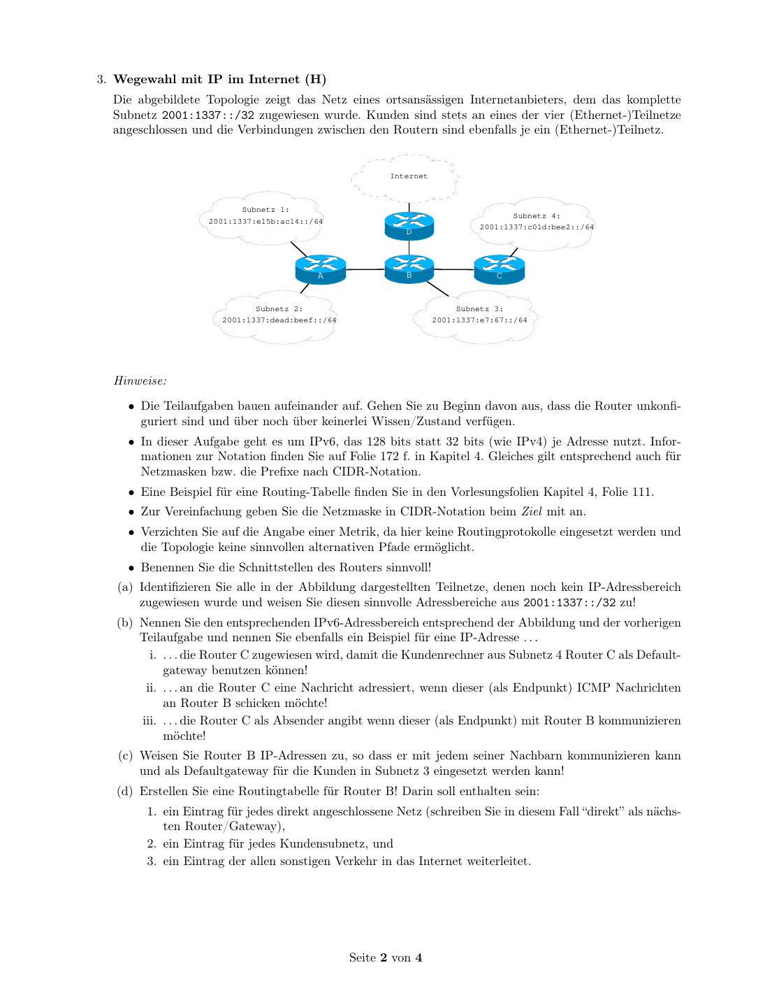
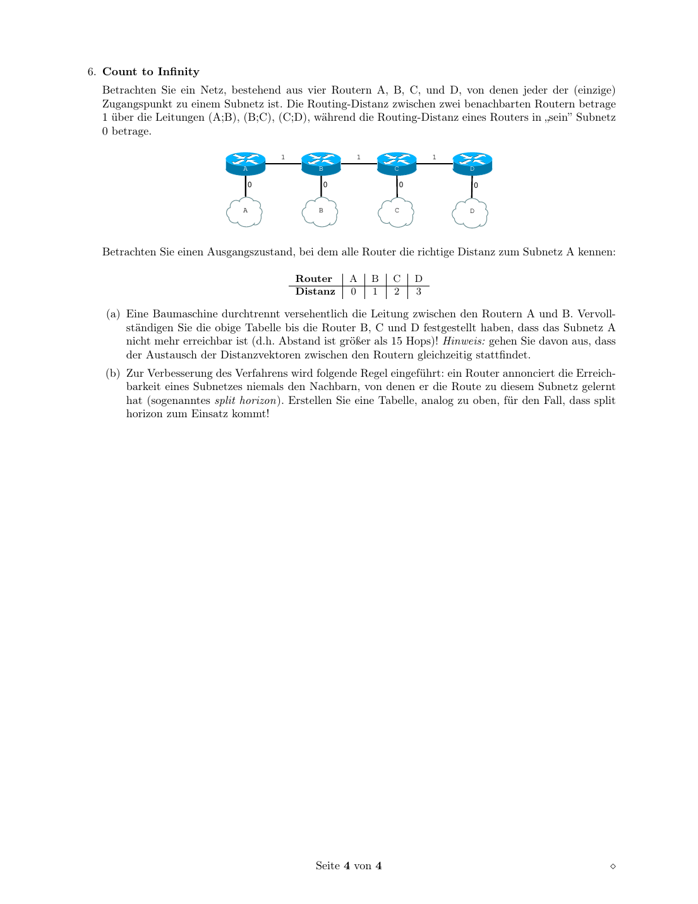

# 路由：Dijkstra、距离向量、BGP 与自治系统

## 知识点总结

- Link-State 用 Dijkstra/SPF；Distance-Vector 用 Bellman-Ford 思想。
- BGP 是 AS 之间的 Path-Vector 协议。
- Count-to-Infinity 是距离向量经典问题。

## 完整题目与解答汇总

### 题目 1: 3. Link-State-Verfahren (H)

**类型：** 作业  

**来源说明：** Uebungsblatt 08, Aufgabe 3  


#### 题目中文翻译 / 中文题意

对给定四路由器图从 A 运行 Dijkstra/SPF，画中间步骤、最终路由表，并分析链路故障后的最短路径树。

#### 德文原题

```text
3. Link-State-Verfahren (H)
Betrachten Sie ein Netz bestehend aus vier Routern A, B, C, D.
C
2
1
2
A B
3
2
D
(a) Berechnen Sie den optimalen QSB (Quellen-Senken-Baum) für A mit Hilfe des SPF-Algorithmus
(oft auch Dijkstra-Algorithmus genannt) und geben Sie eine Skizze für jeden Zwischenschritt an.
(b) Geben Sie die endgültige Routing-Tabelle (Wegetafel) für A an.
(c) Die Leitung A–C fällt aus. Wie sieht der optimale QSB für A nun aus?
```

#### 解答

**3. Link-State-Verfahren / Dijkstra**


**DE:** Kanten aus der Skizze: `A-C=1`, `C-B=2`, `A-B=2`, `A-D=3`, `D-B=2`.

**中文：** 从图中读出的链路权重为：`A-C=1`，`C-B=2`，`A-B=2`，`A-D=3`，`D-B=2`。

**DE:** SPF/Dijkstra von A:

**中文：** 从 A 出发运行 Dijkstra/SPF，每一步固定当前距离最小的未确定节点：

| Schritt | fest | Distanzen |
|---|---|---|
| Start | A | B=2, C=1, D=3 |
| 1 | C | B bleibt 2, D=3 |
| 2 | B | D bleibt 3 |
| 3 | D | fertig |

Routing-Tabelle fuer A:

| Ziel | Kosten | Next Hop |
|---|---:|---|
| B | 2 | B |
| C | 1 | C |
| D | 3 | D |

**DE:** Faellt `A-C` aus, ist C am besten ueber `A-B-C` erreichbar, Kosten `4`; B bleibt `2`, D bleibt `3`.

**中文：** 如果 `A-C` 链路失效，A 到 C 的最短路径变为 `A-B-C`，总代价 `2+2=4`。到 B 仍然直接走，代价 2；到 D 仍然直接走，代价 3。

**备注：** 本题归入本知识点；题目中文翻译/题意、德文原题、解答和来源已保留。


---

### 题目 2: 1. Distanz-Vektor Routing (H)

**类型：** 作业  

**来源说明：** Uebungsblatt 09, Aufgabe 1  


#### 题目中文翻译 / 中文题意

在九个路由器和子网 G 的拓扑中，按距离向量协议逐轮填写每个路由器通告到 G 的 hop 数，直到稳定。

#### 德文原题

```text
1. Distanz-Vektor Routing (H)
Gegeben sei folgendes Netz, bestehend aus neun Routern und dem Subnetz G:
2 3 4
G
1 5 6 8 9
7
Auf allen Routern wird nun gleichzeitig ein Distanz-Vektor Routingprotokoll aktiviert (z.B. RIP). Als
Metrik wird die Anzahl der Zwischenschritte verwendet.
Zeigen Sie wie sich die Routing-Information für Subnetz G Schritt für Schritt ausbreitet, in dem Sie
die Tabelle erweitern. Tragen Sie in die Tabellenfelder die Metrik ein, mit der ein Router zu einem
bestimmten Zeitpunkt Subnetz G ankündigt. t ist Anfangszustand, wenn Router 1 zum ersten Mal
0
Subnetz G ankünigt. Führen Sie die Tabelle fort, bis die Metriken stabil sind.
Hinweis: Lassen Sie das entsprechende Feld leer, wenn der Router zu diesem Zeitpunkt keine Route zu
G kennt.
Zeit- Router
punkt 1 2 3 4 5 6 7 8 9
t 0
0
t
1
. . .
```

#### 解答

**1. Distanz-Vektor Routing / 距离向量路由**


**DE Aufgabenidee:** Subnetz G ist an Router 1 angeschlossen. Die Routinginformation breitet sich hopweise aus.

**中文题意：** 从路由器 1 开始，按 RIP/距离向量方式逐轮传播到子网 G 的距离。

**DE:** Topologie aus der Abbildung: `1-2-3-4-8-9`, `1-5-6-8`, `1-7-8`, und `1-G`.

**中文：** 图中的拓扑可以读成三条从 1 到 8 的路径以及 8 到 9：上路 `1-2-3-4-8-9`，中路 `1-5-6-8`，下路 `1-7-8`，并且子网 G 直接连在路由器 1 上。

| Zeitpunkt | R1 | R2 | R3 | R4 | R5 | R6 | R7 | R8 | R9 |
|---|---:|---:|---:|---:|---:|---:|---:|---:|---:|
| t0 | 0 |  |  |  |  |  |  |  |  |
| t1 | 0 | 1 |  |  | 1 |  | 1 |  |  |
| t2 | 0 | 1 | 2 |  | 1 | 2 | 1 | 2 |  |
| t3 | 0 | 1 | 2 | 3 | 1 | 2 | 1 | 2 | 3 |

**DE:** Danach ist die Tabelle stabil.

**中文：** 到 `t3` 时所有路由器都已经得到到 G 的最短 hop 距离，之后表不再变化。

**Wissen / 知识点：** 距离向量协议每轮只从邻居学习；距离以 hop 数逐步增加，因此信息以“波纹”方式传播。

**备注：** 本题归入本知识点；题目中文翻译/题意、德文原题、解答和来源已保留。


---

### 题目 3: 2. Autonome Systeme (H)

**类型：** 作业  

**来源说明：** Uebungsblatt 09, Aufgabe 2  


#### 题目中文翻译 / 中文题意

说明 AS、IGP、EGP、BGP、路径向量、Routing Policy、Transit 和 Peering 的含义与差异。

#### 德文原题

```text
2. Autonome Systeme (H)
(a) Welches Routing-Protokoll wird zwischen Autonomen Systemen verwendet (EGP) und welches wird
innerhalb eines Autonomen Systems verwendet (IGP)? Nennen Sie zum jeweiligen Verfahren den
entsprechenden Kernalgorithmus!
Innerhalb AS Zwischen AS
Protokoll
Algorithmus
(b) Welcher Unterschied besteht begrifflich zwischen einem Subnetz und einem Autonomen System
(AS)?
(c) Der De-facto-Standard für Inter-AS-Routing-Protokolle ist das Border Gateway Protocol (BGP),
das in RFC 4271 beschrieben wird. BGP wird manchmal als Pfadvektor -Protokoll bezeichnet. Worin
besteht dabei der Unterschied zu einem Distanzvektorprotokoll?
(d) Routing-Policies sind Regeln bezüglich der zu treffenden Wegewahlentscheidungen. Warum spielen
Policies bei EGP eine wichtige Rolle, bei IGP aber nicht?
(e) Transit und Peering sind zwei mögliche Arten der Absprache zwischen Netzbetreibern. Worin be-
steht der Unterschied zwischen Transit und Peering? Nennen Sie zwei Unterschiede!
```

#### 解答

**2. Autonome Systeme / 自治系统**

| | Innerhalb AS | Zwischen AS |
|---|---|---|
| Protokoll | RIP, OSPF, IS-IS | BGP |
| Algorithmus | Distanzvektor oder Link-State/SPF | Pfadvektor |

**(b)**  
**DE:** Ein Subnetz ist ein adressierbarer IP-Adressbereich. Ein autonomes System ist eine administrativ zusammenhaengende Menge von Netzen und Routern unter gemeinsamer Routing-Policy.

**中文：** 子网是一个可以用 IP 前缀表示的地址范围；自治系统 AS 是由同一组织管理、采用共同路由策略的一组网络和路由器。一个 AS 可以包含很多子网。

**(c)**  
**DE:** Beim Distanzvektor wird hauptsaechlich Distanz/Metrik zum Ziel ausgetauscht. Beim Pfadvektor enthaelt die Route den AS-Pfad, also die Folge autonomer Systeme. Dadurch koennen Schleifen erkannt und Policies angewendet werden.

**中文：** 距离向量主要通告“到目标的距离/度量”；路径向量会携带完整或部分 AS 路径，也就是经过哪些自治系统。这样可以检测环路，也便于按商业或管理策略选择路径。

**(d)**  
**DE:** EGP muss wirtschaftliche, rechtliche und organisatorische Beziehungen beachten. IGP arbeitet innerhalb einer Organisation und optimiert meist technische Metriken.

**中文：** EGP 运行在不同组织之间，必须考虑商业关系、合同、政策和法律要求；IGP 在同一个组织内部运行，通常主要优化技术指标，例如跳数、代价或延迟。

**(e)**  
**DE:** Transit bedeutet, dass ein Anbieter Verkehr zu fremden Zielen weiterleitet, oft bezahlt und mit globaler Erreichbarkeit. Peering bedeutet, dass zwei Netze Verkehr fuer ihre eigenen Kunden austauschen, oft gegenseitig und ohne Transit fuer Dritte.

**中文：** Transit 是一个网络付费让另一个网络帮它到达更广泛的互联网；Peering 是两个网络相互交换彼此客户的流量。区别包括是否付费、是否提供第三方转发、覆盖范围是否全球。

**备注：** 本题归入本知识点；题目中文翻译/题意、德文原题、解答和来源已保留。


---

### 题目 4: 3. Wegewahl mit IP im Internet (H)

**类型：** 作业  

**来源说明：** Uebungsblatt 09, Aufgabe 3  


#### 题目中文翻译 / 中文题意

在 IPv6 ISP 拓扑中分配链路前缀和路由器接口地址，并为 Router B 写路由表和默认路由。

#### 德文原题

```text
3. Wegewahl mit IP im Internet (H)
Die abgebildete Topologie zeigt das Netz eines ortsansässigen Internetanbieters, dem das komplette
Subnetz 2001:1337::/32 zugewiesen wurde. Kunden sind stets an eines der vier (Ethernet-)Teilnetze
angeschlossen und die Verbindungen zwischen den Routern sind ebenfalls je ein (Ethernet-)Teilnetz.
Internet
Subnetz 1:
Subnetz 4:
2001:1337:e15b:ac14::/64
D 2001:1337:c01d:bee2::/64
A B C
Subnetz 2: Subnetz 3:
2001:1337:dead:beef::/64 2001:1337:e7:67::/64
Hinweise:
• Die Teilaufgaben bauen aufeinander auf. Gehen Sie zu Beginn davon aus, dass die Router unkonfi-
guriert sind und über noch über keinerlei Wissen/Zustand verfügen.
• In dieser Aufgabe geht es um IPv6, das 128 bits statt 32 bits (wie IPv4) je Adresse nutzt. Infor-
mationen zur Notation finden Sie auf Folie 172 f. in Kapitel 4. Gleiches gilt entsprechend auch für
Netzmasken bzw. die Prefixe nach CIDR-Notation.
• Eine Beispiel für eine Routing-Tabelle finden Sie in den Vorlesungsfolien Kapitel 4, Folie 111.
• Zur Vereinfachung geben Sie die Netzmaske in CIDR-Notation beim Ziel mit an.
• Verzichten Sie auf die Angabe einer Metrik, da hier keine Routingprotokolle eingesetzt werden und
die Topologie keine sinnvollen alternativen Pfade ermöglicht.
• Benennen Sie die Schnittstellen des Routers sinnvoll!
(a) Identifizieren Sie alle in der Abbildung dargestellten Teilnetze, denen noch kein IP-Adressbereich
zugewiesen wurde und weisen Sie diesen sinnvolle Adressbereiche aus 2001:1337::/32 zu!
(b) Nennen Sie den entsprechenden IPv6-Adressbereich entsprechend der Abbildung und der vorherigen
Teilaufgabe und nennen Sie ebenfalls ein Beispiel für eine IP-Adresse . . .
i. . . . die Router C zugewiesen wird, damit die Kundenrechner aus Subnetz 4 Router C als Default-
gateway benutzen können!
ii. . . . an die Router C eine Nachricht adressiert, wenn dieser (als Endpunkt) ICMP Nachrichten
an Router B schicken möchte!
iii. . . . die Router C als Absender angibt wenn dieser (als Endpunkt) mit Router B kommunizieren
möchte!
(c) Weisen Sie Router B IP-Adressen zu, so dass er mit jedem seiner Nachbarn kommunizieren kann
und als Defaultgateway für die Kunden in Subnetz 3 eingesetzt werden kann!
(d) Erstellen Sie eine Routingtabelle für Router B! Darin soll enthalten sein:
1. ein Eintrag für jedes direkt angeschlossene Netz (schreiben Sie in diesem Fall “direkt” als nächs-
ten Router/Gateway),
2. ein Eintrag für jedes Kundensubnetz, und
3. ein Eintrag der allen sonstigen Verkehr in das Internet weiterleitet.
```

#### 解答

**3. Wegewahl mit IPv6 / IPv6 路由选择**



**DE:** Gegeben sind Kundennetze:

**中文：** 图中已经给出四个客户子网：

| Subnetz | Praefix |
|---|---|
| 1 | `2001:1337:e15b:ac14::/64` |
| 2 | `2001:1337:dead:beef::/64` |
| 3 | `2001:1337:e7:67::/64` |
| 4 | `2001:1337:c01d:bee2::/64` |

**(a) Sinnvolle Linknetze aus `2001:1337::/32` / 从 `2001:1337::/32` 中选取链路网段**

**中文说明：** 路由器之间的点到点/以太网链路也需要 IPv6 前缀。题目没有指定这些前缀，因此只要从 ISP 的 `/32` 地址块里选取不冲突、结构清晰的 `/64` 即可。

| Link | Praefix |
|---|---|
| Internet-D | `2001:1337:0:fffe::/64` |
| D-A | `2001:1337:0:da::/64` |
| A-B | `2001:1337:0:ab::/64` |
| B-C | `2001:1337:0:bc::/64` |

**(b) Beispiele fuer Router C / Router C 地址示例**

**中文说明：** Router C 同时连接客户子网 4 和 B-C 链路，因此它在不同接口上可以有不同 IPv6 地址。作为子网 4 的默认网关时使用子网 4 的地址；和 B 通信时使用 B-C 链路上的地址。

| Zweck | Adresse |
|---|---|
| Default-Gateway in Subnetz 4 | `2001:1337:c01d:bee2::1` |
| Zieladresse, wenn C an B auf dem Link B-C sendet | z.B. B: `2001:1337:0:bc::1` |
| Absenderadresse von C auf Link B-C | `2001:1337:0:bc::2` |

**(c) Adressen fuer Router B / Router B 的地址**

**中文说明：** Router B 连接 A-B、B-C 和客户子网 3，所以需要在三个接口上分别配置地址。

| Interface | Adresse |
|---|---|
| zu A | `2001:1337:0:ab::2/64` |
| zu C | `2001:1337:0:bc::1/64` |
| Subnetz 3 | `2001:1337:e7:67::1/64` |

**(d) Routingtabelle Router B / Router B 路由表**

**中文说明：** 直接相连的网络下一跳写“direkt”；左侧客户网和互联网方向走 A；右侧客户网走 C；其他所有未知目标用默认路由 `::/0` 指向互联网方向。

| Ziel | Gateway | Interface |
|---|---|---|
| `2001:1337:0:ab::/64` | direkt | zu A |
| `2001:1337:0:bc::/64` | direkt | zu C |
| `2001:1337:e7:67::/64` | direkt | Subnetz 3 |
| `2001:1337:c01d:bee2::/64` | `2001:1337:0:bc::2` | zu C |
| `2001:1337:dead:beef::/64` | `2001:1337:0:ab::1` | zu A |
| `2001:1337:e15b:ac14::/64` | `2001:1337:0:ab::1` | zu A |
| `::/0` | `2001:1337:0:ab::1` | Richtung Internet |

**备注：** 本题归入本知识点；题目中文翻译/题意、德文原题、解答和来源已保留。


---

### 题目 5: 6. Count to Infinity

**类型：** 作业  

**来源说明：** Uebungsblatt 09, Aufgabe 6  


#### 题目中文翻译 / 中文题意

分析距离向量路由中的 Count-to-Infinity：链路断开后距离如何逐步增加，以及 Split Horizon 如何缓解。

#### 德文原题

```text
6. Count to Infinity
Betrachten Sie ein Netz, bestehend aus vier Routern A, B, C, und D, von denen jeder der (einzige)
Zugangspunkt zu einem Subnetz ist. Die Routing-Distanz zwischen zwei benachbarten Routern betrage
1 über die Leitungen (A;B), (B;C), (C;D), während die Routing-Distanz eines Routers in „sein” Subnetz
0 betrage.
1 1 1
A B C D
0 0 0 0
A B C D
Betrachten Sie einen Ausgangszustand, bei dem alle Router die richtige Distanz zum Subnetz A kennen:
Router A B C D
Distanz 0 1 2 3
(a) Eine Baumaschine durchtrennt versehentlich die Leitung zwischen den Routern A und B. Vervoll-
ständigen Sie die obige Tabelle bis die Router B, C und D festgestellt haben, dass das Subnetz A
nicht mehr erreichbar ist (d.h. Abstand ist größer als 15 Hops)! Hinweis: gehen Sie davon aus, dass
der Austausch der Distanzvektoren zwischen den Routern gleichzeitig stattfindet.
(b) Zur Verbesserung des Verfahrens wird folgende Regel eingeführt: ein Router annonciert die Erreich-
barkeit eines Subnetzes niemals den Nachbarn, von denen er die Route zu diesem Subnetz gelernt
hat (sogenanntes split horizon). Erstellen Sie eine Tabelle, analog zu oben, für den Fall, dass split
horizon zum Einsatz kommt!
```

#### 解答

**6. Count to Infinity**



**DE:** Ausgang: Distanzen zu Subnetz A: A=0, B=1, C=2, D=3. Nach Ausfall A-B und ohne Gegenmassnahme lernen B, C, D gegenseitig immer groessere scheinbare Distanzen.

**中文：** 初始时到子网 A 的距离是 A=0，B=1，C=2，D=3。A-B 断开后，如果没有额外机制，B、C、D 会互相误以为对方还有通往 A 的路，于是距离逐步增大，形成 Count-to-Infinity。

| Runde | B | C | D |
|---:|---:|---:|---:|
| 0 | 1 | 2 | 3 |
| 1 | 3 | 2 | 3 |
| 2 | 3 | 4 | 3 |
| 3 | 5 | 4 | 5 |
| 4 | 5 | 6 | 5 |
| ... | ... | ... | ... |
| bis >15 | unerreichbar | unerreichbar | unerreichbar |

**DE:** Mit Split Horizon annonciert ein Router eine Route nicht an den Nachbarn, von dem er sie gelernt hat. Dadurch wird die Schleife B-C-D deutlich schneller gebrochen.

**中文：** 使用 Split Horizon 时，路由器不会把从某个邻居学来的路由再通告回这个邻居。这样可以避免“你从我这里学到路，再告诉我你有路”的循环，明显缓解 Count-to-Infinity。

**Wissen / 知识点：** Count-to-Infinity 是距离向量协议的经典问题；Split Horizon、Poison Reverse、Hold-down Timer 都是缓解手段。

**备注：** 本题归入本知识点；题目中文翻译/题意、德文原题、解答和来源已保留。


---

### 题目 6: 第3题

**类型：** 考卷  

**来源说明：** Klausur 2015, Abschnitt 第3题  


#### 题目中文翻译 / 中文题意

数据链路层的任务？

#### 德文原题

```text
### 第3题

**Aufg. der Sicherungssch. (Rahmenb., bl., Routing, Fehlererk., Abb. H↔IP, M)**  
**数据链路层的任务？**
```

#### 解答

**Lösung / 答案：**

- **Rahmenbildung / 成帧** ✓
- **Fehlererkennung / 错误检测** ✓
- **Abbildung Host↔IP / 主机到IP映射**（部分正确，ARP在这一层）
- **Medienzugriff / 介质访问控制** ✓

**不属于数据链路层：** Routing（路由）属于网络层

---

**备注：** 本题归入本知识点；题目中文翻译/题意、德文原题、解答和来源已保留。


---

### 题目 7: Distanzvektor-Routing → Count-to-Infinity → Gegenmaßnahme?

**类型：** 考卷  

**来源说明：** Klausur 2015, Abschnitt Distanzvektor-Routing → Count-to-Infinity → Gegenmaßnahme?  


#### 题目中文翻译 / 中文题意

距离向量路由 → 计数到无穷问题 → 对策？
问题： 当链路断开时，路由器可能循环传递错误信息，距离不断增加。
对策：
Split Horizon / 水平分割： 不向信息来源方向发送该信息
Poisoned Reverse / 毒性反转： 向来源方向发送无穷大距离
Hold-down Timer： 收到坏消息后等待一段时间
Maximum Hop Count： 设置最大跳数（如RIP的15跳）

#### 德文原题

```text
### Distanzvektor-Routing → Count-to-Infinity → Gegenmaßnahme?

**距离向量路由 → 计数到无穷问题 → 对策？**

**问题：** 当链路断开时，路由器可能循环传递错误信息，距离不断增加。

**对策：**

- **Split Horizon / 水平分割：** 不向信息来源方向发送该信息
- **Poisoned Reverse / 毒性反转：** 向来源方向发送无穷大距离
- **Hold-down Timer：** 收到坏消息后等待一段时间
- **Maximum Hop Count：** 设置最大跳数（如RIP的15跳）

---
```

#### 解答

**Distanzvektor-Routing → Count-to-Infinity → Gegenmaßnahme?**

**距离向量路由 → 计数到无穷问题 → 对策？**

**问题：** 当链路断开时，路由器可能循环传递错误信息，距离不断增加。

**对策：**

- **Split Horizon / 水平分割：** 不向信息来源方向发送该信息
- **Poisoned Reverse / 毒性反转：** 向来源方向发送无穷大距离
- **Hold-down Timer：** 收到坏消息后等待一段时间
- **Maximum Hop Count：** 设置最大跳数（如RIP的15跳）

---

**备注：** 本题归入本知识点；题目中文翻译/题意、德文原题、解答和来源已保留。


---

### 题目 8: (b) Gibt es Übertr.Fehler die zuv. korrigiert werden?

**类型：** 考卷  

**来源说明：** Klausur 2015, Abschnitt (b) Gibt es Übertr.Fehler die zuv. korrigiert werden?  


#### 题目中文翻译 / 中文题意

有可以可靠纠正的传输错误吗？
对于简单奇偶校验（H=2）：不能纠正任何错误，只能检测奇数位错误。
示例：
发送: 1100101|0
接收: 1100101|0
标记错误位。

#### 德文原题

```text
### (b) Gibt es Übertr.Fehler die zuv. korrigiert werden?

**有可以可靠纠正的传输错误吗？**

对于简单奇偶校验（H=2）：**不能纠正任何错误**，只能检测奇数位错误。

**示例：**

```
发送: 1100101|0
接收: 1100101|0
BCC:  00000001
```

标记错误位。

---

## VII. Routing & IPv4-Multicasting

## 路由与IPv4多播

---
```

#### 解答

**(b) Gibt es Übertr.Fehler die zuv. korrigiert werden?**

**有可以可靠纠正的传输错误吗？**

对于简单奇偶校验（H=2）：**不能纠正任何错误**，只能检测奇数位错误。

**示例：**

```
发送: 1100101|0
接收: 1100101|0
BCC:  00000001
```

标记错误位。

---

**VII. Routing & IPv4-Multicasting**

**路由与IPv4多播**

---

**备注：** 本题归入本知识点；题目中文翻译/题意、德文原题、解答和来源已保留。


---

### 题目 9: (c) Gegeben Multicast-Routing Algorithmus. Aufbasis dessen, welchen Weg wird Paket von S nach C nehmen.

**类型：** 考卷  

**来源说明：** Klausur 2015, Abschnitt (c) Gegeben Multicast-Routing Algorithmus. Aufbasis dessen, welchen Weg wird Paket von S nach C nehmen.  


#### 题目中文翻译 / 中文题意

给定多播路由算法，从S到C的数据包走哪条路径？
常见多播路由算法：
Reverse Path Forwarding (RPF)： 数据包只从最短路径方向接受

#### 德文原题

```text
### (c) Gegeben Multicast-Routing Algorithmus. Aufbasis dessen, welchen Weg wird Paket von S nach C nehmen.

**给定多播路由算法，从S到C的数据包走哪条路径？**

常见多播路由算法：

- **Reverse Path Forwarding (RPF)：** 数据包只从最短路径方向接受
- **PIM (Protocol Independent Multicast)**

---
```

#### 解答

**(c) Gegeben Multicast-Routing Algorithmus. Aufbasis dessen, welchen Weg wird Paket von S nach C nehmen.**

**给定多播路由算法，从S到C的数据包走哪条路径？**

常见多播路由算法：

- **Reverse Path Forwarding (RPF)：** 数据包只从最短路径方向接受
- **PIM (Protocol Independent Multicast)**

---

**备注：** 本题归入本知识点；题目中文翻译/题意、德文原题、解答和来源已保留。


---

### 题目 10: Frage 6 / 第6题

**类型：** 考卷  

**来源说明：** Klausur 2017, Frage 6  


#### 题目中文翻译 / 中文题意

以下关于OSPF（开放最短路径优先）路由协议的哪些陈述是正确的？
OSPF用于自治系统间路由。
OSPF优先作为内部网关协议（IGP）使用。
OSPF是距离向量协议。
OSPF在公开的RFC中规定。
OSPF只将最佳路径传递给邻居。

#### 德文原题

```text
### Frage 6 / 第6题

**Welche Aussagen über OSPF (Open Shortest Path First) Routing Protokoll sind korrekt?**  
**以下关于OSPF（开放最短路径优先）路由协议的哪些陈述是正确的？**

- ○ OSPF wird für Inter-AS Routing verwendet.
    - OSPF用于自治系统间路由。
- ☒ OSPF wird bevorzugt als Interior Gateway Protocol (IGP) eingesetzt.
    - OSPF优先作为内部网关协议（IGP）使用。
- ○ OSPF ist ein Distanzvektor Protokoll.
    - OSPF是距离向量协议。
- ☒ OSPF ist in öffentlichen RFCs spezifiziert.
    - OSPF在公开的RFC中规定。
- ○ OSPF gibt nur den besten Pfad an Nachbarn weiter.
    - OSPF只将最佳路径传递给邻居。
```

#### 解答

**参考答案 / Lösung:**

- ✗ 第一项错误：OSPF是IGP，用于AS内部，不是AS间
- ✓ 第二项正确：OSPF是最常用的IGP之一
- ✗ 第三项错误：OSPF是链路状态协议，不是距离向量
- ✓ 第四项正确：OSPF定义在RFC 2328等
- ✗ 第五项错误：OSPF分发完整的链路状态信息

---

**备注：** 本题归入本知识点；题目中文翻译/题意、德文原题、解答和来源已保留。


---

### 题目 11: Frage 4 / 第4题

**类型：** 考卷  

**来源说明：** Klausur 2019, Frage 4  


#### 题目中文翻译 / 中文题意

列举距离向量路由和链路状态路由之间的一个主要区别。

#### 德文原题

```text
### Frage 4 / 第4题

**Nennen Sie einen wesentlichen Unterschied zwischen Distance-Vector und Link-State Routing. (1分)**  
**列举距离向量路由和链路状态路由之间的一个主要区别。**
```

#### 解答

**Lösung / 答案：**

|特性|Distance-Vector|Link-State|
|---|---|---|
|**信息交换**|只与邻居交换距离向量|向全网广播链路状态信息|
|**网络视图**|只知道到各目的地的距离和下一跳|知道完整的网络拓扑|
|**算法**|Bellman-Ford|Dijkstra|
|**收敛速度**|慢（可能出现计数到无穷问题）|快|
|**典型协议**|RIP|OSPF, IS-IS|

选择其中一个区别即可。

---

**备注：** 本题归入本知识点；题目中文翻译/题意、德文原题、解答和来源已保留。


---
