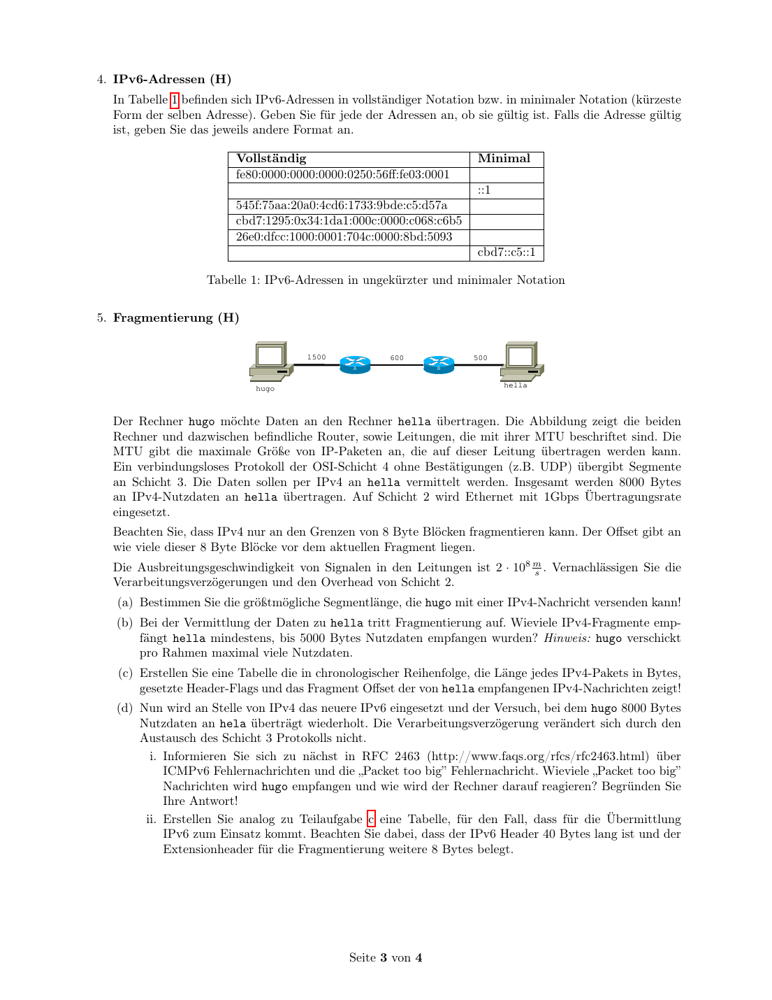

# 分片：MTU、IPv4 与 IPv6

## 知识点总结

- MTU 限制每条链路最大 IP 包大小。
- IPv4 路由器可分片，offset 单位是 8 字节。
- IPv6 中间路由器不分片，而返回 Packet Too Big。

## 完整题目与解答汇总

### 题目 1: 5. Fragmentierung (H)

**类型：** 作业  

**来源说明：** Uebungsblatt 09, Aufgabe 5  


#### 题目中文翻译 / 中文题意

在给定 MTU 路径中计算 IPv4 分片长度、标志和 offset，并比较 IPv6 下 Packet Too Big 与源主机分片。

#### 德文原题

```text
5. Fragmentierung (H)
1500 600 500
A B
hugo hella
Der Rechner hugo möchte Daten an den Rechner hella übertragen. Die Abbildung zeigt die beiden
Rechner und dazwischen befindliche Router, sowie Leitungen, die mit ihrer MTU beschriftet sind. Die
MTU gibt die maximale Größe von IP-Paketen an, die auf dieser Leitung übertragen werden kann.
Ein verbindungsloses Protokoll der OSI-Schicht 4 ohne Bestätigungen (z.B. UDP) übergibt Segmente
an Schicht 3. Die Daten sollen per IPv4 an hella vermittelt werden. Insgesamt werden 8000 Bytes
an IPv4-Nutzdaten an hella übertragen. Auf Schicht 2 wird Ethernet mit 1Gbps Übertragungsrate
eingesetzt.
Beachten Sie, dass IPv4 nur an den Grenzen von 8 Byte Blöcken fragmentieren kann. Der Offset gibt an
wie viele dieser 8 Byte Blöcke vor dem aktuellen Fragment liegen.
Die Ausbreitungsgeschwindigkeit von Signalen in den Leitungen ist 2 · 108 m . Vernachlässigen Sie die
s
Verarbeitungsverzögerungen und den Overhead von Schicht 2.
(a) Bestimmen Sie die größtmögliche Segmentlänge, die hugo mit einer IPv4-Nachricht versenden kann!
(b) Bei der Vermittlung der Daten zu hella tritt Fragmentierung auf. Wieviele IPv4-Fragmente emp-
fängt hella mindestens, bis 5000 Bytes Nutzdaten empfangen wurden? Hinweis: hugo verschickt
pro Rahmen maximal viele Nutzdaten.
(c) Erstellen Sie eine Tabelle die in chronologischer Reihenfolge, die Länge jedes IPv4-Pakets in Bytes,
gesetzte Header-Flags und das Fragment Offset der von hella empfangenen IPv4-Nachrichten zeigt!
(d) Nun wird an Stelle von IPv4 das neuere IPv6 eingesetzt und der Versuch, bei dem hugo 8000 Bytes
Nutzdaten an hela überträgt wiederholt. Die Verarbeitungsverzögerung verändert sich durch den
Austausch des Schicht 3 Protokolls nicht.
i. Informieren Sie sich zu nächst in RFC 2463 (http://www.faqs.org/rfcs/rfc2463.html) über
ICMPv6 Fehlernachrichten und die „Packet too big” Fehlernachricht. Wieviele „Packet too big”
Nachrichten wird hugo empfangen und wie wird der Rechner darauf reagieren? Begründen Sie
Ihre Antwort!
ii. Erstellen Sie analog zu Teilaufgabe c eine Tabelle, für den Fall, dass für die Übermittlung
IPv6 zum Einsatz kommt. Beachten Sie dabei, dass der IPv6 Header 40 Bytes lang ist und der
Extensionheader für die Fragmentierung weitere 8 Bytes belegt.
```

#### 解答

**5. Fragmentierung / IPv4 与 IPv6 分片**



**(a)**  
**DE:** IPv4-Header `20 B`, erster Link MTU `1500 B`: maximale IPv4-Nutzdaten pro Paket `1480 B`.

**中文：** IPv4 首部按 20 B 计算，第一段链路 MTU 为 1500 B，所以一个 IPv4 包最多携带 `1500 - 20 = 1480 B` 的 IPv4 负载。

**(b)**  
**DE:** Auf dem letzten Link ist MTU `500 B`; IPv4-Nutzdaten pro Fragment maximal `floor((500-20)/8)*8 = 480 B`. Ein `1480 B`-Paket wird zu `480+480+480+40`. Bis mindestens `5000 B` Nutzdaten bei hella angekommen sind: 3 volle Originalpakete `= 4440 B` plus 2 Fragmente des 4. Pakets `= 960 B`, also mindestens `14` Fragmente.

**中文：** 最后一段链路 MTU 为 500 B，扣掉 20 B IPv4 首部，还剩 480 B；IPv4 分片偏移必须按 8 B 对齐，480 正好满足。一个 1480 B 的原始 IPv4 负载会分成 `480+480+480+40` 四片。收到 3 个完整原始包是 `3*1480=4440 B`，还不到 5000 B；第四个原始包再收到两个 480 B 分片后达到 5400 B，因此最少收到 `3*4+2=14` 个分片。

**(c)** Fuer 8000 B IPv4-Nutzdaten sendet hugo `5 * 1480 B + 600 B`. Hella empfaengt:

| Originalpaket | Fragment-Nutzdaten | IP-Laenge | Offset | MF |
|---:|---:|---:|---:|---|
| je 1-5 | 480 | 500 | 0 | 1 |
| je 1-5 | 480 | 500 | 60 | 1 |
| je 1-5 | 480 | 500 | 120 | 1 |
| je 1-5 | 40 | 60 | 180 | 0 |
| 6 | 480 | 500 | 0 | 1 |
| 6 | 120 | 140 | 60 | 0 |

Insgesamt `22` IPv4-Fragmente.

**(d) IPv6 / IPv6 情况**

**DE:** Router fragmentieren bei IPv6 nicht. hugo erhaelt zuerst `Packet Too Big` mit MTU 600, danach bei erneut zu grossem Paket noch eine Meldung mit MTU 500. Danach fragmentiert die Quelle selbst.

**中文：** IPv6 中间路由器不负责分片。如果包太大，路由器会丢弃并返回 ICMPv6 `Packet Too Big`。hugo 先会收到 MTU 600 的提示，如果之后仍超过下一段 500 MTU，还会收到 MTU 500 的提示。之后源主机根据路径 MTU 自己分片。

IPv6 Header `40 B`, Fragment Extension Header `8 B`, maximale Fragment-Nutzdaten:

```text
floor((500 - 40 - 8)/8)*8 = 448 B
```

Fuer `8000 B`: `17 * 448 B + 384 B`, also 18 Fragmente. Laenge der ersten 17 IPv6-Pakete: `40+8+448 = 496 B`; letztes: `40+8+384 = 432 B`.

**备注：** 本题归入本知识点；题目中文翻译/题意、德文原题、解答和来源已保留。


---

### 题目 2: 第4题

**类型：** 考卷  

**来源说明：** Klausur 2015, Abschnitt 第4题  


#### 题目中文翻译 / 中文题意

第3层（网络层）的典型任务？

#### 德文原题

```text
### 第4题

**Typische Aufg. d. Schicht 3: IPv6, Subnetz, IPv4, IP-Header Fragmentierung, ARP-Cache**  
**第3层（网络层）的典型任务？**
```

#### 解答

**Lösung / 答案：**

- **IPv6** ✓
- **IPv4** ✓
- **Subnetz / 子网划分** ✓
- **IP-Header** ✓
- **Fragmentierung / 分片** ✓

**ARP-Cache** - 严格来说ARP工作在第2/3层之间

---

**备注：** 本题归入本知识点；题目中文翻译/题意、德文原题、解答和来源已保留。


---

### 题目 3: Frage 4 / 第4题

**类型：** 考卷  

**来源说明：** Klausur 2017, Frage 4  


#### 题目中文翻译 / 中文题意

以下关于互联网协议（IP）的哪些陈述是正确的？
IP是面向连接的协议。
IP与ICMP位于同一OSI层。
IP数据包的长度是固定的。
IP数据包的分片决定取决于MTU。
IP头部的协议字段指示如何解释有效载荷。

#### 德文原题

```text
### Frage 4 / 第4题

**Welche Aussagen über das Internetprotokoll (IP) treffen zu?**  
**以下关于互联网协议（IP）的哪些陈述是正确的？**

- ○ IP ist ein verbindungsorientiertes Protokoll.
    - IP是面向连接的协议。
- ☒ IP befindet sich auf der gleichen OSI-Schicht wie ICMP.
    - IP与ICMP位于同一OSI层。
- ○ Die Länge von IP-Paketen ist konstant.
    - IP数据包的长度是固定的。
- ☒ Die Entscheidung über Fragmentierung von IP-Paketen ist von der MTU abhängig.
    - IP数据包的分片决定取决于MTU。
- ☒ Das Protocol-Feld des IP-Headers gibt an, wie die Nutzdaten interpretiert werden sollen.
    - IP头部的协议字段指示如何解释有效载荷。
```

#### 解答

**参考答案 / Lösung:**

- ✗ 第一项错误：IP是无连接的
- ✓ 第二项正确：IP和ICMP都在网络层（第3层）
- ✗ 第三项错误：IP数据包长度可变
- ✓ 第四项正确：MTU决定是否需要分片
- ✓ 第五项正确：协议字段标识上层协议（如TCP=6，UDP=17）

---

**备注：** 本题归入本知识点；题目中文翻译/题意、德文原题、解答和来源已保留。


---

### 题目 4: Frage 21 / 第21题

**类型：** 考卷  

**来源说明：** Klausur 2017, Frage 21  


#### 题目中文翻译 / 中文题意

当总长度为...时，列出对IP数据包进行分片的组件...
为200字节时。

#### 德文原题

```text
### Frage 21 / 第21题

**Nennen Sie die Komponenten, die das IP-Paket fragmentieren, wenn die Gesamtlänge...**  
**当总长度为...时，列出对IP数据包进行分片的组件...**

**(a) 200 Byte beträgt.**  
**为200字节时。**
```

#### 解答

**参考答案 / Lösung:** **Keine (Nein) / 无（不需要）**

200 < 300，不需要分片。

**(b) 1000 Byte beträgt.**  
**为1000字节时。**

**参考答案 / Lösung:** **R1**

1000 > 300 (Kanal B的MTU)，R1需要分片。

**(c) 2000 Byte beträgt.**  
**为2000字节时。**

**参考答案 / Lösung:** **R1**

2000 > 300，R1分片。R1分片后的片段已经足够小，R2不需要再分片。

---

**备注：** 本题归入本知识点；题目中文翻译/题意、德文原题、解答和来源已保留。


---

### 题目 5: Frage 22 / 第22题

**类型：** 考卷  

**来源说明：** Klausur 2017, Frage 22  


#### 题目中文翻译 / 中文题意

假设R1要将以下IPv4数据包转发给R2：
画出分片，标明头部和数据长度，按R1发送的顺序！

#### 德文原题

```text
### Frage 22 / 第22题

**Angenommen, R1 soll folgendes IPv4-Paket an R2 weiterleiten:**  
**假设R1要将以下IPv4数据包转发给R2：**

|Header(20 Byte)|Nutzdaten(600 Byte)|
|---|---|

**(a) Zeichnen Sie die Fragmente unter Angabe von Kopf- und Nutzdatenlänge (wie in der Aufgabenstellung), in der Reihenfolge, in der sie von R1 versendet werden!**  
**画出分片，标明头部和数据长度，按R1发送的顺序！**
```

#### 解答

**参考答案 / Lösung:**

MTU = 300 Bytes，每个分片最大300字节

- 头部固定20字节
- 每个分片最大数据量 = 300 - 20 = 280字节
- 数据必须是8字节的倍数：280字节（280 ÷ 8 = 35）

| Fragmentnummer / 分片号 | Header-Länge / 头部长度 | Nutzdatenlänge / 数据长度 |
| -------------------- | ------------------- | --------------------- |
| 1                    | 20                  | 280                   |
| 2                    | 20                  | 280                   |
| 3                    | 20                  | 40                    |

总计：280 + 280 + 40 = 600 字节（原始数据）

**(b) Wie erkennt R2 beim ersten Fragment, dass es sich um ein Fragment handelt (und nicht um ein "vollständiges" IPv4-Paket)?**  
**R2如何从第一个分片识别出这是一个分片（而不是"完整"的IPv4数据包）？**

**参考答案 / Lösung:** **Gesetztes "More Fragments" (MF) Flag / 设置了"更多分片"(MF)标志**

IP头部中的MF标志位为1表示后面还有分片。

---

**7 Transmission Control Protocol (TCP)**

**7 传输控制协议（TCP）**

---

**备注：** 本题归入本知识点；题目中文翻译/题意、德文原题、解答和来源已保留。


---

### 题目 6: Frage 19 / 第19题

**类型：** 考卷  

**来源说明：** Klausur 2018, Frage 19  


#### 题目中文翻译 / 中文题意

当IP数据包的总长度为...时，列出对其进行分片的组件...
为200字节时。

#### 德文原题

```text
### Frage 19 / 第19题

**Nennen Sie die Komponenten, die das IP-Paket fragmentieren, wenn seine Gesamtlänge...**  
**当IP数据包的总长度为...时，列出对其进行分片的组件...**

**(a) 200 Byte beträgt.**  
**为200字节时。**
```

#### 解答

**Lösung / 答案：** **Keine / 无**

200 < 280（Kanal B的MTU），不需要分片。

**(b) 1000 Byte beträgt.**  
**为1000字节时。**

**Lösung / 答案：** **R1**

1000 > 280，R1需要分片才能通过Kanal B。

**(c) 2000 Byte beträgt.**  
**为2000字节时。**

**Lösung / 答案：** **R1**

2000 > 280，R1分片。分片后每个片段小于1500，R2不需要再分片。

---

**备注：** 本题归入本知识点；题目中文翻译/题意、德文原题、解答和来源已保留。


---

### 题目 7: Frage 20 / 第20题

**类型：** 考卷  

**来源说明：** Klausur 2018, Frage 20  


#### 题目中文翻译 / 中文题意

假设R1要将以下IPv4数据包转发给R2：
画出分片，标明头部和数据长度，按R1发送的顺序！

#### 德文原题

```text
### Frage 20 / 第20题

**Angenommen R1 soll folgendes IPv4-Paket an R2 weiterleiten:**  
**假设R1要将以下IPv4数据包转发给R2：**

|Header (20 Byte)|Nutzdaten (600 Byte)|
|---|---|

**(a) Zeichnen Sie die Fragmente unter Angabe von Kopf- und Nutzdatenlänge, in der Reihenfolge, in der sie von R1 versendet werden!**  
**画出分片，标明头部和数据长度，按R1发送的顺序！**
```

#### 解答

**Lösung / 答案：**

MTU = 280 Bytes

- 每个分片最大数据量 = 280 - 20 = 260字节
- 数据必须是8字节的倍数：256字节（256 ÷ 8 = 32）

|Fragmentnummer|Header-Länge|Nutzdatenlänge|
|---|---|---|
|1|20|256|
|2|20|256|
|3|20|88|

**验证：** 256 + 256 + 88 = 600 字节 ✓

**(b) Wie erkennt R2 beim ersten Fragment, dass es sich um ein Fragment handelt?**  
**R2如何从第一个分片识别出这是一个分片？**

**Lösung / 答案：** **MF-Flag (More Fragments) 被设置为1**

IP头部中的MF标志位为1表示后面还有更多分片。

---

**VI. Adressierung / 寻址**

---

**备注：** 本题归入本知识点；题目中文翻译/题意、德文原题、解答和来源已保留。


---

### 题目 8: Frage 13 / 第13题

**类型：** 考卷  

**来源说明：** Klausur 2019, Frage 13  


#### 题目中文翻译 / 中文题意

当IP数据包的总长度为...时，列出进行分片的组件...

#### 德文原题

```text
### Frage 13 / 第13题

**Nennen Sie die Komponenten, die das IP-Paket fragmentieren, wenn seine Gesamtlänge...**  
**当IP数据包的总长度为...时，列出进行分片的组件...**

**(a) 200 Byte beträgt. (1分)**
```

#### 解答

**Lösung / 答案：** **Keine / 无**

200 < 280（Kanal B的MTU），不需要分片。

**(b) 1000 Byte beträgt. (1分)**

**Lösung / 答案：** **R1**

1000 > 280，R1需要分片。

**(c) 2000 Byte beträgt. (1分)**

**Lösung / 答案：** **R1**

R1分片后，每个片段小于1500字节，R2不需要再分片。

---

**备注：** 本题归入本知识点；题目中文翻译/题意、德文原题、解答和来源已保留。


---

### 题目 9: Frage 14 / 第14题

**类型：** 考卷  

**来源说明：** Klausur 2019, Frage 14  


#### 题目中文翻译 / 中文题意

R1要将以下IPv4数据包转发给R2：
(a) 画出分片，标明头部和数据长度 (3分)

#### 德文原题

```text
### Frage 14 / 第14题

**R1要将以下IPv4数据包转发给R2：**

| Header (20 Byte) | Nutzdaten (600 Byte) |

**(a) 画出分片，标明头部和数据长度 (3分)**
```

#### 解答

**Lösung / 答案：**

MTU = 280 Bytes

- 每个分片最大数据量 = 280 - 20 = 260字节
- 数据必须是8字节的倍数：256字节

|Fragmentnummer|Header-Länge|Nutzdatenlänge|
|---|---|---|
|1|20|256|
|2|20|256|
|3|20|88|

验证：256 + 256 + 88 = 600 字节 ✓

**(b) Wie erkennt R2 beim ersten Fragment, dass es sich um ein Fragment handelt? (1分)**  
**R2如何识别第一个分片是分片而不是完整数据包？**

**Lösung / 答案：** **MF-Flag (More Fragments) 被设置为1**

第一个和第二个分片的MF=1，最后一个分片MF=0但Fragment Offset > 0。

---

**VI. IP und Routing / IP和路由 (9分)**

---

**备注：** 本题归入本知识点；题目中文翻译/题意、德文原题、解答和来源已保留。


---
