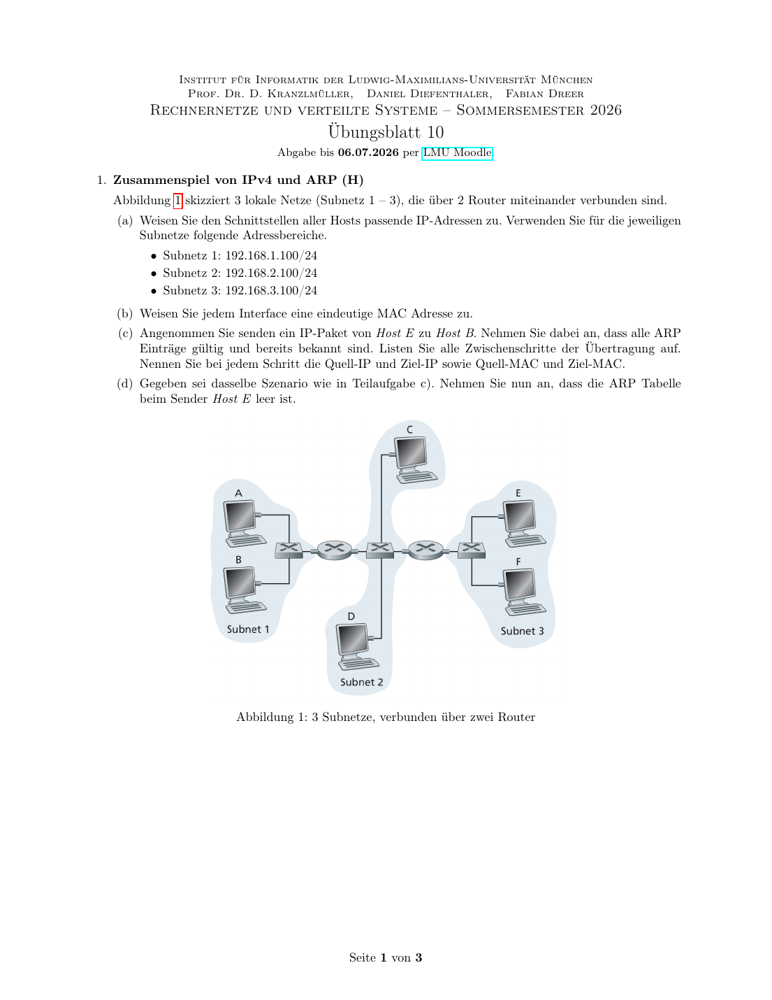

# 以太网、Hub/Switch、CSMA/CD 与物理层

## 知识点总结

- Hub 广播到所有端口；Switch 学习 MAC 后定向转发。
- CSMA/CD 需要最小帧长以保证碰撞可检测。
- 物理层关注信号、介质、带宽、编码和传播。

## 完整题目与解答汇总

### 题目 1: 1. Zusammenspiel von IPv4 und ARP (H)

**类型：** 作业  

**来源说明：** Uebungsblatt 10, Aufgabe 1  


#### 题目中文翻译 / 中文题意

给三个 IPv4 子网和两个路由器分配 IP/MAC，分析 E 到 B 的转发过程中每一跳的源/目的 IP 与 MAC，并讨论 ARP 表为空时的流程。

#### 德文原题

```text
1. Zusammenspiel von IPv4 und ARP (H)
Abbildung 1 skizziert 3 lokale Netze (Subnetz 1 – 3), die über 2 Router miteinander verbunden sind.
(a) Weisen Sie den Schnittstellen aller Hosts passende IP-Adressen zu. Verwenden Sie für die jeweiligen
Subnetze folgende Adressbereiche.
• Subnetz 1: 192.168.1.100/24
• Subnetz 2: 192.168.2.100/24
• Subnetz 3: 192.168.3.100/24
(b) Weisen Sie jedem Interface eine eindeutige MAC Adresse zu.
(c) Angenommen Sie senden ein IP-Paket von Host E zu Host B. Nehmen Sie dabei an, dass alle ARP
Einträge gültig und bereits bekannt sind. Listen Sie alle Zwischenschritte der Übertragung auf.
Nennen Sie bei jedem Schritt die Quell-IP und Ziel-IP sowie Quell-MAC und Ziel-MAC.
(d) Gegeben sei dasselbe Szenario wie in Teilaufgabe c). Nehmen Sie nun an, dass die ARP Tabelle
beim Sender Host E leer ist.
Abbildung 1: 3 Subnetze, verbunden über zwei Router
```

#### 解答

**1. Zusammenspiel von IPv4 und ARP / IPv4 与 ARP**



**(a)(b) Beispielhafte IP- und MAC-Vergabe / IP 与 MAC 分配示例**

**DE:** Die folgende Vergabe ist nur ein konsistentes Beispiel; andere eindeutige Hostadressen und MAC-Adressen waeren ebenfalls korrekt.

**中文：** 下表只是一个一致的分配示例。只要每个接口在对应子网内有合法且不冲突的 IP，每个接口 MAC 唯一，其他分配也可以。

| Interface | IP | MAC |
|---|---|---|
| Host A | `192.168.1.101/24` | `00:00:00:00:01:0A` |
| Host B | `192.168.1.102/24` | `00:00:00:00:01:0B` |
| Router R1 links | `192.168.1.1/24` | `00:00:00:00:01:01` |
| Router R1 mitte | `192.168.2.1/24` | `00:00:00:00:02:01` |
| Host C | `192.168.2.101/24` | `00:00:00:00:02:0C` |
| Host D | `192.168.2.102/24` | `00:00:00:00:02:0D` |
| Router R2 mitte | `192.168.2.2/24` | `00:00:00:00:02:02` |
| Router R2 rechts | `192.168.3.1/24` | `00:00:00:00:03:01` |
| Host E | `192.168.3.101/24` | `00:00:00:00:03:0E` |
| Host F | `192.168.3.102/24` | `00:00:00:00:03:0F` |

**(c) Paket von E nach B, ARP bekannt / ARP 已知时从 E 到 B**

**DE:** IP-Quelle und IP-Ziel bleiben Ende-zu-Ende gleich.

**中文：** IP 源地址和目的地址表示端到端通信，因此从 E 到 B 的整个过程中保持不变：

```text
Src-IP = 192.168.3.101
Dst-IP = 192.168.1.102
```

**DE:** Nur die MAC-Adressen wechseln je Hop.

**中文：** MAC 地址只在当前链路内有效，所以每经过一跳都会换成“当前发送接口 MAC”和“下一跳接口 MAC”：

| Hop | Src-MAC | Dst-MAC |
|---|---|---|
| E -> R2 rechts | `00:...:03:0E` | `00:...:03:01` |
| R2 mitte -> R1 mitte | `00:...:02:02` | `00:...:02:01` |
| R1 links -> B | `00:...:01:01` | `00:...:01:0B` |

**(d) ARP-Tabelle bei E leer / E 的 ARP 表为空**

**DE:** E erkennt: B liegt nicht im eigenen `/24`, also muss das Paket an Default-Gateway `192.168.3.1`. E sendet ARP-Broadcast:

**中文：** E 发现 B 的 IP 不在自己的 `192.168.3.0/24` 子网内，因此不能直接发给 B，而要先发给默认网关 `192.168.3.1`。由于 E 的 ARP 表为空，它先广播询问网关的 MAC：

```text
Who has 192.168.3.1? Tell 192.168.3.101
```

**DE:** R2 antwortet mit MAC `00:...:03:01`. Danach laeuft die Uebertragung wie in (c). Falls Router-ARP-Tabellen ebenfalls leer waeren, wuerden R2 und R1 auf ihren jeweiligen Ausgangsnetzen ebenfalls ARP-Anfragen stellen.

**中文：** R2 回复自己的右侧接口 MAC `00:...:03:01`。之后 E 就能把 IP 包封装进以太网帧发给 R2。若路由器的 ARP 表也为空，R2、R1 在各自下一跳链路上也要先 ARP 查询。

**备注：** 本题归入本知识点；题目中文翻译/题意、德文原题、解答和来源已保留。


---

### 题目 2: 2. Was ist es, was kann es? (H)

**类型：** 作业  

**来源说明：** Uebungsblatt 10, Aufgabe 2  


#### 题目中文翻译 / 中文题意

设计实验区分未知设备是 Hub 还是 Switch，并测量交换机转发表老化时间。

#### 德文原题

```text
2. Was ist es, was kann es? (H)
Sie finden in einem Büroschrank eine unbeschriftete Komponente mit 5 RJ45-Ports, von der Sie nur
wissen, dass diese entweder ein Hub oder ein Switch ist. Sie haben außerdem drei Rechner mit je einer
Netzschnittstelle und ausreichend Twisted-Pair-Kabel. Auf den Rechnern können Sie das Programm ping
und/oder einen Protokoll-Analysator (z.B. wireshark) einsetzen, mit dem Sie sich alle eingehenden und
ausgehenden Rahmen vollständig anzeigen lassen können.
Bei allen folgenden Untersuchungen soll das Ergebnis nur durch funktionale Tests und logisches Schluss-
folgern bestimmt werden. Erstellen Sie eine Skizze Ihres Versuchsaufbaus und geben Sie die Sequenz der
Aktionen (z.B. Programmaufrufe) an. Begründen Sie, warum Ihr Test das richtige Ergebnis liefert!
(a) Wie finden Sie heraus, ob das unbekannte Gerät ein Switch oder ein Hub ist?
(b) Nehmen Sie an, es sei ein Switch. Wie bestimmen Sie möglichst genau und effizient die Zeit, nach
der der Switch Einträge aus der Forwarding-Tabelle löscht?
```

#### 解答

**2. Hub oder Switch? / 如何区分 Hub 和 Switch**

**(a)**  
**DE:** Aufbau: drei Rechner A, B, C an das unbekannte Geraet. Starte Wireshark auf C. Lasse A B anpingen. Bei einem Hub sieht C die Unicast-Frames zwischen A und B, weil alles an alle Ports wiederholt wird. Bei einem Switch sieht C nach dem Lernen der MAC-Adressen diese Unicast-Frames nicht.

**中文：** 实验搭建：三台电脑 A、B、C 接到未知设备上，在 C 上打开 Wireshark，让 A ping B。如果设备是 Hub，它会把帧复制到所有端口，所以 C 能看到 A 和 B 之间的单播帧。如果是 Switch，学习到 MAC 表后只会把单播帧转发到目标端口，C 看不到这些单播帧。

**(b)**  
**DE:** Forwarding-Table-Aging: A pingt B, damit der Switch `MAC_A -> Port_A` lernt. Dann A schweigen lassen. C sendet in steigenden Zeitabstaenden ein Frame an MAC_A. Solange der Eintrag existiert, wird nur an A-Port weitergeleitet; ist er geloescht, floodet der Switch. Durch binaere Suche ueber die Wartezeit bestimmt man den Aging Timeout effizient.

**中文：** 测转发表老化时间：先让 A ping B，使交换机学习 `MAC_A -> A端口`。然后让 A 静默。C 隔不同等待时间后向 `MAC_A` 发送帧。如果表项还在，交换机只转发到 A 端口；如果表项已过期，交换机会泛洪，B 的抓包器就能看到。用二分法调整等待时间，可以高效逼近老化时间。

**备注：** 本题归入本知识点；题目中文翻译/题意、德文原题、解答和来源已保留。


---

### 题目 3: 5. CSMA/CD

**类型：** 作业  

**来源说明：** Uebungsblatt 10, Aufgabe 5  


#### 题目中文翻译 / 中文题意

分析 CSMA/CD 中两主机同时发送导致碰撞、jam signal、退避和重新发送的时间关系与公式。

#### 德文原题

```text
5. CSMA/CD
Zwei Rechner A und B seien über einen Bus miteinander verbunden. Es seien:
L Leitungslänge zwischen den Hosts, in m
R Übertragungsrate, in Bit/s
v Ausbreitungsgeschwindigkeit von Signalen im Leiter, in m/s
d Länge des Störsignals, in Bit(-zeiten) |d |Bit zu übertragen)
jam jam
d Länge eines Warteintervalls beim Exponential-Backoff Algorithmus, in Bit(-zeiten)
slot
d Dauer, die ein Kanal vor dem Senden frei sein muss, in Bit(-zeiten)
frei
t Zeitpunkt, zu dem beide Stationen gleichzeitig beginnen zu senden
0
(a) Die Abbildung zeigt einen zeitlichen Ablauf (nicht maßstabsgetreu) in dem A und B jeweils einen
Rahmen übertragen und durch CSMA eine Kollision vermieden wird. Mit CSMA erkennt B nachdem
er sendebereit wird, dass bereits eine Übertragung stattfindet und wartet bis die Übertragung des
Rahmens von A abgeschlossen ist und der Kanal frei ist, bevor B mit der Übertragung seines
Rahmens beginnt.
A ist Sendebereit und Kanal ist frei
Wartezeit (dFrei)
Sendebeginn
A
Übertragung abgeschlossen
Rahmendauer
Zeit
Kanal ist belegt Rahmendauer
B
Übertragung
Sendebeginn abgeschlossen
Wartezeit (dFrei)
B ist Sendebereit Kanal ist frei
Erstellen Sie analog zu dieser Abbildung ein Diagramm, dass die vollständige Übertragung jeweils
eines Rahmens von A und B zeigt, wobei A und B gleichzeitig sendebereit werden, es zu einer
Kollision kommt und der Konflikt mit CSMA/CD gelöst wird. Hinweis: Gehen Sie davon aus, dass
es zu keiner weiteren Kollision kommt.
(b) Geben Sie die Berechnungsvorschrift für den Zeitpunkt t an, zu dem A erkennt, dass eine Kollision
1
stattgefunden hat. Hinweis: Berechnen Sie t relativ zu t .
1 0
(c) Geben Sie die Berechnungsvorschrift für den Zeitpunkt t an, zu dem A wieder einen freien Kanal
2
erkennen kann.
(d) Zum Zeitpunkt t wurde der k-te Übertragungsversuch unternommen. A wartet eine gewisse Zeit
0
nach dem Binary Exponential-Backoff Algorithmus, vor einem erneuten Übertragungsversuch.
i. Geben Sie die Berechnungsvorschrift für den frühest möglichen Zeitpunkt t an, zu dem A
3,min
einen erneuten Sendeversuch unternimmt.
ii. Geben Sie die Berechnungsvorschrift für den spätest möglichen Zeitpunkt t an, zu dem A
3,max
einen erneuten Sendeversuch unternimmt.
iii. Die Wartezeit von Rechner B ist um d größer, als die von A. Welche Bedingung muss für
slot
Leitungslänge bzw. d gelten, damit es nicht zu einer erneuten Kollision zwischen A und B
slot
kommt?
```

#### 解答

**5. CSMA/CD**


**(a)**  
**DE:** A und B starten gleichzeitig, die Signale laufen aufeinander zu, eine Kollision entsteht. Jede Station erkennt die Kollision, sobald das fremde Signal ankommt, sendet ein Jam-Signal, wartet Interframe Gap und Binary Exponential Backoff, danach sendet der Gewinner erneut.

**中文：** A 和 B 同时开始发送，两个信号在总线上相向传播并发生冲突。每个站点在收到对方信号时检测到碰撞，然后发送 jam 信号，等待帧间隔和二进制指数退避时间。退避结束后，等待时间较短的一方先重新发送。

**(b)**  
**DE:** A erkennt die Kollision nach der Ausbreitungszeit von B nach A:

**中文：** A 检测到碰撞需要等 B 的信号传播到 A，因此相对 `t0` 的时间为：

```text
t1 - t0 = L / v
```

**(c)**  
**DE:** A sieht den Kanal sicher wieder frei, wenn auch das letzte Jam-Bit von B angekommen ist:

**中文：** A 要确认信道重新空闲，至少要等对方的碰撞/干扰信号也传播回来。因此包含往返传播时间和 jam 信号持续时间：

```text
t2 - t0 = 2L/v + d_jam/R
```

**(d)**  
**DE:** Beim k-ten Versuch waehlt A `K` aus `0 ... 2^k-1` (praktisch begrenzt). Mit Warteintervall `d_slot`:

**中文：** 第 k 次发送尝试失败后，A 按二进制指数退避从 `0 ... 2^k-1` 中选择一个随机等待槽数。最早情况是选 0，最晚情况是选最大值：

```text
t3,min = t2 + d_frei/R
t3,max = t2 + d_frei/R + (2^k - 1) * d_slot/R
```

**DE:** Wenn B genau ein Slotintervall laenger wartet, muss A's erneuter Sendebeginn bei B ankommen, bevor B sendet. Bedingung:

**中文：** 如果 B 比 A 多等一个 slot，为了避免再次碰撞，A 的重新发送信号必须在 B 开始发送前传播到 B。因此 slot 时间至少要覆盖往返传播延迟：

```text
d_slot/R >= 2L/v
```

also in Bitzeiten:

```text
d_slot >= 2LR/v
```

**备注：** 本题归入本知识点；题目中文翻译/题意、德文原题、解答和来源已保留。


---

### 题目 4: 6. Ethernet - minimale Nachrichtenlänge

**类型：** 作业  

**来源说明：** Uebungsblatt 10, Aufgabe 6  


#### 题目中文翻译 / 中文题意

解释以太网最小帧长对碰撞检测的意义，并根据速率、距离和传播速度计算最小消息长度。

#### 德文原题

```text
6. Ethernet - minimale Nachrichtenlänge
Gegeben sei ein Ethernet (CSMA/CD) mit Übertragungsrate von 10 Mbit/s. Zwei Hosts sind maximal
2,5 km voneinander entfernt. Die Ausbereitungsverzögerung beträgt 2 × 108 m/s.
(a) Welche Bedeutung hat die minimale Nachrichtenlänge für die Erkennung von Kollision?
(b) Wie groß ist die minimale Nachrichtenlänge in der angegebenen Konfiguration?
```

#### 解答

**6. Ethernet - minimale Nachrichtenlaenge**

**(a)**  
**DE:** Die minimale Rahmenlaenge stellt sicher, dass ein Sender noch sendet, wenn eine Kollision vom entferntesten Punkt zurueckwirkt. Sonst koennte er eine Kollision nicht erkennen.

**中文：** 最小帧长的意义是：即使碰撞发生在最远端，碰撞信号返回发送端时，发送端仍然还在发送。否则发送端已经发完帧，就无法检测到碰撞。

**(b)**  
**DE:** Abstand `2.5 km`, Ausbreitung `2*10^8 m/s`:

**中文：** 最大距离是 `2.5 km = 2500 m`，信号传播速度是 `2*10^8 m/s`：

```text
tau = 2500 / (2*10^8) = 12.5 us
2tau = 25 us
R * 2tau = 10 Mbit/s * 25 us = 250 bit
```

**DE:** Theoretisches Minimum dieser Konfiguration: `250 bit`, also `31.25 B`, praktisch auf mindestens 32 Byte aufzurunden. Klassisches Ethernet verwendet 64 Byte Mindestframegroesse.

**中文：** 所以这个给定配置下的理论最小长度是 `250 bit = 31.25 B`，实际至少向上取整到 32 B。经典以太网标准使用 64 B 最小帧长，留有更保守的碰撞检测余量。

**Wissen / 知识点：** ARP 解析的是“下一跳”的 MAC，不是最终目标的 MAC；IP 地址端到端基本不变，MAC 地址每一跳都会换。

**备注：** 本题归入本知识点；题目中文翻译/题意、德文原题、解答和来源已保留。


---

### 题目 5: 第3题

**类型：** 考卷  

**来源说明：** Klausur 2015, Abschnitt 第3题  


#### 题目中文翻译 / 中文题意

数据链路层的任务？

#### 德文原题

```text
### 第3题

**Aufg. der Sicherungssch. (Rahmenb., bl., Routing, Fehlererk., Abb. H↔IP, M)**  
**数据链路层的任务？**
```

#### 解答

**Lösung / 答案：**

- **Rahmenbildung / 成帧** ✓
- **Fehlererkennung / 错误检测** ✓
- **Abbildung Host↔IP / 主机到IP映射**（部分正确，ARP在这一层）
- **Medienzugriff / 介质访问控制** ✓

**不属于数据链路层：** Routing（路由）属于网络层

---

**备注：** 本题归入本知识点；题目中文翻译/题意、德文原题、解答和来源已保留。


---

### 题目 6: Wozu ARP?

**类型：** 考卷  

**来源说明：** Klausur 2015, Abschnitt Wozu ARP?  


#### 题目中文翻译 / 中文题意

ARP的用途？

#### 德文原题

```text
### Wozu ARP?

**ARP的用途？**

**Lösung / 答案：** 将**IPv4地址**解析为**MAC地址**

当主机知道目标IP但不知道MAC地址时，发送ARP请求广播，目标主机回复其MAC地址。

---
```

#### 解答

**Lösung / 答案：** 将**IPv4地址**解析为**MAC地址**

当主机知道目标IP但不知道MAC地址时，发送ARP请求广播，目标主机回复其MAC地址。

---

**备注：** 本题归入本知识点；题目中文翻译/题意、德文原题、解答和来源已保留。


---

### 题目 7: Störeffekte, welche bei elektr. aber nicht Lichtwellenleiter?

**类型：** 考卷  

**来源说明：** Klausur 2015, Abschnitt Störeffekte, welche bei elektr. aber nicht Lichtwellenleiter?  


#### 题目中文翻译 / 中文题意

电导体有但光纤没有的干扰效应？

#### 德文原题

```text
### Störeffekte, welche bei elektr. aber nicht Lichtwellenleiter?

**电导体有但光纤没有的干扰效应？**
```

#### 解答

**Lösung / 答案：**

- **Elektromagnetische Interferenz (EMI) / 电磁干扰**
- **Übersprechen (Crosstalk) / 串扰**
- **Induktion / 感应**

光纤使用光信号，不受电磁干扰影响。

---

**备注：** 本题归入本知识点；题目中文翻译/题意、德文原题、解答和来源已保留。


---

### 题目 8: Lichtwellenleiter: 2 Klassen (Kerndurchmesser) nennen

**类型：** 考卷  

**来源说明：** Klausur 2015, Abschnitt Lichtwellenleiter: 2 Klassen (Kerndurchmesser) nennen  


#### 题目中文翻译 / 中文题意

光纤：列举两类（按纤芯直径）

#### 德文原题

```text
### Lichtwellenleiter: 2 Klassen (Kerndurchmesser) nennen

**光纤：列举两类（按纤芯直径）**
```

#### 解答

**Lösung / 答案：**

|类型|Kerndurchmesser|特性|
|---|---|---|
|**Multimode / 多模**|50-62.5 μm|短距离，较便宜|
|**Singlemode / 单模**|8-10 μm|长距离，高带宽|

---

**备注：** 本题归入本知识点；题目中文翻译/题意、德文原题、解答和来源已保留。


---

### 题目 9: Durch Dämpfung ist Reichw. v. Signalen (elektr. u. Licht) begrenzt.

**类型：** 考卷  

**来源说明：** Klausur 2015, Abschnitt Durch Dämpfung ist Reichw. v. Signalen (elektr. u. Licht) begrenzt.  


#### 题目中文翻译 / 中文题意

本题围绕“以太网、Hub/Switch、CSMA/CD 与物理层”展开；请先阅读德文原题，再结合下方解答理解题意和考点。

#### 德文原题

```text
### Durch Dämpfung ist Reichw. v. Signalen (elektr. u. Licht) begrenzt.
```

#### 解答

**Durch Dämpfung ist Reichw. v. Signalen (elektr. u. Licht) begrenzt.**

**备注：** 本题归入本知识点；题目中文翻译/题意、德文原题、解答和来源已保留。


---

### 题目 10: (a) Wie groß max. Leitungslänge, um Kollision durch CSMA/CD erkennen zu können?

**类型：** 考卷  

**来源说明：** Klausur 2015, Abschnitt (a) Wie groß max. Leitungslänge, um Kollision durch CSMA/CD erkennen zu können?  


#### 题目中文翻译 / 中文题意

能通过CSMA/CD检测碰撞的最大线路长度？

#### 德文原题

```text
### (a) Wie groß max. Leitungslänge, um Kollision durch CSMA/CD erkennen zu können?

**能通过CSMA/CD检测碰撞的最大线路长度？**
```

#### 解答

**Lösung / 答案：**

**计算：**

1. 帧传输时间：  $t_{frame} = \frac{64 \times 8}{10^7} = \frac{512}{10^7} = 51.2 \mu s$
    
2. 最大往返时间：  

- $2 \times t_{prop} \leq t_{frame}$​  
- $t_{prop} \leq 25.6 \mu s$
    
3. 最大距离：  

- $d_{max} = 25.6 \times 10^{-6} \times 2 \times 10^8 = 5120 m = \textbf{5.12 km}$
    

---

**备注：** 本题归入本知识点；题目中文翻译/题意、德文原题、解答和来源已保留。


---

### 题目 11: Frage (b) / 问题(b)

**类型：** 考卷  

**来源说明：** Klausur 2017, Abschnitt Frage (b) / 问题(b)  


#### 题目中文翻译 / 中文题意

该图显示的是接口。
图示：显示HTTP、TCP、IP、Ethernet、(WAN)等协议层

#### 德文原题

```text
### Frage (b) / 问题(b)

**Diese Abbildung zeigt den _____ Schnitt.**  
**该图显示的是_____接口。**

图示：显示HTTP、TCP、IP、Ethernet、(WAN)等协议层
```

#### 解答

**参考答案 / Lösung:** **Protokollschnitt / 协议接口**

**Begründung / 理由:**

- 显示了对等实体之间的通信
- 同层协议之间的逻辑通信
- Kommunikation zwischen Peer-Entities
- Logische Kommunikation zwischen gleichrangigen Protokollen

---

**4 Domain Name System (6 Punkte)**

**4 域名系统（6分）**

---

**备注：** 本题归入本知识点；题目中文翻译/题意、德文原题、解答和来源已保留。


---

### 题目 12: Frage 3 / 第3题

**类型：** 考卷  

**来源说明：** Klausur 2018, Frage 3  


#### 题目中文翻译 / 中文题意

将模拟数据数字化需要以下哪些步骤：
Quantisierung / 量化
Diskretisierung / 离散化（采样）
○ Modulation / 调制
Codierung / 编码

#### 德文原题

```text
### Frage 3 / 第3题

**Zur Digitalisierung von analogen Daten sind folgende Schritte erforderlich:**  
**将模拟数据数字化需要以下哪些步骤：**

- ☒ Quantisierung / 量化
- ☒ Diskretisierung / 离散化（采样）
- ○ Modulation / 调制
- ☒ Codierung / 编码
```

#### 解答

**解析：**  
模拟到数字转换（ADC）的三个步骤：

1. **离散化/采样**：在时间上将连续信号变为离散点
2. **量化**：将连续幅度值映射到有限个离散级别
3. **编码**：将量化值转换为二进制代码

调制是将数字信号转换为模拟信号的过程，不属于数字化步骤。

---

**备注：** 本题归入本知识点；题目中文翻译/题意、德文原题、解答和来源已保留。


---

### 题目 13: Frage 7 / 第7题

**类型：** 考卷  

**来源说明：** Klausur 2018, Frage 7  


#### 题目中文翻译 / 中文题意

在以太网（IEEE 802.3）中规定最小帧长度，因为…
以太网使用层次化地址空间。
帧太短时冲突参数会太高。
这样冲突检测才能正常工作。
这样帧大小总是32位的倍数。

#### 德文原题

```text
### Frage 7 / 第7题

**Bei Ethernet (IEEE 802.3) wird eine Mindestrahmlänge festgelegt, weil …**  
**在以太网（IEEE 802.3）中规定最小帧长度，因为…**

- ○ Ethernet einen hierarchischen Adressraum benutzt.
    - 以太网使用层次化地址空间。
- ○ bei zu kurzem Rahmen der Konfliktparameter zu hoch wird.
    - 帧太短时冲突参数会太高。
- ☒ damit die Kollisionserkennung funktionieren kann.
    - 这样冲突检测才能正常工作。
- ○ damit die Rahmengröße immer ein Vielfaches von 32 Bit ist.
    - 这样帧大小总是32位的倍数。
```

#### 解答

**解析：**  
以太网的最小帧长度（64字节）是为了确保在最坏情况下（信号传播到最远端并返回），发送方仍在发送数据，从而能够检测到冲突。如果帧太短，发送方可能在冲突信号返回之前就已经完成发送，导致无法检测冲突。

---

**备注：** 本题归入本知识点；题目中文翻译/题意、德文原题、解答和来源已保留。


---

### 题目 14: Frage 25 / 第25题

**类型：** 考卷  

**来源说明：** Klausur 2018, Frage 25  


#### 题目中文翻译 / 中文题意

以太网拓扑题：路由器连接Hub、Switch和主机F
图中显示了多少个冲突域？

#### 德文原题

```text
### Frage 25 / 第25题

**以太网拓扑题：路由器连接Hub、Switch和主机F**

**(a) Wie viele Kollisionsdomänen zeigt die Abbildung?**  
**图中显示了多少个冲突域？**
```

#### 解答

**Lösung / 答案：** **3**

- Hub与主机B形成1个冲突域（Hub不隔离冲突域）
- Switch与主机A形成1个冲突域（每个Switch端口是独立冲突域）
- 主机F形成1个冲突域
- 路由器隔离冲突域

**(b) IPv6地址分配**

使用子网：fd00::a:0/112, fd00::b:0/112, fd00::f:0/112

|Rechner|IP-Adresse|Schnittstelle|IP-Adresse|
|---|---|---|---|
|A|fd00::a:1|R₀|fd00::a:ffff|
|B|fd00::b:1|R₁|fd00::b:ffff|
|F|fd00::f:1|R₂|fd00::f:ffff|

**(c) Default-Route für Rechner F**

**Ziel Subnetz:** ::/0（或 default）

**Erreichbar über:** fd00::f:ffff（路由器R₂接口的地址）

---

**VII. Transmission Control Protocol (TCP)**

---

**备注：** 本题归入本知识点；题目中文翻译/题意、德文原题、解答和来源已保留。


---

### 题目 15: Frage 28 / 第28题

**类型：** 考卷  

**来源说明：** Klausur 2018, Frage 28  


#### 题目中文翻译 / 中文题意

补充CSMA/CD（1-persistent）流程图。

#### 德文原题

```text
### Frage 28 / 第28题

**Vervollständigen Sie das CSMA/CD (1-persistent) Ablaufdiagramm.**  
**补充CSMA/CD（1-persistent）流程图。**
```

#### 解答

**Lösung / 答案：**

流程图中的三个空白框：

1. **Senden beenden / 停止发送**（或 Jam-Signal senden / 发送干扰信号）
2. **Warten (Backoff) / 等待（退避）**
3. **zurück zu Carrier Sense / 返回载波侦听**

---

**备注：** 本题归入本知识点；题目中文翻译/题意、德文原题、解答和来源已保留。


---

### 题目 16: Frage 29 / 第29题

**类型：** 考卷  

**来源说明：** Klausur 2018, Frage 29  


#### 题目中文翻译 / 中文题意

帧长128字节，传输速率10⁷ bit/sec，信号传播速度2×10⁸ m/sec
(a) 使用CSMA/CD时能可靠检测冲突的最大线路长度是多少？

#### 德文原题

```text
### Frage 29 / 第29题

**帧长128字节，传输速率10⁷ bit/sec，信号传播速度2×10⁸ m/sec**

**(a) 使用CSMA/CD时能可靠检测冲突的最大线路长度是多少？**
```

#### 解答

**Lösung / 答案：**

**计算过程：**

1. 帧传输时间 $t_{frame} = \frac{128 \times 8 \text{ bits}}{10^7 \text{ bit/s}} = \frac{1024}{10^7} = 102.4 \times 10^{-6} \text{ s} = 102.4 \mu st$
    
2. 为检测冲突，信号必须在帧传输完成前往返：  

	- $2×tprop​≤tframe$​  
    - $st_{prop} \leq \frac{t_{frame}}{2} = 51.2 \mu s$
    
3. 最大距离：  

    $d_{max} = t_{prop} \times v = 51.2 \times 10^{-6} \times 2 \times 10^8 = 10240\text{ m} = \textbf{10.24} km$
    

**(b) 如果提高传输速率，最大线路长度会如何变化？**

**Lösung / 答案：** **最大线路长度会减小**

传输速率提高 → 帧传输时间减少 → 可用于信号往返的时间减少 → 最大距离减小

---

**IX. Von Signalen zu Bitströmen / 从信号到比特流**

---

**备注：** 本题归入本知识点；题目中文翻译/题意、德文原题、解答和来源已保留。


---

### 题目 17: Frage 30 / 第30题

**类型：** 考卷  

**来源说明：** Klausur 2018, Frage 30  


#### 题目中文翻译 / 中文题意

画出传输位序列1001的调制示意图
(a) Amplituden-Modulation / 幅度调制（ASK）
1对应高振幅，0对应低振幅（或无信号）
(b) Frequenz-Modulation / 频率调制（FSK）
1对应高频率，0对应低频率
(c) Phasen-Modulation / 相位调制（PSK）
相位在0和1之间转换时发生180°跳变

#### 德文原题

```text
### Frage 30 / 第30题

**画出传输位序列1001的调制示意图**

**(a) Amplituden-Modulation / 幅度调制（ASK）**

```
Signal
  ^
  |   ____      ____
  |  |    |    |    |
  |  | 1  | 0  | 0  | 1
--|--|    |____|____|    |-->  Zeit
  |
```

1对应高振幅，0对应低振幅（或无信号）

**(b) Frequenz-Modulation / 频率调制（FSK）**

```
Signal
  ^
  |  /\/\  ___  ___  /\/\
  | /    \/   \/   \/    \
--|--1----0----0----1------->  Zeit
  |
```

1对应高频率，0对应低频率

**(c) Phasen-Modulation / 相位调制（PSK）**

```
Signal
  ^
  |  /\    \/    \/    /\
  | /  \  /  \  /  \  /  \
--|------\/----\/------\/--->  Zeit
  |
```

相位在0和1之间转换时发生180°跳变

---
```

#### 解答

**Frage 30 / 第30题**

**画出传输位序列1001的调制示意图**

**(a) Amplituden-Modulation / 幅度调制（ASK）**

```
Signal
  ^
  |   ____      ____
  |  |    |    |    |
  |  | 1  | 0  | 0  | 1
--|--|    |____|____|    |-->  Zeit
  |
```

1对应高振幅，0对应低振幅（或无信号）

**(b) Frequenz-Modulation / 频率调制（FSK）**

```
Signal
  ^
  |  /\/\  ___  ___  /\/\
  | /    \/   \/   \/    \
--|--1----0----0----1------->  Zeit
  |
```

1对应高频率，0对应低频率

**(c) Phasen-Modulation / 相位调制（PSK）**

```
Signal
  ^
  |  /\    \/    \/    /\
  | /  \  /  \  /  \  /  \
--|------\/----\/------\/--->  Zeit
  |
```

相位在0和1之间转换时发生180°跳变

---

**备注：** 本题归入本知识点；题目中文翻译/题意、德文原题、解答和来源已保留。


---

### 题目 18: Frage 31 / 第31题

**类型：** 考卷  

**来源说明：** Klausur 2018, Frage 31  


#### 题目中文翻译 / 中文题意

如果能区分16个信号状态（符号），每个信号步骤传输多少位？比特率和波特率的关系如何？

#### 德文原题

```text
### Frage 31 / 第31题

**如果能区分16个信号状态（符号），每个信号步骤传输多少位？比特率和波特率的关系如何？**
```

#### 解答

**Lösung / 答案：**

- **每符号位数** = log₂(16) = **4 bits**
- **比特率 = 4 × 波特率**

或者说：Bitrate = Baudrate × log₂(Symbolanzahl)

---

**备注：** 本题归入本知识点；题目中文翻译/题意、德文原题、解答和来源已保留。


---

### 题目 19: Frage 32 / 第32题

**类型：** 考卷  

**来源说明：** Klausur 2018, Frage 32  


#### 题目中文翻译 / 中文题意

给定上限频率 f₀ = 2.1 GHz，下限频率 fᵤ = 2.8 GHz
注意： 题目中可能有印刷错误，通常上限频率应大于下限频率。假设 fᵤ = 2.1 GHz，f₀ = 2.8 GHz。
(a) 介质的带宽是多少？

#### 德文原题

```text
### Frage 32 / 第32题

**给定上限频率 f₀ = 2.1 GHz，下限频率 fᵤ = 2.8 GHz**

**注意：** 题目中可能有印刷错误，通常上限频率应大于下限频率。假设 fᵤ = 2.1 GHz，f₀ = 2.8 GHz。

**(a) 介质的带宽是多少？**
```

#### 解答

**Lösung / 答案：** B = f₀ - fᵤ = 2.8 - 2.1 = **0.7 GHz = 700 MHz**

**(b) 根据Shannon-Nyquist采样定理，采样频率应该是多少？**

**Lösung / 答案：** $f_{Abtast} \geq 2 \times f_{max} = 2 \times 2.8 \text{ GHz} = \textbf{5.6 GHz}$

---

**X. Cyclic Redundancy Check (CRC)**

---

**备注：** 本题归入本知识点；题目中文翻译/题意、德文原题、解答和来源已保留。


---

### 题目 20: Frage 22 / 第22题

**类型：** 考卷  

**来源说明：** Klausur 2019, Frage 22  


#### 题目中文翻译 / 中文题意

简要说明CSMA/CD和时隙ALOHA的区别。

#### 德文原题

```text
### Frage 22 / 第22题

**Erläutern Sie kurz den Unterschied zwischen CSMA/CD und Slotted Aloha. (2分)**  
**简要说明CSMA/CD和时隙ALOHA的区别。**
```

#### 解答

**Lösung / 答案：**

|特性|CSMA/CD|Slotted Aloha|
|---|---|---|
|**载波侦听**|发送前侦听信道|不侦听，直接发送|
|**冲突检测**|发送时检测冲突|不检测冲突|
|**时间分槽**|无|有，只在时隙开始时发送|
|**效率**|较高（约90%以上）|约37%（1/e）|
|**应用**|有线以太网|早期卫星通信|

---

**备注：** 本题归入本知识点；题目中文翻译/题意、德文原题、解答和来源已保留。


---

### 题目 21: Frage 23 / 第23题

**类型：** 考卷  

**来源说明：** Klausur 2019, Frage 23  


#### 题目中文翻译 / 中文题意

补充CSMA/CD流程图。

#### 德文原题

```text
### Frage 23 / 第23题

**Vervollständigen Sie das CSMA/CD Ablaufdiagramm. (3分)**  
**补充CSMA/CD流程图。**
```

#### 解答

**Lösung / 答案：**

1. **Jam-Signal senden / 发送干扰信号**（检测到冲突后）
2. **Warten (exponentielles Backoff) / 等待（指数退避）**
3. **zurück zu Carrier Sense / 返回载波侦听**

---

**备注：** 本题归入本知识点；题目中文翻译/题意、德文原题、解答和来源已保留。


---

### 题目 22: Frage 24 / 第24题

**类型：** 考卷  

**来源说明：** Klausur 2019, Frage 24  


#### 题目中文翻译 / 中文题意

帧长512字节，传输速率10⁷ bit/s，信号传播速度2×10⁸ m/s
(a) 使用CSMA/CD时能可靠检测冲突的最大线路长度是多少？(3分)

#### 德文原题

```text
### Frage 24 / 第24题

**帧长512字节，传输速率10⁷ bit/s，信号传播速度2×10⁸ m/s**

**(a) 使用CSMA/CD时能可靠检测冲突的最大线路长度是多少？(3分)**
```

#### 解答

**Lösung / 答案：**

**计算过程：**

1. 帧传输时间：  $t_{frame} = \frac{512 \times 8}{10^7} = \frac{4096}{10^7} = 409.6 \mu$
    
2. 冲突检测要求：  

- $2 \times t_{prop} \leq t_{frame}$​  
- $t_{prop} \leq \frac{409.6}{2} = 204.8 \mu s$
    
3. 最大距离：  

- $d_{max} = t_{prop} \times v = 204.8 \times 10^{-6} \times 2 \times 10^8 = 40960 m = \textbf{40.96 km}$
    

**(b) Wie verändert sich die maximal mögliche Leitungslänge zur Kollisionserkennung, wenn die effektive Übertragungsrate verringert wird? (1分)**  
**如果降低有效传输速率，最大线路长度会如何变化？**

**Lösung / 答案：** **最大线路长度会增加**

传输速率降低 → 帧传输时间增加 → 可用于信号往返的时间增加 → 最大距离增加

---

**IX. Fehlererkennung bei UDP / UDP错误检测 (5分)**

**消息"RNVS"的ASCII编码：**

- R = 01010010
- N = 01001110
- V = 01010110
- S = 01000011

---

**备注：** 本题归入本知识点；题目中文翻译/题意、德文原题、解答和来源已保留。


---
